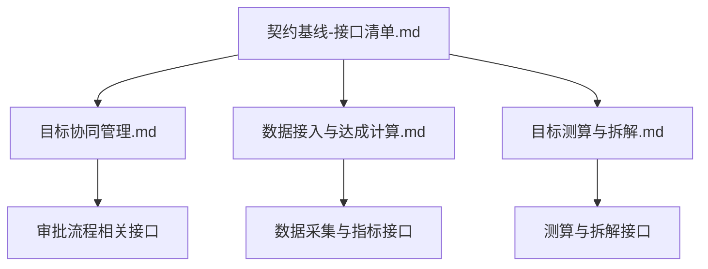
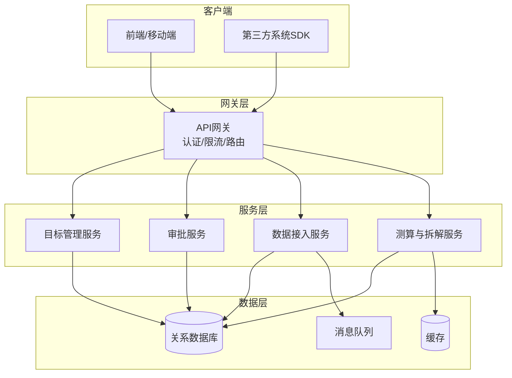
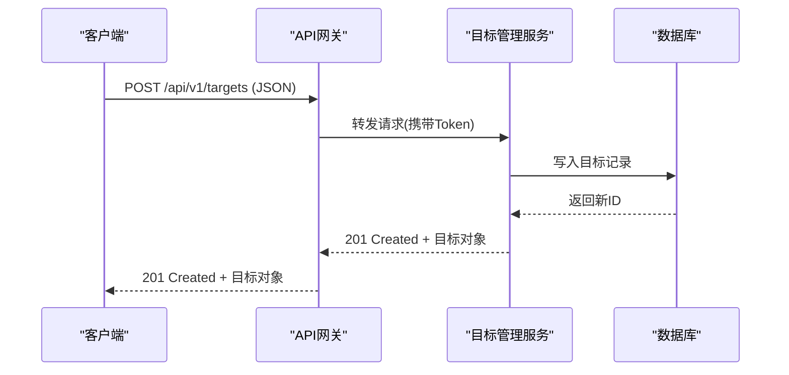
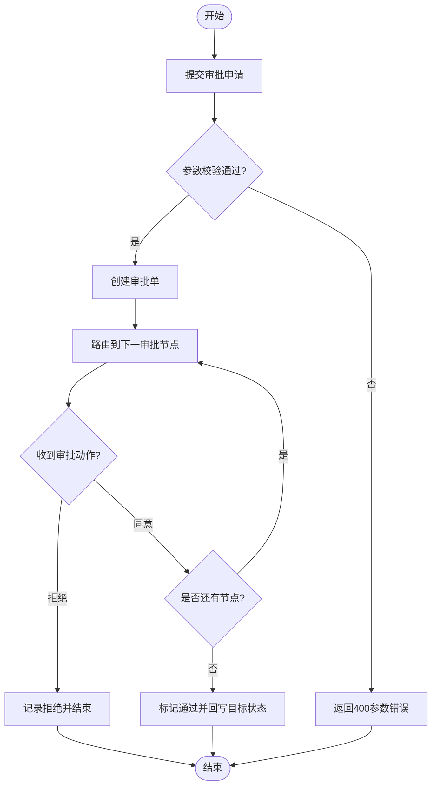
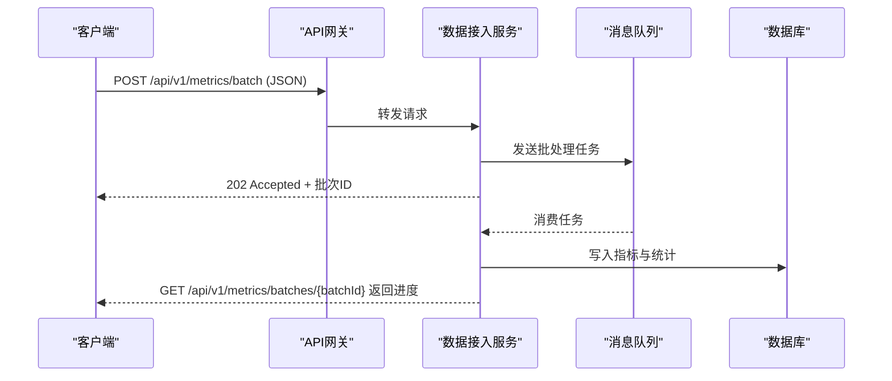
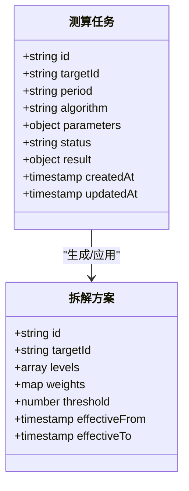
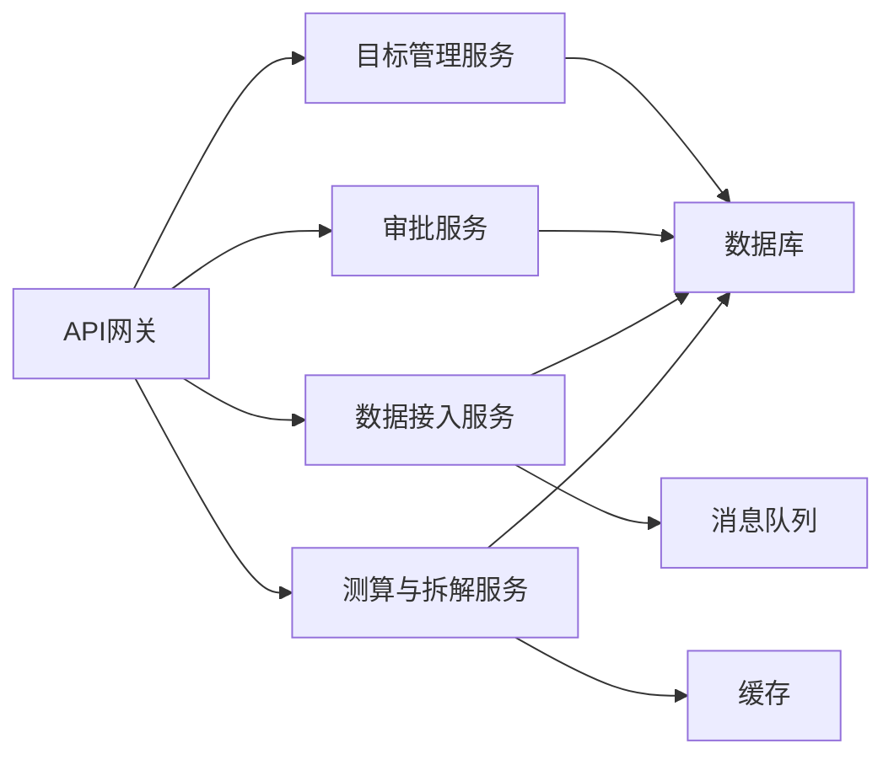

# API接口规范

<cite>
**本文引用的文件**   
- [契约基线-接口清单.md](file://docs/design/00-契约基线-接口清单.md)
- [目标协同管理.md](file://docs/design/目标协同管理.md)
- [数据接入与达成计算.md](file://docs/design/数据接入与达成计算.md)
- [目标测算与拆解.md](file://docs/design/目标测算与拆解.md)
</cite>

## 目录
1. [简介](#简介)
2. [项目结构](#项目结构)
3. [核心组件](#核心组件)
4. [架构总览](#架构总览)
5. [详细组件分析](#详细组件分析)
6. [依赖分析](#依赖分析)
7. [性能考虑](#性能考虑)
8. [故障排查指南](#故障排查指南)
9. [结论](#结论)
10. [附录](#附录)

## 简介
本规范基于仓库中的“契约基线”与设计文档，为目标平台定义完整的RESTful API接口规范。内容覆盖：
- REST端点、HTTP方法、URL模式、请求/响应格式与认证方式
- 目标管理、审批流程、数据查询等核心接口的完整规范
- 请求参数验证规则、错误码定义与响应数据结构
- 实际API调用示例与客户端集成指南
- 版本管理策略、向后兼容性保证与迁移路径
- API测试方法与调试工具使用指南

说明：由于当前仓库未包含实现代码，本文档以设计文档为依据进行规范化整理，确保后续实现与契约一致。

## 项目结构
本项目为纯文档型仓库，核心API契约与设计说明位于 docs/design 目录下。关键文件包括：
- 契约基线与接口清单：用于统一接口边界与字段约定
- 目标协同管理：目标创建、变更、协同与审批流程
- 数据接入与达成计算：指标采集、清洗、聚合与达成率计算
- 目标测算与拆解：目标分解、预测来源与测算逻辑

图表来源
- [契约基线-接口清单.md](file://docs/design/00-契约基线-接口清单.md)
- [目标协同管理.md](file://docs/design/目标协同管理.md)
- [数据接入与达成计算.md](file://docs/design/数据接入与达成计算.md)
- [目标测算与拆解.md](file://docs/design/目标测算与拆解.md)

章节来源
- [契约基线-接口清单.md](file://docs/design/00-契约基线-接口清单.md)
- [目标协同管理.md](file://docs/design/目标协同管理.md)
- [数据接入与达成计算.md](file://docs/design/数据接入与达成计算.md)
- [目标测算与拆解.md](file://docs/design/目标测算与拆解.md)

## 核心组件
围绕业务域，API划分为以下核心组件：
- 目标管理：目标生命周期（创建、更新、归档、删除）、版本与快照
- 协同与审批：变更申请、审批流、结果回写
- 数据接入：指标上报、批量导入、校验与幂等
- 测算与拆解：目标分解、预测来源、测算任务与结果查询
- 通用能力：认证鉴权、分页排序、过滤、审计日志、错误码

章节来源
- [契约基线-接口清单.md](file://docs/design/00-契约基线-接口清单.md)
- [目标协同管理.md](file://docs/design/目标协同管理.md)
- [数据接入与达成计算.md](file://docs/design/数据接入与达成计算.md)
- [目标测算与拆解.md](file://docs/design/目标测算与拆解.md)

## 架构总览
整体采用分层架构：网关层负责认证、限流与路由；服务层按领域拆分；数据层提供持久化与缓存。

图表来源
- [契约基线-接口清单.md](file://docs/design/00-契约基线-接口清单.md)
- [目标协同管理.md](file://docs/design/目标协同管理.md)
- [数据接入与达成计算.md](file://docs/design/数据接入与达成计算.md)
- [目标测算与拆解.md](file://docs/design/目标测算与拆解.md)

## 详细组件分析

### 目标管理接口
- 资源模型
  - 目标：标识、名称、周期、负责人、状态、版本、时间戳、扩展字段
  - 目标版本：版本号、快照、差异摘要
- 主要端点
  - 创建目标：POST /api/v1/targets
  - 获取目标：GET /api/v1/targets/{id}
  - 更新目标：PATCH /api/v1/targets/{id}
  - 删除目标：DELETE /api/v1/targets/{id}
  - 列表查询：GET /api/v1/targets?period=&owner=&status=&page=&size=
  - 版本操作：GET/POST /api/v1/targets/{id}/versions
- 认证与权限
  - 使用Bearer Token，需具备目标读写权限
- 请求参数验证
  - 必填字段校验、枚举值校验、范围与格式校验
- 响应数据结构
  - 统一响应体：code、message、data、trace_id
- 错误码
  - 400 参数错误、401 未认证、403 无权限、404 不存在、409 冲突、500 内部错误

图表来源
- [契约基线-接口清单.md](file://docs/design/00-契约基线-接口清单.md)
- [目标协同管理.md](file://docs/design/目标协同管理.md)

章节来源
- [契约基线-接口清单.md](file://docs/design/00-契约基线-接口清单.md)
- [目标协同管理.md](file://docs/design/目标协同管理.md)

### 审批流程接口
- 资源模型
  - 审批单：标识、关联目标、发起人、审批人、状态、节点、意见、时间戳
- 主要端点
  - 提交审批：POST /api/v1/approvals
  - 获取审批详情：GET /api/v1/approvals/{id}
  - 审批动作：POST /api/v1/approvals/{id}/actions
  - 审批历史：GET /api/v1/approvals/{id}/history
- 认证与权限
  - 审批人需具备对应角色或授权
- 请求参数验证
  - 审批动作类型、意见长度、必填字段
- 响应数据结构
  - 统一响应体，含审批节点与状态机信息

图表来源
- [目标协同管理.md](file://docs/design/目标协同管理.md)

章节来源
- [目标协同管理.md](file://docs/design/目标协同管理.md)

### 数据接入与达成计算接口
- 资源模型
  - 指标项：标识、指标编码、周期、数值、单位、来源、时间戳
  - 批次：标识、文件名、状态、统计信息
- 主要端点
  - 单条上报：POST /api/v1/metrics
  - 批量导入：POST /api/v1/metrics/batch
  - 查询指标：GET /api/v1/metrics?indicator=&period=&page=&size=
  - 达成率计算：GET /api/v1/achievements?targetId=&period=
- 认证与权限
  - 数据上报需具备指标写入权限
- 请求参数验证
  - 指标编码白名单、数值范围、去重键（幂等）
- 响应数据结构
  - 统一响应体，含批次处理结果与失败明细

图表来源
- [数据接入与达成计算.md](file://docs/design/数据接入与达成计算.md)

章节来源
- [数据接入与达成计算.md](file://docs/design/数据接入与达成计算.md)

### 目标测算与拆解接口
- 资源模型
  - 测算任务：标识、目标ID、周期、算法、参数、状态、结果
  - 拆解方案：标识、层级、权重、阈值、生效时间
- 主要端点
  - 创建测算任务：POST /api/v1/calculations
  - 查询测算结果：GET /api/v1/calculations/{id}
  - 应用拆解方案：POST /api/v1/schemes/{id}/apply
  - 查询拆解明细：GET /api/v1/schemes/{id}/details
- 认证与权限
  - 测算与拆解需具备相应权限
- 请求参数验证
  - 算法参数合法性、权重总和校验、生效时间约束
- 响应数据结构
  - 统一响应体，含任务进度与结果摘要

图表来源
- [目标测算与拆解.md](file://docs/design/目标测算与拆解.md)

章节来源
- [目标测算与拆解.md](file://docs/design/目标测算与拆解.md)

### 通用接口规范
- 认证方法
  - 使用Bearer Token，Header中携带Authorization
- 请求/响应格式
  - Content-Type: application/json
  - 统一响应体：{ code, message, data, trace_id }
- 分页与排序
  - page、size、sort字段，支持多字段排序
- 过滤与查询
  - 支持精确匹配、范围查询、模糊匹配
- 幂等性
  - 幂等键在Header中传递，服务端保证重复提交不产生副作用
- 审计日志
  - 所有写操作记录审计日志，便于追踪

章节来源
- [契约基线-接口清单.md](file://docs/design/00-契约基线-接口清单.md)

## 依赖分析
- 组件耦合
  - 网关层对服务层解耦，服务间通过API或消息通信
- 外部依赖
  - 数据库、缓存、消息队列
- 接口契约
  - 以契约基线为准，任何变更需同步更新接口清单

图表来源
- [契约基线-接口清单.md](file://docs/design/00-契约基线-接口清单.md)
- [目标协同管理.md](file://docs/design/目标协同管理.md)
- [数据接入与达成计算.md](file://docs/design/数据接入与达成计算.md)
- [目标测算与拆解.md](file://docs/design/目标测算与拆解.md)

章节来源
- [契约基线-接口清单.md](file://docs/design/00-契约基线-接口清单.md)
- [目标协同管理.md](file://docs/design/目标协同管理.md)
- [数据接入与达成计算.md](file://docs/design/数据接入与达成计算.md)
- [目标测算与拆解.md](file://docs/design/目标测算与拆解.md)

## 性能考虑
- 分页与增量查询：避免全量拉取，支持游标分页
- 缓存策略：热点指标与测算结果缓存，设置合理TTL
- 异步处理：大批量导入与测算任务异步执行
- 限流与熔断：网关层实施限流，服务层配置熔断阈值
- 连接池与索引：数据库连接池优化，关键查询建立索引

[本节为通用指导，无需引用具体文件]

## 故障排查指南
- 常见问题
  - 401/403：检查Token有效期与权限
  - 400：核对必填字段与格式
  - 404：确认资源ID与路径
  - 409：并发冲突，建议重试或合并
  - 500：查看trace_id与服务日志
- 调试工具
  - 使用Postman或cURL构造请求，携带Trace ID
  - 启用网关访问日志与服务错误日志
  - 监控指标：QPS、延迟、错误率

章节来源
- [契约基线-接口清单.md](file://docs/design/00-契约基线-接口清单.md)

## 结论
本规范以契约基线为核心，结合目标协同、数据接入与测算拆解的设计文档，形成统一的API接口规范。后续实现应严格遵循本文档的端点、字段、错误码与版本策略，确保跨团队协作的一致性与可维护性。

[本节为总结性内容，无需引用具体文件]

## 附录

### 版本管理与兼容性
- 版本策略
  - URL前缀包含版本号，如/api/v1
  - 重大变更升级版本号，小改动保持兼容
- 向后兼容
  - 新增字段默认空值，移除字段需废弃期
- 迁移路径
  - 提供双版本并行期与迁移脚本
  - 发布说明与变更日志

章节来源
- [契约基线-接口清单.md](file://docs/design/00-契约基线-接口清单.md)

### 客户端集成指南
- 初始化
  - 配置Base URL与Token
- 重试与退避
  - 指数退避与抖动
- 错误处理
  - 根据code分类处理，记录trace_id
- 示例
  - 使用SDK封装常用操作，简化调用

章节来源
- [契约基线-接口清单.md](file://docs/design/00-契约基线-接口清单.md)

### API测试方法
- 单元测试
  - 针对服务层逻辑与数据校验
- 集成测试
  - 端到端流程，模拟审批与数据接入
- 契约测试
  - 基于契约基线进行自动化比对
- 压测
  - 评估吞吐与延迟，定位瓶颈

章节来源
- [契约基线-接口清单.md](file://docs/design/00-契约基线-接口清单.md)