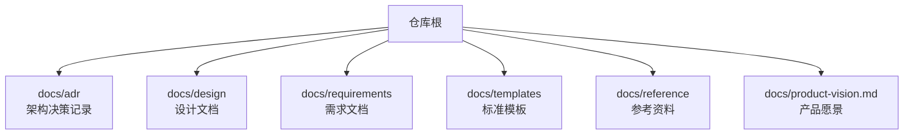
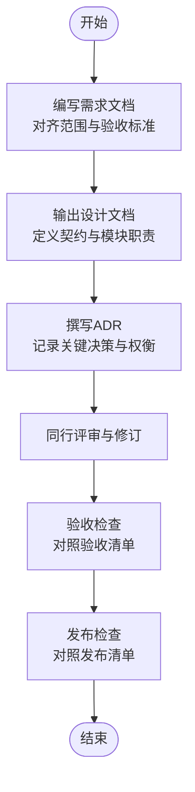
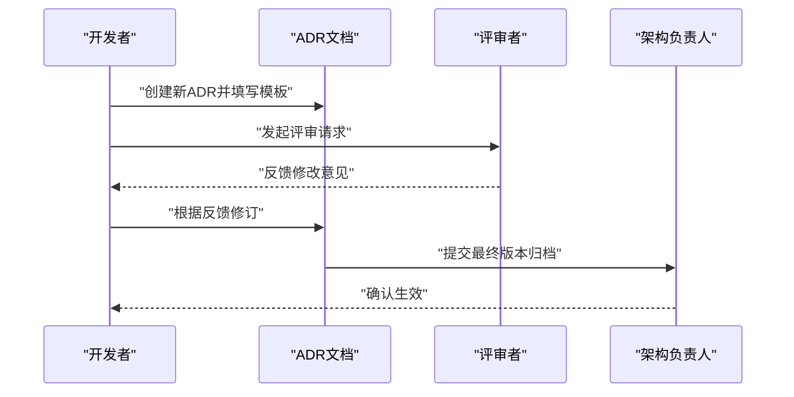
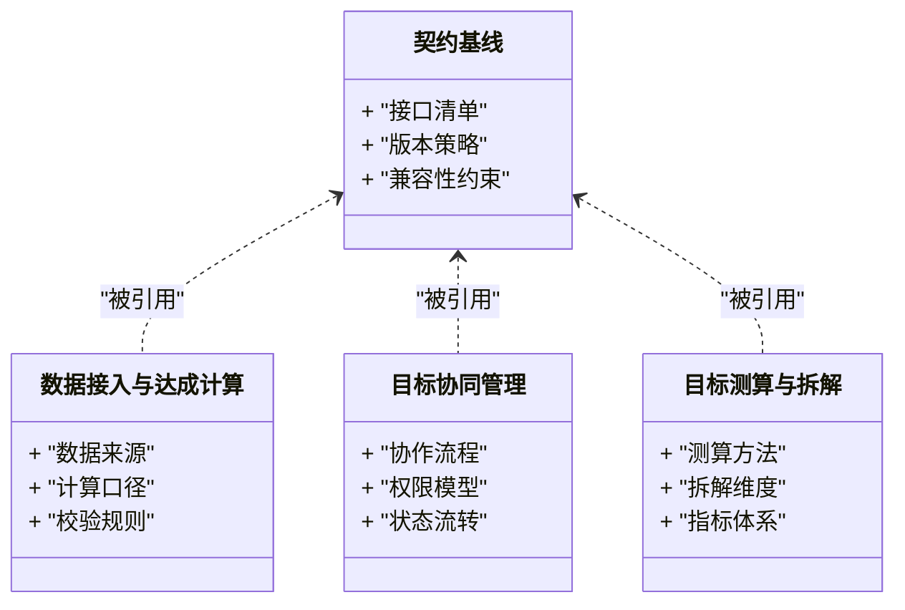
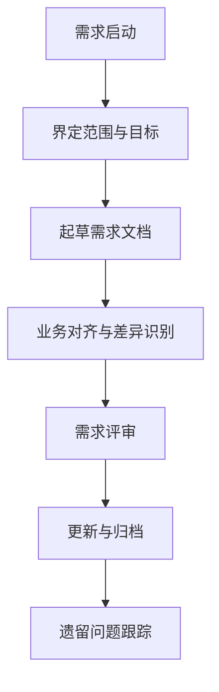
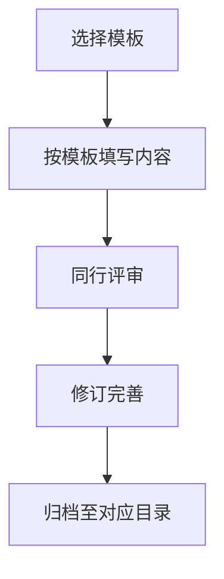
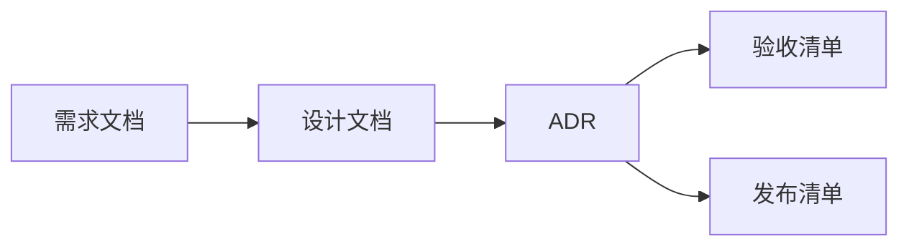

# 开发指南

<cite>
**本文引用的文件**   
- [docs/templates/adr-template.md](file://docs/templates/adr-template.md)
- [docs/templates/design-template.md](file://docs/templates/design-template.md)
- [docs/templates/requirement-template.md](file://docs/templates/requirement-template.md)
- [docs/templates/product-vision-template.md](file://docs/templates/product-vision-template.md)
- [docs/templates/acceptance-checklist-template.md](file://docs/templates/acceptance-checklist-template.md)
- [docs/templates/release-checklist-template.md](file://docs/templates/release-checklist-template.md)
- [docs/adr/0001-AI-Agent框架选型-AgentScope.md](file://docs/adr/0001-AI-Agent框架选型-AgentScope.md)
- [docs/adr/0002-数值预测来源-大数据团队.md](file://docs/adr/0002-数值预测来源-大数据团队.md)
- [docs/adr/0003-服务拆分策略.md](file://docs/adr/0003-服务拆分策略.md)
- [docs/design/00-契约基线-接口清单.md](file://docs/design/00-契约基线-接口清单.md)
- [docs/design/数据接入与达成计算.md](file://docs/design/数据接入与达成计算.md)
- [docs/design/目标协同管理.md](file://docs/design/目标协同管理.md)
- [docs/design/目标测算与拆解.md](file://docs/design/目标测算与拆解.md)
- [docs/reference/.claude/agent-memory/requirements-analyst/MEMORY.md](file://docs/reference/.claude/agent-memory/requirements-analyst/MEMORY.md)
- [docs/reference/.claude/agent-memory/requirements-analyst/one-period-scope.md](file://docs/reference/.claude/agent-memory/requirements-analyst/one-period-scope.md)
- [docs/reference/.claude/agent-memory/requirements-analyst/ref_execution_tracking_module.md](file://docs/reference/.claude/agent-memory/requirements-analyst/ref_execution_tracking_module.md)
- [docs/reference/.claude/agent-memory/requirements-analyst/ref_target_collaboration_module.md](file://docs/reference/.claude/agent-memory/requirements-analyst/ref_target_collaboration_module.md)
- [docs/requirements/Demo业务对齐差异清单.md](file://docs/requirements/Demo业务对齐差异清单.md)
- [docs/requirements/TAM大图对齐与演进路线.md](file://docs/requirements/TAM大图对齐与演进路线.md)
- [docs/requirements/需求审查遗留问题.md](file://docs/requirements/需求审查遗留问题.md)
- [docs/product-vision.md](file://docs/product-vision.md)
</cite>

## 目录
1. [简介](#简介)
2. [项目结构](#项目结构)
3. [核心组件](#核心组件)
4. [架构总览](#架构总览)
5. [详细组件分析](#详细组件分析)
6. [依赖分析](#依赖分析)
7. [性能考虑](#性能考虑)
8. [故障排查指南](#故障排查指南)
9. [结论](#结论)
10. [附录](#附录)

## 简介
本指南面向目标平台的新老成员，提供从环境搭建到文档驱动开发、编码规范、Git工作流、模板使用、代码审查、测试策略与发布检查的完整流程说明。本项目以“文档即事实”的方式推进研发，通过ADR（架构决策记录）、设计文档与需求文档的标准化模板，确保技术决策可追溯、设计意图清晰、需求边界明确。

## 项目结构
仓库采用“按主题组织”的文档结构，核心目录如下：
- docs/adr：架构决策记录，编号化命名，便于检索与演进追踪
- docs/design：系统设计、模块设计与契约基线等
- docs/requirements：需求清单、对齐与遗留问题跟踪
- docs/templates：标准模板集合（ADR、设计、需求、愿景、验收、发布）
- docs/reference：参考实现与记忆材料（含Agent Memory相关参考）
- docs/product-vision.md：产品愿景与总体定位

**章节来源**
- [docs/templates/adr-template.md](file://docs/templates/adr-template.md)
- [docs/templates/design-template.md](file://docs/templates/design-template.md)
- [docs/templates/requirement-template.md](file://docs/templates/requirement-template.md)
- [docs/templates/product-vision-template.md](file://docs/templates/product-vision-template.md)
- [docs/templates/acceptance-checklist-template.md](file://docs/templates/acceptance-checklist-template.md)
- [docs/templates/release-checklist-template.md](file://docs/templates/release-checklist-template.md)
- [docs/adr/0001-AI-Agent框架选型-AgentScope.md](file://docs/adr/0001-AI-Agent框架选型-AgentScope.md)
- [docs/adr/0002-数值预测来源-大数据团队.md](file://docs/adr/0002-数值预测来源-大数据团队.md)
- [docs/adr/0003-服务拆分策略.md](file://docs/adr/0003-服务拆分策略.md)
- [docs/design/00-契约基线-接口清单.md](file://docs/design/00-契约基线-接口清单.md)
- [docs/design/数据接入与达成计算.md](file://docs/design/数据接入与达成计算.md)
- [docs/design/目标协同管理.md](file://docs/design/目标协同管理.md)
- [docs/design/目标测算与拆解.md](file://docs/design/目标测算与拆解.md)
- [docs/reference/.claude/agent-memory/requirements-analyst/MEMORY.md](file://docs/reference/.claude/agent-memory/requirements-analyst/MEMORY.md)
- [docs/reference/.claude/agent-memory/requirements-analyst/one-period-scope.md](file://docs/reference/.claude/agent-memory/requirements-analyst/one-period-scope.md)
- [docs/reference/.claude/agent-memory/requirements-analyst/ref_execution_tracking_module.md](file://docs/reference/.claude/agent-memory/requirements-analyst/ref_execution_tracking_module.md)
- [docs/reference/.claude/agent-memory/requirements-analyst/ref_target_collaboration_module.md](file://docs/reference/.claude/agent-memory/requirements-analyst/ref_target_collaboration_module.md)
- [docs/requirements/Demo业务对齐差异清单.md](file://docs/requirements/Demo业务对齐差异清单.md)
- [docs/requirements/TAM大图对齐与演进路线.md](file://docs/requirements/TAM大图对齐与演进路线.md)
- [docs/requirements/需求审查遗留问题.md](file://docs/requirements/需求审查遗留问题.md)
- [docs/product-vision.md](file://docs/product-vision.md)

## 核心组件
- 文档驱动开发体系
  - ADR：用于记录关键架构决策，包含背景、选项、权衡与影响范围
  - 设计文档：覆盖系统契约、模块职责、数据流与集成点
  - 需求文档：对齐业务目标、范围与验收标准
- 模板体系
  - ADR模板、设计模板、需求模板、产品愿景模板、验收清单、发布清单
- 参考资料
  - Agent Memory与需求分析师参考材料，辅助理解上下文与历史决策

**章节来源**
- [docs/templates/adr-template.md](file://docs/templates/adr-template.md)
- [docs/templates/design-template.md](file://docs/templates/design-template.md)
- [docs/templates/requirement-template.md](file://docs/templates/requirement-template.md)
- [docs/templates/product-vision-template.md](file://docs/templates/product-vision-template.md)
- [docs/templates/acceptance-checklist-template.md](file://docs/templates/acceptance-checklist-template.md)
- [docs/templates/release-checklist-template.md](file://docs/templates/release-checklist-template.md)
- [docs/reference/.claude/agent-memory/requirements-analyst/MEMORY.md](file://docs/reference/.claude/agent-memory/requirements-analyst/MEMORY.md)
- [docs/reference/.claude/agent-memory/requirements-analyst/one-period-scope.md](file://docs/reference/.claude/agent-memory/requirements-analyst/one-period-scope.md)
- [docs/reference/.claude/agent-memory/requirements-analyst/ref_execution_tracking_module.md](file://docs/reference/.claude/agent-memory/requirements-analyst/ref_execution_tracking_module.md)
- [docs/reference/.claude/agent-memory/requirements-analyst/ref_target_collaboration_module.md](file://docs/reference/.claude/agent-memory/requirements-analyst/ref_target_collaboration_module.md)

## 架构总览
下图展示了文档驱动开发的端到端流程：从需求提出、设计评审、ADR决策、到验收与发布的全链路。

[此图为概念性流程图，不直接映射具体源码文件]

## 详细组件分析

### ADR（架构决策记录）
- 目的：沉淀关键架构决策，保证可追溯性与一致性
- 生命周期：提案 → 评审 → 定稿 → 归档
- 编号规则：按顺序递增，文件名包含序号与主题关键词
- 内容要点：背景、可选方案、选择理由、影响面、风险与缓解措施

**图表来源**
- [docs/templates/adr-template.md](file://docs/templates/adr-template.md)
- [docs/adr/0001-AI-Agent框架选型-AgentScope.md](file://docs/adr/0001-AI-Agent框架选型-AgentScope.md)
- [docs/adr/0002-数值预测来源-大数据团队.md](file://docs/adr/0002-数值预测来源-大数据团队.md)
- [docs/adr/0003-服务拆分策略.md](file://docs/adr/0003-服务拆分策略.md)

**章节来源**
- [docs/templates/adr-template.md](file://docs/templates/adr-template.md)
- [docs/adr/0001-AI-Agent框架选型-AgentScope.md](file://docs/adr/0001-AI-Agent框架选型-AgentScope.md)
- [docs/adr/0002-数值预测来源-大数据团队.md](file://docs/adr/0002-数值预测来源-大数据团队.md)
- [docs/adr/0003-服务拆分策略.md](file://docs/adr/0003-服务拆分策略.md)

### 设计文档
- 作用：将需求转化为可实施的设计，明确契约、数据流与集成点
- 重点：接口契约基线、模块职责划分、数据接入与计算逻辑、协同机制
- 建议：在变更时同步更新契约与依赖方通知

**图表来源**
- [docs/design/00-契约基线-接口清单.md](file://docs/design/00-契约基线-接口清单.md)
- [docs/design/数据接入与达成计算.md](file://docs/design/数据接入与达成计算.md)
- [docs/design/目标协同管理.md](file://docs/design/目标协同管理.md)
- [docs/design/目标测算与拆解.md](file://docs/design/目标测算与拆解.md)

**章节来源**
- [docs/design/00-契约基线-接口清单.md](file://docs/design/00-契约基线-接口清单.md)
- [docs/design/数据接入与达成计算.md](file://docs/design/数据接入与达成计算.md)
- [docs/design/目标协同管理.md](file://docs/design/目标协同管理.md)
- [docs/design/目标测算与拆解.md](file://docs/design/目标测算与拆解.md)

### 需求文档
- 目标：明确业务目标、范围边界、验收标准与遗留问题
- 产出：需求清单、对齐差异、演进路线与遗留问题跟踪
- 维护：随迭代持续更新，保持与设计与ADR的一致性

**章节来源**
- [docs/requirements/Demo业务对齐差异清单.md](file://docs/requirements/Demo业务对齐差异清单.md)
- [docs/requirements/TAM大图对齐与演进路线.md](file://docs/requirements/TAM大图对齐与演进路线.md)
- [docs/requirements/需求审查遗留问题.md](file://docs/requirements/需求审查遗留问题.md)

### 模板体系使用方法
- ADR模板：用于记录架构决策，强调背景、选项、权衡与影响
- 设计模板：用于系统化描述设计，包括契约、模块、数据流与集成
- 需求模板：用于结构化表达需求，包括目标、范围、验收与风险
- 产品愿景模板：用于统一产品方向与长期规划
- 验收清单模板：用于逐项核对交付质量与合规性
- 发布清单模板：用于保障发布过程的可控与可回滚

**章节来源**
- [docs/templates/adr-template.md](file://docs/templates/adr-template.md)
- [docs/templates/design-template.md](file://docs/templates/design-template.md)
- [docs/templates/requirement-template.md](file://docs/templates/requirement-template.md)
- [docs/templates/product-vision-template.md](file://docs/templates/product-vision-template.md)
- [docs/templates/acceptance-checklist-template.md](file://docs/templates/acceptance-checklist-template.md)
- [docs/templates/release-checklist-template.md](file://docs/templates/release-checklist-template.md)

### 参考资料与记忆
- Agent Memory与需求分析师参考材料有助于理解上下文、历史决策与模块职责
- 建议在需求与设计阶段引用相关参考，确保一致性与延续性

**章节来源**
- [docs/reference/.claude/agent-memory/requirements-analyst/MEMORY.md](file://docs/reference/.claude/agent-memory/requirements-analyst/MEMORY.md)
- [docs/reference/.claude/agent-memory/requirements-analyst/one-period-scope.md](file://docs/reference/.claude/agent-memory/requirements-analyst/one-period-scope.md)
- [docs/reference/.claude/agent-memory/requirements-analyst/ref_execution_tracking_module.md](file://docs/reference/.claude/agent-memory/requirements-analyst/ref_execution_tracking_module.md)
- [docs/reference/.claude/agent-memory/requirements-analyst/ref_target_collaboration_module.md](file://docs/reference/.claude/agent-memory/requirements-analyst/ref_target_collaboration_module.md)

### 产品愿景
- 产品愿景文档用于统一方向、明确价值主张与长期演进路径
- 作为需求与设计的高层输入，指导后续细化与落地

**章节来源**
- [docs/product-vision.md](file://docs/product-vision.md)

## 依赖分析
- 文档间依赖关系
  - 需求文档为设计文档输入
  - 设计文档为ADR决策依据
  - ADR对设计与需求具有约束力
  - 验收与发布清单对设计与实现进行质量把关

**章节来源**
- [docs/requirements/Demo业务对齐差异清单.md](file://docs/requirements/Demo业务对齐差异清单.md)
- [docs/design/00-契约基线-接口清单.md](file://docs/design/00-契约基线-接口清单.md)
- [docs/adr/0001-AI-Agent框架选型-AgentScope.md](file://docs/adr/0001-AI-Agent框架选型-AgentScope.md)
- [docs/templates/acceptance-checklist-template.md](file://docs/templates/acceptance-checklist-template.md)
- [docs/templates/release-checklist-template.md](file://docs/templates/release-checklist-template.md)

## 性能考虑
- 文档驱动的性能体现在“减少返工与沟通成本”，通过清晰的契约与决策降低后期变更代价
- 建议在设计与ADR中明确性能目标与非功能约束，并在验收清单中纳入验证项

[本节为通用指导，不直接分析具体文件]

## 故障排查指南
- 常见问题
  - 文档不一致：需求、设计与ADR之间出现冲突
  - 遗漏评审：未按要求完成同行评审或归档
  - 版本混乱：模板使用不规范导致信息缺失
- 处理步骤
  - 定位冲突源：对比需求、设计与ADR的版本与日期
  - 发起修订：按模板补充必要信息并重新评审
  - 归档确认：更新后归档至对应目录并通知相关方

**章节来源**
- [docs/templates/adr-template.md](file://docs/templates/adr-template.md)
- [docs/templates/design-template.md](file://docs/templates/design-template.md)
- [docs/templates/requirement-template.md](file://docs/templates/requirement-template.md)
- [docs/templates/acceptance-checklist-template.md](file://docs/templates/acceptance-checklist-template.md)
- [docs/templates/release-checklist-template.md](file://docs/templates/release-checklist-template.md)

## 结论
通过标准化的模板与严格的文档驱动流程，目标平台能够高效地推进复杂系统的研发与演进。建议在新成员入职时优先熟悉模板与流程，并在实际项目中逐步实践，以确保团队协作的一致性与质量可控。

[本节为总结性内容，不直接分析具体文件]

## 附录
- 快速上手清单
  - 阅读产品愿景与参考资料，了解背景与目标
  - 学习并使用模板：ADR、设计、需求、验收、发布
  - 遵循文档依赖关系：需求→设计→ADR→验收→发布
  - 在评审与归档环节保持及时与透明

[本节为通用指导，不直接分析具体文件]