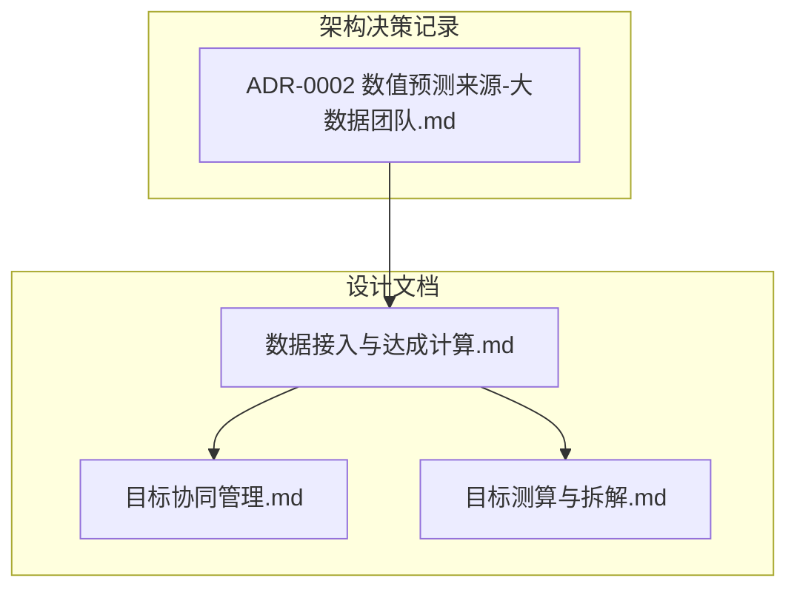
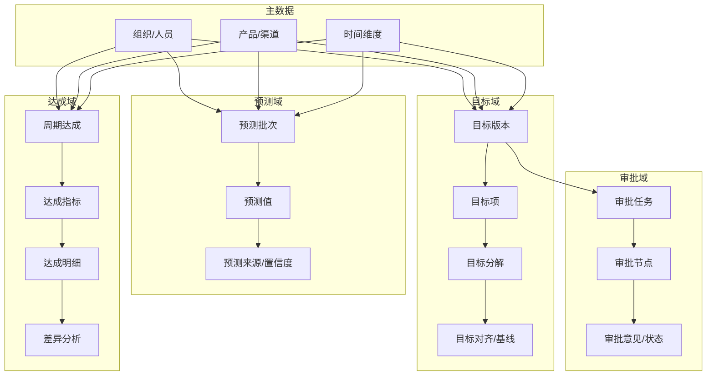
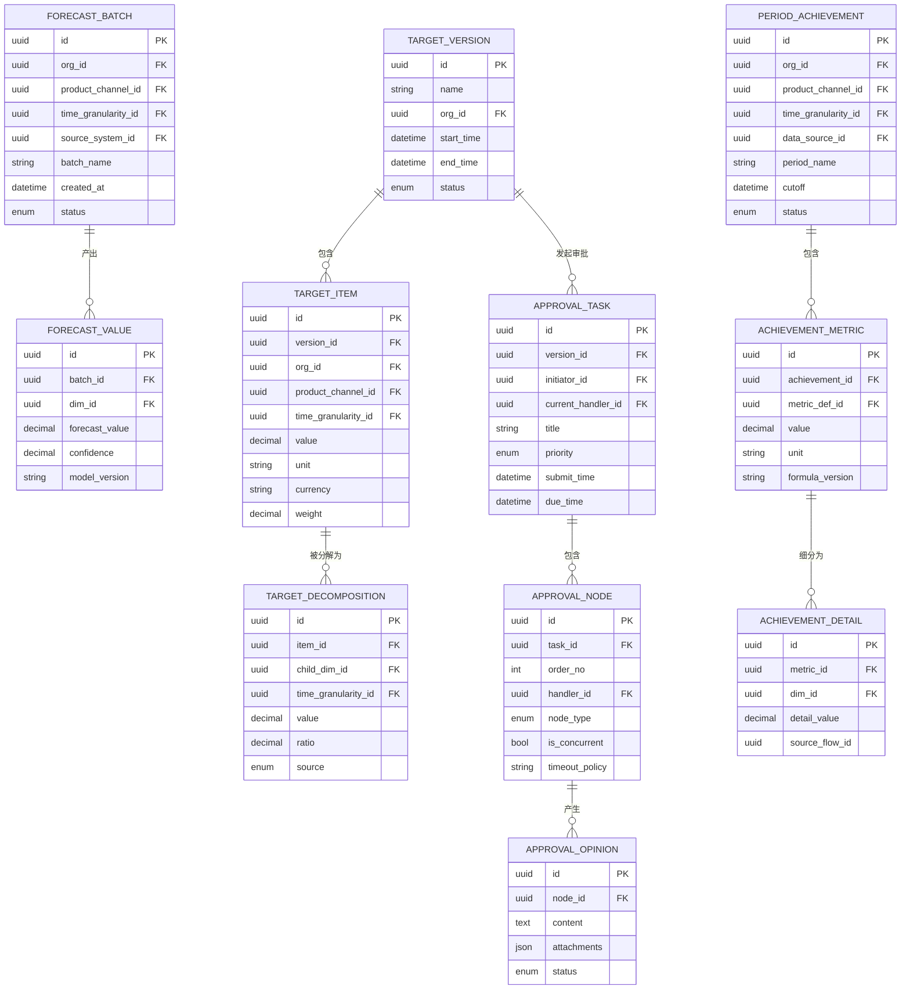
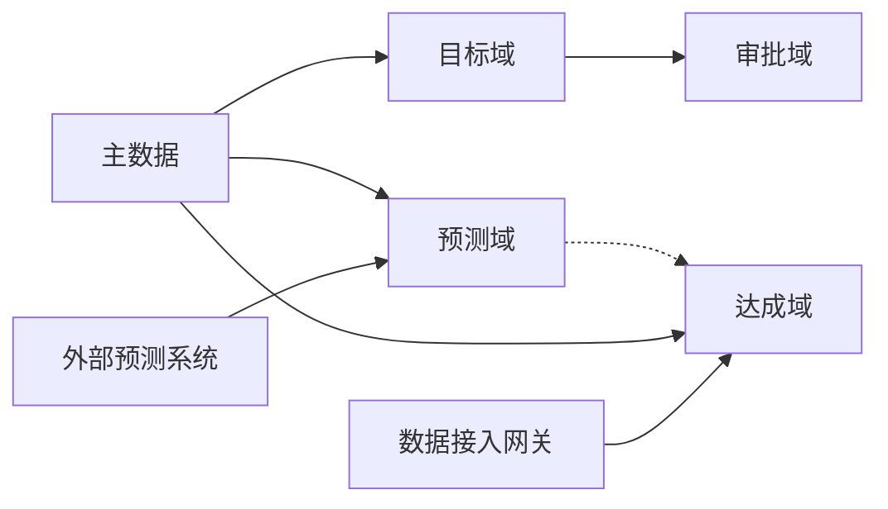

# 数据模型设计

<cite>
**本文引用的文件**   
- [docs/design/数据接入与达成计算.md](file://docs/design/数据接入与达成计算.md)
- [docs/design/目标协同管理.md](file://docs/design/目标协同管理.md)
- [docs/design/目标测算与拆解.md](file://docs/design/目标测算与拆解.md)
- [docs/adr/0002-数值预测来源-大数据团队.md](file://docs/adr/0002-数值预测来源-大数据团队.md)
</cite>

## 目录
1. [引言](#引言)
2. [项目结构](#项目结构)
3. [核心组件](#核心组件)
4. [架构总览](#架构总览)
5. [详细组件分析](#详细组件分析)
6. [依赖关系分析](#依赖关系分析)
7. [性能考虑](#性能考虑)
8. [故障排查指南](#故障排查指南)
9. [结论](#结论)
10. [附录](#附录)

## 引言
本文件面向“目标平台”的数据模型设计与治理，聚焦以下目标：
- 明确核心实体定义、字段规范与数据类型
- 文档化关键数据模型（目标、审批流程、预测数据、达成指标）的关系图谱
- 说明主键/外键关系、索引设计与约束条件
- 定义数据验证规则与业务逻辑约束
- 提供数据库Schema图与ER关系图
- 阐述数据访问模式、缓存策略与性能优化要点
- 定义数据生命周期管理、保留策略与归档规则
- 明确数据安全要求与访问控制机制

## 项目结构
仓库以文档驱动为主，数据模型相关的设计与约定集中在 docs/design 与 docs/adr 目录。核心参考文件包括：
- 数据接入与达成计算：描述数据来源、接入方式、达成指标的计算口径与校验规则
- 目标协同管理：描述目标制定、分解、对齐与版本管理的模型与流程
- 目标测算与拆解：描述目标测算方法、拆解维度与汇总校验
- ADR-0002：明确数值预测的来源与对接边界，影响预测数据模型与集成点

图表来源
- [docs/design/数据接入与达成计算.md](file://docs/design/数据接入与达成计算.md)
- [docs/design/目标协同管理.md](file://docs/design/目标协同管理.md)
- [docs/design/目标测算与拆解.md](file://docs/design/目标测算与拆解.md)
- [docs/adr/0002-数值预测来源-大数据团队.md](file://docs/adr/0002-数值预测来源-大数据团队.md)

章节来源
- [docs/design/数据接入与达成计算.md](file://docs/design/数据接入与达成计算.md)
- [docs/design/目标协同管理.md](file://docs/design/目标协同管理.md)
- [docs/design/目标测算与拆解.md](file://docs/design/目标测算与拆解.md)
- [docs/adr/0002-数值预测来源-大数据团队.md](file://docs/adr/0002-数值预测来源-大数据团队.md)

## 核心组件
围绕目标平台的关键数据域如下：
- 目标域：目标版本、目标项、目标分解、目标对齐与基线
- 审批域：审批任务、审批节点、审批意见与状态流转
- 预测域：预测批次、预测值、预测来源与置信度
- 达成域：周期达成、达成指标、达成明细与差异分析
- 主数据域：组织、人员、产品/渠道、时间维度等

上述域在“数据接入与达成计算”“目标协同管理”“目标测算与拆解”中均有对应建模与规则约定；预测数据域受“数值预测来源-大数据团队”的集成约束。

章节来源
- [docs/design/数据接入与达成计算.md](file://docs/design/数据接入与达成计算.md)
- [docs/design/目标协同管理.md](file://docs/design/目标协同管理.md)
- [docs/design/目标测算与拆解.md](file://docs/design/目标测算与拆解.md)
- [docs/adr/0002-数值预测来源-大数据团队.md](file://docs/adr/0002-数值预测来源-大数据团队.md)

## 架构总览
从数据视角看，系统由“目标-预测-达成-审批”四大子域构成，通过统一的主数据与时间维度进行关联。

图表来源
- [docs/design/数据接入与达成计算.md](file://docs/design/数据接入与达成计算.md)
- [docs/design/目标协同管理.md](file://docs/design/目标协同管理.md)
- [docs/design/目标测算与拆解.md](file://docs/design/目标测算与拆解.md)
- [docs/adr/0002-数值预测来源-大数据团队.md](file://docs/adr/0002-数值预测来源-大数据团队.md)

## 详细组件分析

### 实体与字段规范（目标域）
- 目标版本
  - 主键：版本ID
  - 关键字段：名称、所属组织、生效起止时间、状态、创建人/时间、更新人/时间
  - 约束：同一组织在同一时间窗口内仅允许一个有效版本；版本间存在继承关系
- 目标项
  - 主键：目标项ID
  - 外键：目标版本ID、组织ID、产品/渠道ID、时间粒度ID
  - 关键字段：目标值、单位、币种、权重、备注
  - 约束：目标值非负；同版本同维度唯一
- 目标分解
  - 主键：分解ID
  - 外键：目标项ID、下级维度ID（组织/产品/渠道）、时间粒度ID
  - 关键字段：分解值、比例、来源（人工/算法）
  - 约束：分解值之和等于父级目标值（允许容差阈值）
- 目标对齐/基线
  - 主键：对齐ID
  - 外键：目标版本ID、对齐对象ID、对齐类型
  - 关键字段：对齐结果、差异、确认人/时间
  - 约束：仅在目标版本锁定前可变更

章节来源
- [docs/design/目标协同管理.md](file://docs/design/目标协同管理.md)
- [docs/design/目标测算与拆解.md](file://docs/design/目标测算与拆解.md)

### 实体与字段规范（预测域）
- 预测批次
  - 主键：批次ID
  - 外键：组织ID、产品/渠道ID、时间粒度ID、来源系统ID
  - 关键字段：批次名称、生成时间、状态、责任人
  - 约束：同一批次内对同一维度仅允许一条预测记录
- 预测值
  - 主键：预测ID
  - 外键：预测批次ID、维度ID（组织/产品/渠道/时间）
  - 关键字段：预测值、置信度、模型版本、特征摘要
  - 约束：预测值非负；置信度在[0,1]区间
- 预测来源/置信度
  - 主键：来源ID
  - 外键：预测批次ID
  - 关键字段：来源系统、模型名、评估指标、更新时间
  - 约束：来源系统需白名单校验

章节来源
- [docs/adr/0002-数值预测来源-大数据团队.md](file://docs/adr/0002-数值预测来源-大数据团队.md)

### 实体与字段规范（达成域）
- 周期达成
  - 主键：达成ID
  - 外键：组织ID、产品/渠道ID、时间粒度ID、数据源ID
  - 关键字段：周期名称、统计截止、状态、导入批次号
  - 约束：周期不可重叠；数据源需可信签名校验
- 达成指标
  - 主键：指标ID
  - 外键：周期达成ID、指标定义ID
  - 关键字段：指标值、单位、计算公式版本
  - 约束：指标值非负；公式版本与计算口径一致
- 达成明细
  - 主键：明细ID
  - 外键：达成指标ID、维度ID（组织/产品/渠道/时间）
  - 关键字段：明细值、来源流水ID
  - 约束：明细聚合应等于指标值（允许容差）
- 差异分析
  - 主键：差异ID
  - 外键：达成指标ID、目标项ID、预测ID
  - 关键字段：差异值、贡献度、原因标签
  - 约束：差异=达成-目标；支持多因子归因

章节来源
- [docs/design/数据接入与达成计算.md](file://docs/design/数据接入与达成计算.md)

### 实体与字段规范（审批域）
- 审批任务
  - 主键：任务ID
  - 外键：目标版本ID、发起人ID、当前处理人ID
  - 关键字段：任务标题、优先级、提交时间、截止时间
  - 约束：同一版本仅允许一个活跃审批任务
- 审批节点
  - 主键：节点ID
  - 外键：审批任务ID、节点顺序、处理人ID
  - 关键字段：节点类型、是否会签、超时策略
  - 约束：节点顺序严格递增
- 审批意见/状态
  - 主键：意见ID
  - 外键：审批节点ID
  - 关键字段：意见内容、附件、状态（通过/驳回/退回）
  - 约束：状态机合法转换；驳回需填写原因

章节来源
- [docs/design/目标协同管理.md](file://docs/design/目标协同管理.md)

### ER关系图

图表来源
- [docs/design/目标协同管理.md](file://docs/design/目标协同管理.md)
- [docs/design/数据接入与达成计算.md](file://docs/design/数据接入与达成计算.md)
- [docs/adr/0002-数值预测来源-大数据团队.md](file://docs/adr/0002-数值预测来源-大数据团队.md)

### 数据验证规则与业务约束
- 数值约束
  - 所有金额/数量类字段非负；百分比/置信度在[0,1]
  - 分解值之和与父级目标值的容差阈值需配置并记录
- 一致性约束
  - 同版本同维度唯一；同批次同维度唯一
  - 明细聚合等于指标值；差异=达成-目标
- 状态机约束
  - 目标版本：草稿→待审批→已批准→已锁定→已归档
  - 审批任务：进行中→已通过/已驳回→已完成
- 来源与审计
  - 预测来源系统白名单；数据导入需携带签名与批次号
  - 全量操作留痕：创建人/时间、修改人/时间、变更原因

章节来源
- [docs/design/数据接入与达成计算.md](file://docs/design/数据接入与达成计算.md)
- [docs/design/目标协同管理.md](file://docs/design/目标协同管理.md)
- [docs/adr/0002-数值预测来源-大数据团队.md](file://docs/adr/0002-数值预测来源-大数据团队.md)

### 主键/外键与索引设计
- 主键
  - 所有实体采用单列主键（建议UUID或自增整型），避免复合主键
- 外键
  - 目标项→目标版本、组织、产品/渠道、时间粒度
  - 分解→目标项、下级维度、时间粒度
  - 预测值→预测批次、维度
  - 达成指标→周期达成、指标定义
  - 达成明细→达成指标、维度
  - 审批节点→审批任务；审批意见→审批节点
- 索引建议
  - 查询热点：按组织+时间粒度+产品/渠道的组合索引
  - 版本与状态：目标版本(组织ID, 生效起止时间)、目标版本(status)
  - 批次与来源：预测批次(来源系统ID, 生成时间)
  - 达成与周期：周期达成(组织ID, 时间粒度ID, 数据源ID)
  - 审批：审批任务(版本ID, 状态)、审批节点(任务ID, 顺序)

章节来源
- [docs/design/目标协同管理.md](file://docs/design/目标协同管理.md)
- [docs/design/数据接入与达成计算.md](file://docs/design/数据接入与达成计算.md)
- [docs/adr/0002-数值预测来源-大数据团队.md](file://docs/adr/0002-数值预测来源-大数据团队.md)

### 数据访问模式与缓存策略
- 读取模式
  - 高频读：目标版本列表、目标项明细、达成指标汇总
  - 批量读：预测批次导出、达成明细拉取
- 写入模式
  - 批处理导入：预测值、达成明细
  - 事务性更新：目标分解调整、审批状态流转
- 缓存策略
  - 目标版本与目标项：短TTL缓存（分钟级），变更时失效
  - 达成汇总：长TTL缓存（小时级），重算后刷新
  - 预测批次元信息：近实时缓存（秒级）
- 一致性保障
  - 写扩散+版本号/时间戳冲突检测
  - 读写分离：报表查询走只读副本

章节来源
- [docs/design/数据接入与达成计算.md](file://docs/design/数据接入与达成计算.md)
- [docs/design/目标协同管理.md](file://docs/design/目标协同管理.md)

### 数据生命周期、保留与归档
- 生命周期阶段
  - 采集/导入→清洗/校验→计算/汇总→发布/展示→归档/清理
- 保留策略
  - 原始明细：保留N年（合规要求）
  - 中间结果：保留M个月
  - 发布结果：长期保留，历史快照按版本归档
- 归档规则
  - 版本锁定后进入归档队列
  - 归档数据压缩存储，保留索引以便回溯
  - 归档后禁止在线修改，仅允许只读访问

章节来源
- [docs/design/数据接入与达成计算.md](file://docs/design/数据接入与达成计算.md)
- [docs/design/目标协同管理.md](file://docs/design/目标协同管理.md)

### 数据安全与访问控制
- 数据分级
  - 公开：汇总指标
  - 内部：明细与过程数据
  - 敏感：个人/财务相关字段
- 访问控制
  - 基于角色的访问控制（RBAC）：管理员、分析师、填报员、审计员
  - 行级权限：按组织/产品线隔离
  - 字段级脱敏：敏感字段按需掩码
- 安全要求
  - 传输加密（TLS）、存储加密（静态）
  - 审计日志：谁在何时访问/修改了哪些数据
  - 数据导入签名校验与来源白名单

章节来源
- [docs/design/数据接入与达成计算.md](file://docs/design/数据接入与达成计算.md)
- [docs/design/目标协同管理.md](file://docs/design/目标协同管理.md)

## 依赖关系分析
- 模块耦合
  - 目标域与审批域强耦合（版本审批）
  - 预测域与达成域弱耦合（对比分析）
  - 主数据为各域共享基础
- 外部依赖
  - 预测来源系统（大数据团队）
  - 数据接入网关（签名校验、格式校验）
- 潜在循环依赖
  - 目标分解与对齐应避免双向引用，使用事件或异步补偿

图表来源
- [docs/design/目标协同管理.md](file://docs/design/目标协同管理.md)
- [docs/design/数据接入与达成计算.md](file://docs/design/数据接入与达成计算.md)
- [docs/adr/0002-数值预测来源-大数据团队.md](file://docs/adr/0002-数值预测来源-大数据团队.md)

章节来源
- [docs/design/目标协同管理.md](file://docs/design/目标协同管理.md)
- [docs/design/数据接入与达成计算.md](file://docs/design/数据接入与达成计算.md)
- [docs/adr/0002-数值预测来源-大数据团队.md](file://docs/adr/0002-数值预测来源-大数据团队.md)

## 性能考虑
- 分库分表
  - 按组织/时间维度水平拆分，热点组织单独分片
- 索引优化
  - 覆盖常用查询组合索引，减少回表
- 计算优化
  - 增量重算与物化视图，降低全量计算开销
- 并发控制
  - 乐观锁（版本号）避免覆盖更新
- 监控与告警
  - 慢查询、导入失败率、审批超时等关键指标

[本节为通用指导，不直接分析具体文件]

## 故障排查指南
- 常见错误
  - 数据不一致：分解/明细与父级不一致
  - 审批阻塞：节点状态非法或超时未处理
  - 预测异常：来源系统返回空值或置信度过低
- 定位步骤
  - 核对批次号与签名，确认来源合法性
  - 检查版本状态与审批任务状态机
  - 查看差异分析与贡献度，定位异常维度
- 恢复策略
  - 回滚至最近稳定版本
  - 重新触发预测/达成计算任务
  - 补录缺失明细并重新聚合

章节来源
- [docs/design/数据接入与达成计算.md](file://docs/design/数据接入与达成计算.md)
- [docs/design/目标协同管理.md](file://docs/design/目标协同管理.md)

## 结论
本数据模型围绕“目标-预测-达成-审批”四大域构建，强调一致性、可追溯性与可扩展性。通过严格的验证规则、合理的索引与缓存策略、完善的生命周期与安全控制，支撑目标协同管理与达成计算的稳定运行。后续可在主数据标准化、预测质量评估与达成归因增强方面持续演进。

[本节为总结，不直接分析具体文件]

## 附录
- 术语表
  - 目标版本：某组织在某时间窗口的目标集合及其状态
  - 预测批次：一次预测任务的产物集合
  - 周期达成：某周期内的实际达成情况
  - 审批任务：针对目标版本的审批流程实例
- 参考文档
  - 数据接入与达成计算
  - 目标协同管理
  - 目标测算与拆解
  - ADR-0002 数值预测来源-大数据团队

[本节为补充信息，不直接分析具体文件]