# AI Agent架构设计

<cite>
**本文引用的文件**   
- [0001-AI-Agent框架选型-AgentScope.md](file://docs/adr/0001-AI-Agent框架选型-AgentScope.md)
- [0002-数值预测来源-大数据团队.md](file://docs/adr/0002-数值预测来源-大数据团队.md)
- [0003-服务拆分策略.md](file://docs/adr/0003-服务拆分策略.md)
- [00-契约基线-接口清单.md](file://docs/design/00-契约基线-接口清单.md)
- [数据接入与达成计算.md](file://docs/design/数据接入与达成计算.md)
- [目标协同管理.md](file://docs/design/目标协同管理.md)
- [目标测算与拆解.md](file://docs/design/目标测算与拆解.md)
- [MEMORY.md](file://docs/reference/.claude/agent-memory/requirements-analyst/MEMORY.md)
- [one-period-scope.md](file://docs/reference/.claude/agent-memory/requirements-analyst/one-period-scope.md)
- [ref_execution_tracking_module.md](file://docs/reference/.claude/agent-memory/requirements-analyst/ref_execution_tracking_module.md)
- [ref_target_collaboration_module.md](file://docs/reference/.claude/agent-memory/requirements-analyst/ref_target_collaboration_module.md)
</cite>

## 目录
1. [引言](#引言)
2. [项目结构](#项目结构)
3. [核心组件](#核心组件)
4. [架构总览](#架构总览)
5. [详细组件分析](#详细组件分析)
6. [依赖分析](#依赖分析)
7. [性能考虑](#性能考虑)
8. [故障排查指南](#故障排查指南)
9. [结论](#结论)
10. [附录](#附录)

## 引言
本技术文档围绕AI Agent架构设计与落地方案展开，重点阐述AgentScope框架的选型决策、整体架构设计（代理生命周期、任务编排、消息传递与状态同步）、与目标协同管理系统的集成方案（API接口、数据格式、错误处理），并提供配置示例与最佳实践。文档同时给出架构图、组件交互图与部署拓扑图，帮助读者快速理解系统全貌并指导工程化实施。

## 项目结构
仓库采用“设计驱动”的组织方式，以ADR（架构决策记录）与设计文档为核心，辅以参考实现要点与需求对齐材料。主要目录：
- docs/adr：架构决策记录，包含Agent框架选型、数据来源与服务拆分策略等关键决策
- docs/design：系统设计文档，涵盖契约基线、数据接入与达成计算、目标协同管理与目标测算与拆解
- docs/reference：参考实现与记忆模块需求说明，包括执行跟踪与目标协作模块参考

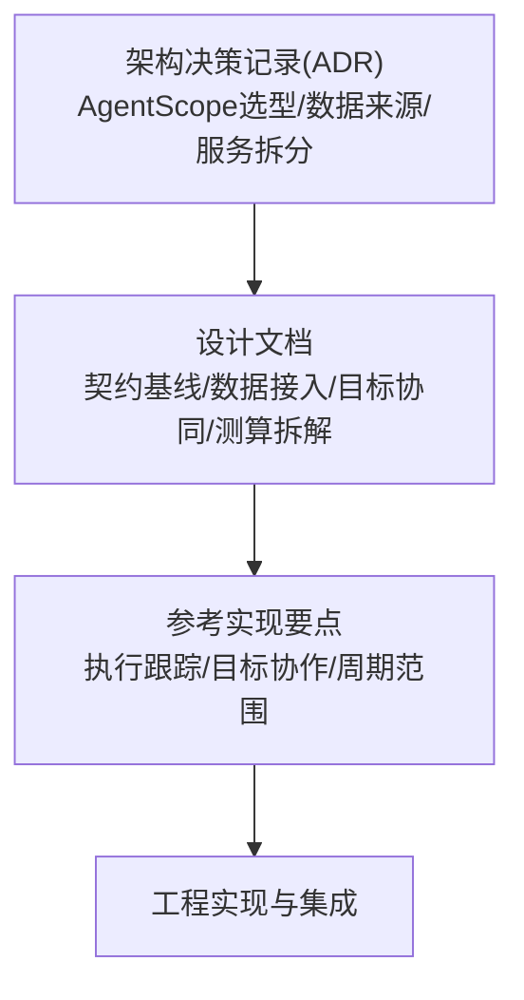

**图表来源** 
- [0001-AI-Agent框架选型-AgentScope.md](file://docs/adr/0001-AI-Agent框架选型-AgentScope.md)
- [0002-数值预测来源-大数据团队.md](file://docs/adr/0002-数值预测来源-大数据团队.md)
- [0003-服务拆分策略.md](file://docs/adr/0003-服务拆分策略.md)
- [00-契约基线-接口清单.md](file://docs/design/00-契约基线-接口清单.md)
- [数据接入与达成计算.md](file://docs/design/数据接入与达成计算.md)
- [目标协同管理.md](file://docs/design/目标协同管理.md)
- [目标测算与拆解.md](file://docs/design/目标测算与拆解.md)
- [ref_execution_tracking_module.md](file://docs/reference/.claude/agent-memory/requirements-analyst/ref_execution_tracking_module.md)
- [ref_target_collaboration_module.md](file://docs/reference/.claude/agent-memory/requirements-analyst/ref_target_collaboration_module.md)

**章节来源**
- [0001-AI-Agent框架选型-AgentScope.md](file://docs/adr/0001-AI-Agent框架选型-AgentScope.md)
- [0002-数值预测来源-大数据团队.md](file://docs/adr/0002-数值预测来源-大数据团队.md)
- [0003-服务拆分策略.md](file://docs/adr/0003-服务拆分策略.md)
- [00-契约基线-接口清单.md](file://docs/design/00-契约基线-接口清单.md)
- [数据接入与达成计算.md](file://docs/design/数据接入与达成计算.md)
- [目标协同管理.md](file://docs/design/目标协同管理.md)
- [目标测算与拆解.md](file://docs/design/目标测算与拆解.md)
- [MEMORY.md](file://docs/reference/.claude/agent-memory/requirements-analyst/MEMORY.md)
- [one-period-scope.md](file://docs/reference/.claude/agent-memory/requirements-analyst/one-period-scope.md)
- [ref_execution_tracking_module.md](file://docs/reference/.claude/agent-memory/requirements-analyst/ref_execution_tracking_module.md)
- [ref_target_collaboration_module.md](file://docs/reference/.claude/agent-memory/requirements-analyst/ref_target_collaboration_module.md)

## 核心组件
基于设计文档与参考实现要点，系统由以下核心组件构成：
- 代理层（Agent Layer）：负责业务意图解析、工具调用、上下文记忆与结果收敛
- 编排层（Orchestrator）：负责任务分解、调度、重试与超时控制
- 消息总线（Message Bus）：提供异步消息传递、事件订阅与发布
- 状态存储（State Store）：持久化代理状态、会话上下文与执行轨迹
- 外部系统集成：对接目标协同管理系统、大数据预测服务与下游数据源

上述组件通过标准化接口进行交互，确保可插拔与可扩展性。

**章节来源**
- [00-契约基线-接口清单.md](file://docs/design/00-契约基线-接口清单.md)
- [ref_execution_tracking_module.md](file://docs/reference/.claude/agent-memory/requirements-analyst/ref_execution_tracking_module.md)
- [ref_target_collaboration_module.md](file://docs/reference/.claude/agent-memory/requirements-analyst/ref_target_collaboration_module.md)

## 架构总览
下图展示Agent架构的总体分层与关键交互路径，包括代理生命周期、任务编排、消息传递与状态同步。

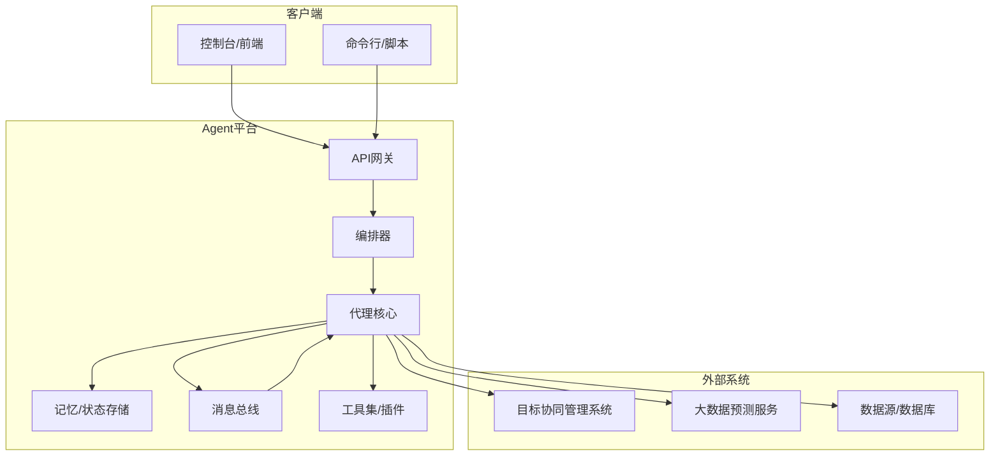

**图表来源**
- [00-契约基线-接口清单.md](file://docs/design/00-契约基线-接口清单.md)
- [目标协同管理.md](file://docs/design/目标协同管理.md)
- [数据接入与达成计算.md](file://docs/design/数据接入与达成计算.md)
- [ref_execution_tracking_module.md](file://docs/reference/.claude/agent-memory/requirements-analyst/ref_execution_tracking_module.md)

## 详细组件分析

### 代理生命周期管理
代理从创建到销毁经历初始化、准备、运行、暂停、恢复与终止等阶段。编排器根据任务类型与资源可用性触发状态迁移，并通过消息总线广播生命周期事件，供监控与审计使用。

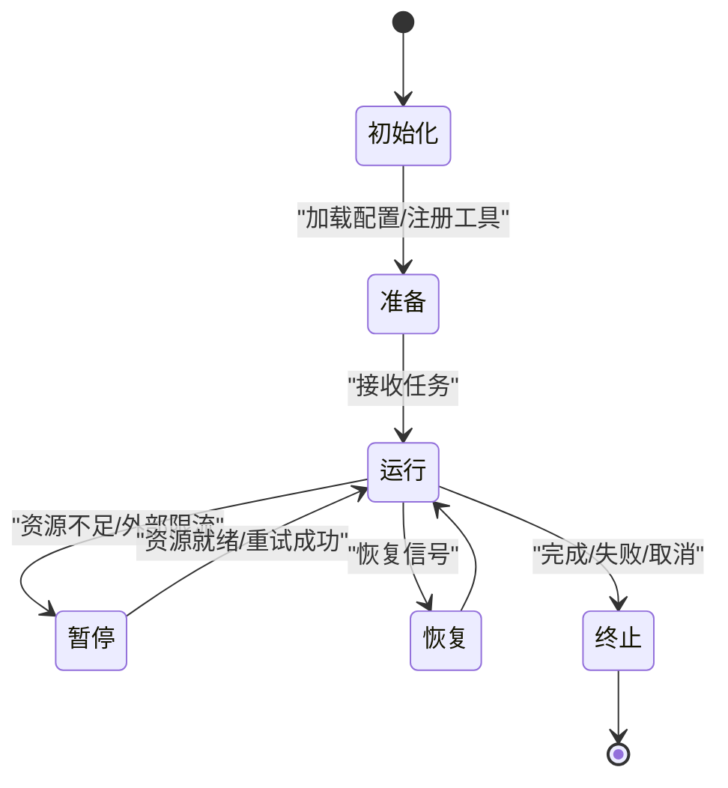

**图表来源**
- [00-契约基线-接口清单.md](file://docs/design/00-契约基线-接口清单.md)
- [ref_execution_tracking_module.md](file://docs/reference/.claude/agent-memory/requirements-analyst/ref_execution_tracking_module.md)

**章节来源**
- [00-契约基线-接口清单.md](file://docs/design/00-契约基线-接口清单.md)
- [ref_execution_tracking_module.md](file://docs/reference/.claude/agent-memory/requirements-analyst/ref_execution_tracking_module.md)

### 任务编排机制
编排器将复杂目标拆解为子任务，按依赖关系构建执行图，支持并行与串行混合调度。对每个节点设置超时、重试与熔断策略，并通过状态存储持久化执行轨迹，便于回溯与审计。

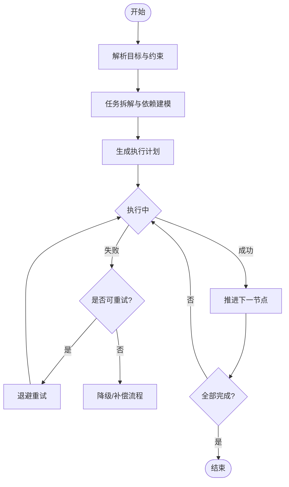

**图表来源**
- [00-契约基线-接口清单.md](file://docs/design/00-契约基线-接口清单.md)
- [目标测算与拆解.md](file://docs/design/目标测算与拆解.md)

**章节来源**
- [00-契约基线-接口清单.md](file://docs/design/00-契约基线-接口清单.md)
- [目标测算与拆解.md](file://docs/design/目标测算与拆解.md)

### 消息传递模式
系统采用发布-订阅与请求-应答两种模式：
- 发布-订阅：用于事件广播（如生命周期事件、指标上报）
- 请求-应答：用于同步调用（如查询目标、提交结果）

消息体遵循统一的数据格式规范，包含标识、时间戳、版本、载荷与签名字段，确保跨系统一致性。

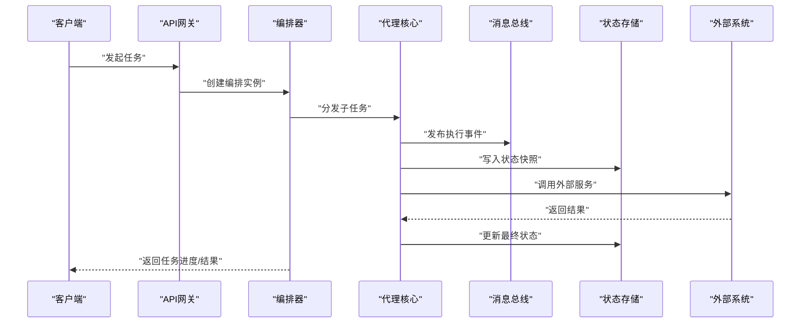

**图表来源**
- [00-契约基线-接口清单.md](file://docs/design/00-契约基线-接口清单.md)
- [数据接入与达成计算.md](file://docs/design/数据接入与达成计算.md)

**章节来源**
- [00-契约基线-接口清单.md](file://docs/design/00-契约基线-接口清单.md)
- [数据接入与达成计算.md](file://docs/design/数据接入与达成计算.md)

### 状态同步策略
状态同步采用“最终一致性+增量快照”的策略：
- 增量快照：每次状态变更仅持久化差异，降低存储压力
- 冲突解决：基于版本号与时间戳进行合并，必要时引入人工干预
- 一致性保障：在关键路径上采用事务或补偿机制，确保端到端正确性

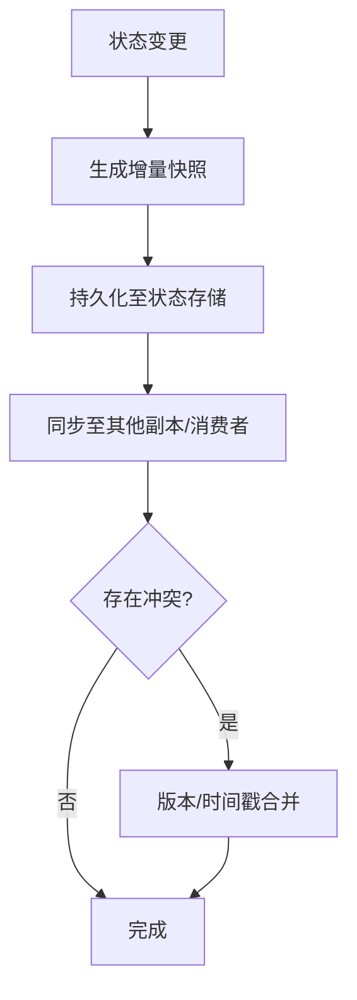

**图表来源**
- [ref_execution_tracking_module.md](file://docs/reference/.claude/agent-memory/requirements-analyst/ref_execution_tracking_module.md)

**章节来源**
- [ref_execution_tracking_module.md](file://docs/reference/.claude/agent-memory/requirements-analyst/ref_execution_tracking_module.md)

### 与目标协同管理系统的集成方案
- API接口设计：定义统一的REST/gRPC接口清单，明确方法、参数、返回值与错误码
- 数据格式规范：采用JSON Schema描述数据结构，包含必填字段、枚举值与校验规则
- 错误处理机制：区分网络异常、业务异常与数据不一致三类，提供重试、回滚与告警策略

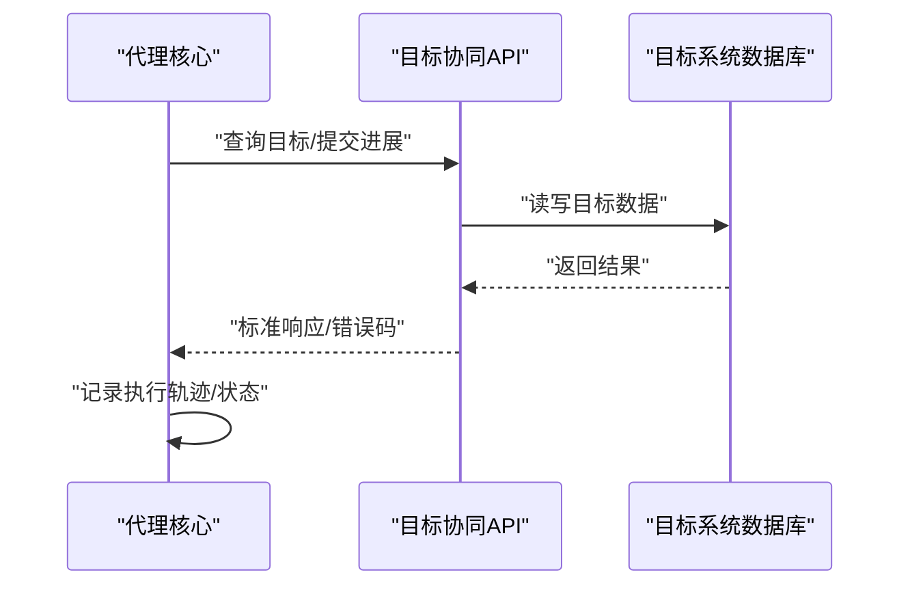

**图表来源**
- [00-契约基线-接口清单.md](file://docs/design/00-契约基线-接口清单.md)
- [目标协同管理.md](file://docs/design/目标协同管理.md)

**章节来源**
- [00-契约基线-接口清单.md](file://docs/design/00-契约基线-接口清单.md)
- [目标协同管理.md](file://docs/design/目标协同管理.md)

### AgentScope框架选型决策
- 技术优势：模块化设计、丰富的工具生态、良好的扩展性与社区活跃度
- 性能特点：异步并发、低延迟消息处理、可观测性强
- 生态兼容性：与主流LLM、向量数据库、消息中间件兼容，便于替换与升级

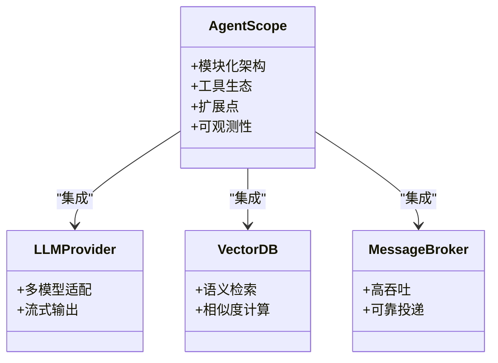

**图表来源**
- [0001-AI-Agent框架选型-AgentScope.md](file://docs/adr/0001-AI-Agent框架选型-AgentScope.md)

**章节来源**
- [0001-AI-Agent框架选型-AgentScope.md](file://docs/adr/0001-AI-Agent框架选型-AgentScope.md)

### 数值预测来源与大数据团队协作
- 数据来源：来自大数据团队的数值预测服务，提供周期性预测结果
- 数据质量：包含置信度、误差区间与更新时间戳
- 集成方式：通过标准API拉取或订阅推送，结合本地缓存与去重逻辑

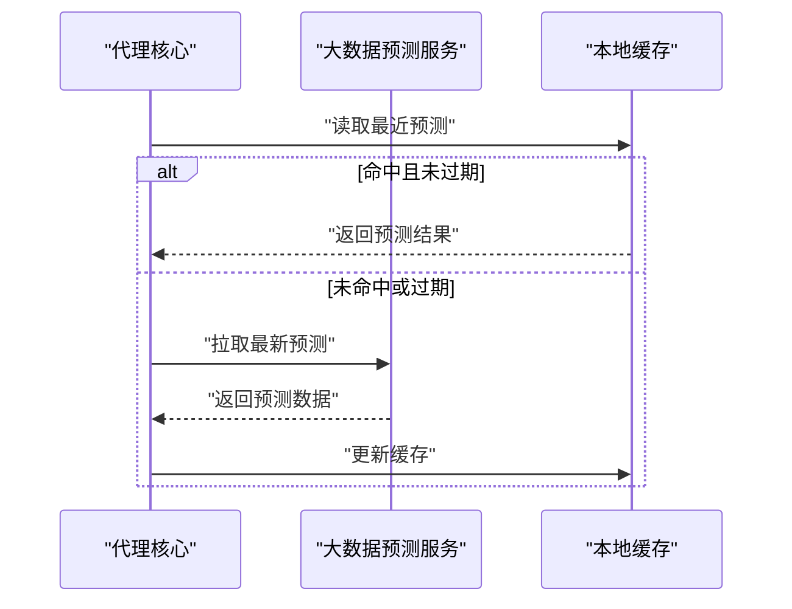

**图表来源**
- [0002-数值预测来源-大数据团队.md](file://docs/adr/0002-数值预测来源-大数据团队.md)
- [数据接入与达成计算.md](file://docs/design/数据接入与达成计算.md)

**章节来源**
- [0002-数值预测来源-大数据团队.md](file://docs/adr/0002-数值预测来源-大数据团队.md)
- [数据接入与达成计算.md](file://docs/design/数据接入与达成计算.md)

### 服务拆分策略
- 拆分原则：按业务能力与数据边界划分，减少耦合，提升可维护性
- 边界定义：代理核心、编排器、消息总线与外部系统各自独立演进
- 治理策略：统一接口契约、版本管理与灰度发布

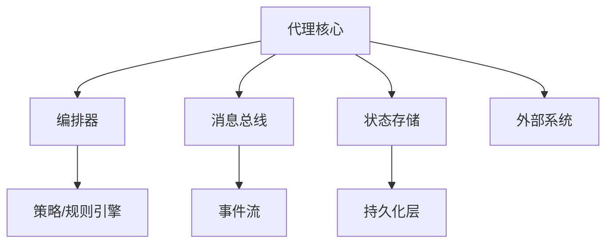

**图表来源**
- [0003-服务拆分策略.md](file://docs/adr/0003-服务拆分策略.md)

**章节来源**
- [0003-服务拆分策略.md](file://docs/adr/0003-服务拆分策略.md)

### 配置示例与最佳实践
- 基础配置：定义代理能力、工具列表、消息通道与状态存储后端
- 高级配置：设置重试次数、超时阈值、并发度与日志级别
- 最佳实践：
  - 使用环境变量管理敏感信息
  - 为关键路径添加可观测性埋点
  - 定期清理历史状态与日志
  - 对第三方服务增加熔断与降级

[本节为通用指导，不直接分析具体文件，故无“章节来源”]

### 扩展自定义Agent能力
- 插件机制：通过标准接口注册新工具与处理器
- 上下文注入：在运行时动态注入用户偏好与环境变量
- 测试策略：编写单元测试与集成测试，覆盖正常与异常路径

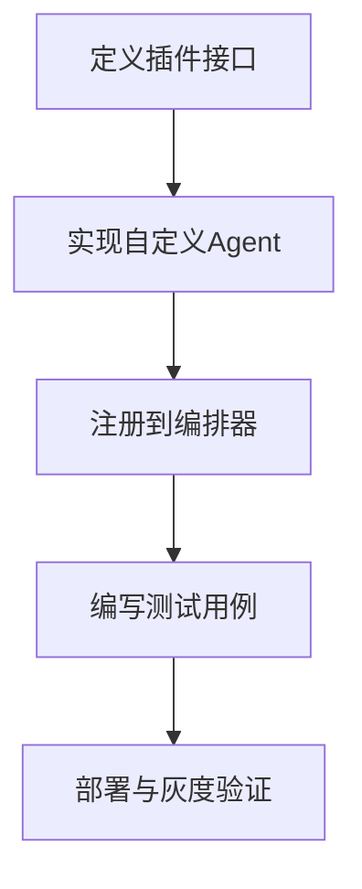

**图表来源**
- [00-契约基线-接口清单.md](file://docs/design/00-契约基线-接口清单.md)

**章节来源**
- [00-契约基线-接口清单.md](file://docs/design/00-契约基线-接口清单.md)

## 依赖分析
系统内部组件与外部依赖关系如下：

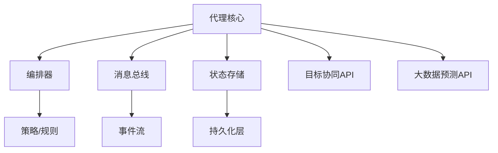

**图表来源**
- [00-契约基线-接口清单.md](file://docs/design/00-契约基线-接口清单.md)
- [目标协同管理.md](file://docs/design/目标协同管理.md)
- [数据接入与达成计算.md](file://docs/design/数据接入与达成计算.md)

**章节来源**
- [00-契约基线-接口清单.md](file://docs/design/00-契约基线-接口清单.md)
- [目标协同管理.md](file://docs/design/目标协同管理.md)
- [数据接入与达成计算.md](file://docs/design/数据接入与达成计算.md)

## 性能考虑
- 并发与吞吐：合理设置线程池与队列容量，避免阻塞与背压
- 缓存策略：热点数据本地缓存，冷数据按需拉取
- 序列化与传输：选择高效序列化格式，压缩大对象
- 可观测性：采集延迟、错误率与资源利用率指标，建立告警阈值

[本节为通用指导，不直接分析具体文件，故无“章节来源”]

## 故障排查指南
- 常见问题：
  - 任务卡死：检查编排器状态与外部服务健康度
  - 数据不一致：核对版本号与时间戳，定位冲突点
  - 消息丢失：确认消息总线持久化与重试策略
- 诊断步骤：
  - 查看执行轨迹与状态快照
  - 检查日志与指标
  - 复现最小用例并逐步隔离问题

**章节来源**
- [ref_execution_tracking_module.md](file://docs/reference/.claude/agent-memory/requirements-analyst/ref_execution_tracking_module.md)

## 结论
本架构以AgentScope为核心，结合清晰的服务拆分与标准化的接口契约，实现了高内聚、低耦合的AI Agent平台。通过完善的编排、消息与状态管理机制，系统在可扩展性、可观测性与稳定性方面具备良好表现。后续将持续优化性能与生态兼容性，推动复杂业务场景的规模化落地。

[本节为总结性内容，不直接分析具体文件，故无“章节来源”]

## 附录
- 参考实现要点：
  - 执行跟踪模块：关注状态快照、事件回放与审计
  - 目标协作模块：关注接口契约、数据一致性与错误处理
  - 周期范围：明确单期目标与跨期目标的边界与流转

**章节来源**
- [MEMORY.md](file://docs/reference/.claude/agent-memory/requirements-analyst/MEMORY.md)
- [one-period-scope.md](file://docs/reference/.claude/agent-memory/requirements-analyst/one-period-scope.md)
- [ref_execution_tracking_module.md](file://docs/reference/.claude/agent-memory/requirements-analyst/ref_execution_tracking_module.md)
- [ref_target_collaboration_module.md](file://docs/reference/.claude/agent-memory/requirements-analyst/ref_target_collaboration_module.md)