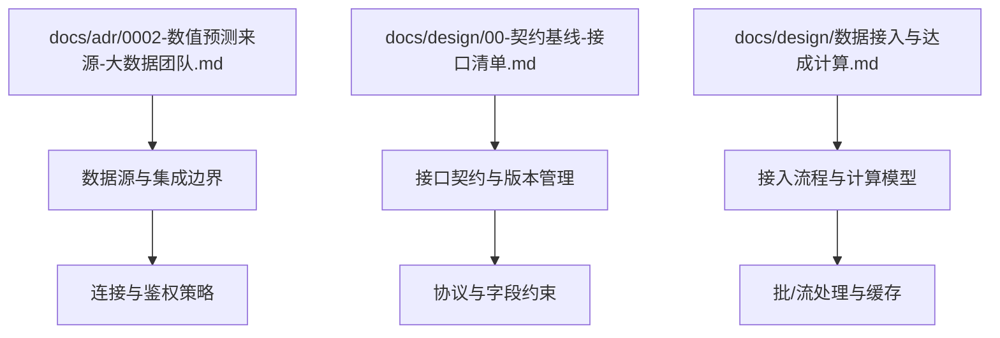
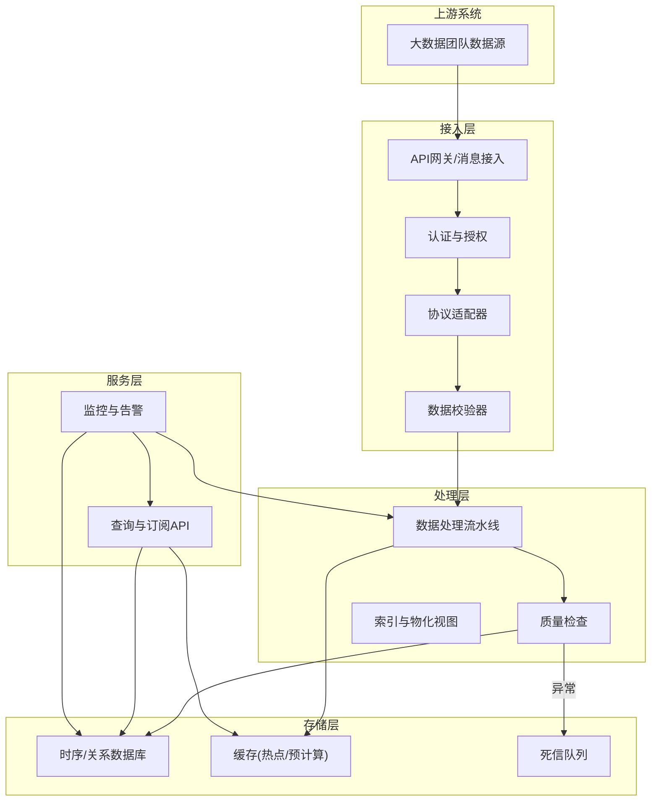
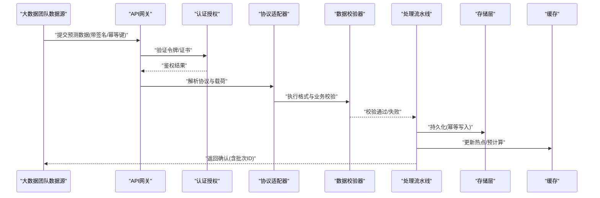
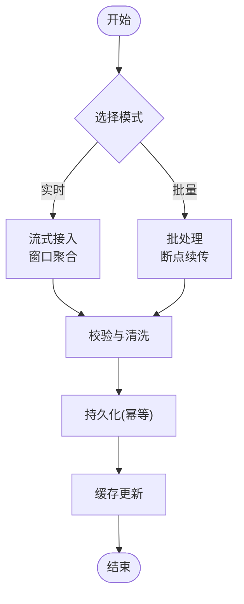
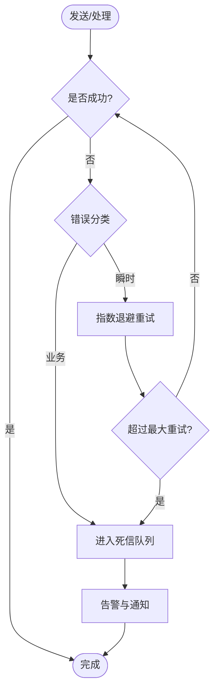
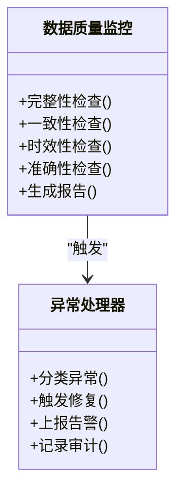
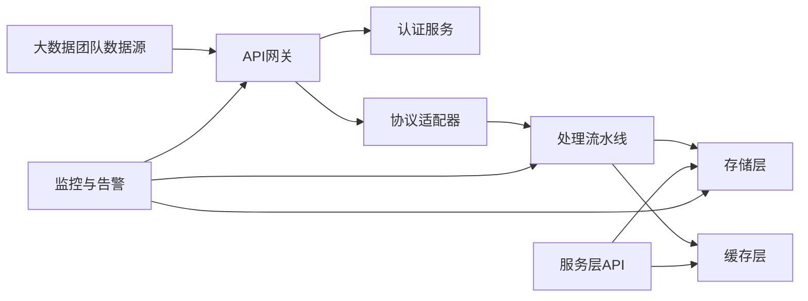

# 数据集成架构

<cite>
**本文引用的文件**   
- [0002-数值预测来源-大数据团队.md](file://docs/adr/0002-数值预测来源-大数据团队.md)
- [00-契约基线-接口清单.md](file://docs/design/00-契约基线-接口清单.md)
- [数据接入与达成计算.md](file://docs/design/数据接入与达成计算.md)
</cite>

## 目录
1. [简介](#简介)
2. [项目结构](#项目结构)
3. [核心组件](#核心组件)
4. [架构总览](#架构总览)
5. [详细组件分析](#详细组件分析)
6. [依赖分析](#依赖分析)
7. [性能考虑](#性能考虑)
8. [故障排查指南](#故障排查指南)
9. [结论](#结论)
10. [附录](#附录)

## 简介
本技术文档面向数据集成架构，聚焦于与大数据团队的系统集成方案。内容覆盖数据源识别、连接管理与认证授权机制；数值预测数据的接入流程（格式规范、传输协议、校验规则）；数据流转架构（实时处理、批量同步、缓存策略）；可靠性保障（重试、容错、监控告警）；以及数据质量监控与异常处理方案。文档同时提供数据流图、系统架构图和集成示例代码路径，帮助读者快速理解并落地实施。

## 项目结构
仓库以设计文档为主，围绕“数值预测来源”“接口契约”“数据接入与达成计算”三大主题展开，形成从需求到设计的闭环。

图表来源
- [0002-数值预测来源-大数据团队.md](file://docs/adr/0002-数值预测来源-大数据团队.md)
- [00-契约基线-接口清单.md](file://docs/design/00-契约基线-接口清单.md)
- [数据接入与达成计算.md](file://docs/design/数据接入与达成计算.md)

章节来源
- [0002-数值预测来源-大数据团队.md](file://docs/adr/0002-数值预测来源-大数据团队.md)
- [00-契约基线-接口清单.md](file://docs/design/00-契约基线-接口清单.md)
- [数据接入与达成计算.md](file://docs/design/数据接入与达成计算.md)

## 核心组件
- 数据源识别与注册：明确大数据团队提供的数值预测数据源范围、命名规范与元数据描述，建立统一的数据源目录与发现机制。
- 连接管理与认证授权：定义统一的连接配置、密钥轮换、访问控制策略与最小权限原则，确保跨域安全访问。
- 数值预测数据接入：规定数据格式、时间粒度、指标口径、必填字段与校验规则，支持HTTP/REST或消息队列等传输协议。
- 数据流转架构：构建“采集—清洗—校验—落库—服务化”的流水线，兼顾实时与批量场景，并提供多级缓存策略。
- 可靠性与可观测性：实现幂等写入、重试退避、死信队列、断点续传、指标采集与告警联动。
- 数据质量与异常处理：建立完整性、一致性、时效性与准确性检查，结合异常分类、自动修复与人工干预流程。

章节来源
- [0002-数值预测来源-大数据团队.md](file://docs/adr/0002-数值预测来源-大数据团队.md)
- [00-契约基线-接口清单.md](file://docs/design/00-契约基线-接口清单.md)
- [数据接入与达成计算.md](file://docs/design/数据接入与达成计算.md)

## 架构总览
整体采用分层解耦与事件驱动相结合的设计：上游由大数据团队通过标准接口推送数值预测数据；接入层负责鉴权、协议适配与格式校验；处理层完成清洗、聚合与质量检查；存储层提供时序/关系型存储与热点缓存；服务层对外暴露查询与订阅能力。

图表来源
- [0002-数值预测来源-大数据团队.md](file://docs/adr/0002-数值预测来源-大数据团队.md)
- [00-契约基线-接口清单.md](file://docs/design/00-契约基线-接口清单.md)
- [数据接入与达成计算.md](file://docs/design/数据接入与达成计算.md)

## 详细组件分析

### 数据源识别与连接管理
- 数据源登记：为每个预测指标建立唯一标识、业务含义、更新频率、责任人及SLA。
- 连接配置：集中化管理连接参数（端点、超时、重试、TLS证书），支持多环境隔离与动态刷新。
- 认证授权：基于令牌或双向TLS进行身份核验，按数据源维度授予最小权限，定期轮换密钥。
- 健康检查：周期性探测连通性与延迟，失败时触发降级与告警。

章节来源
- [0002-数值预测来源-大数据团队.md](file://docs/adr/0002-数值预测来源-大数据团队.md)
- [00-契约基线-接口清单.md](file://docs/design/00-契约基线-接口清单.md)

### 数值预测数据接入流程
- 数据格式规范：包含时间戳、指标键、数值、单位、置信区间、来源标记与扩展字段；时间采用统一时区与精度。
- 传输协议：优先使用HTTPS REST或消息队列；要求幂等键、签名与压缩可选。
- 校验规则：必填项检查、类型与范围校验、去重与顺序校验、跨表一致性校验。
- 接入入口：统一网关接收请求，路由至对应适配器与校验器，通过后进入处理流水线。

图表来源
- [00-契约基线-接口清单.md](file://docs/design/00-契约基线-接口清单.md)
- [数据接入与达成计算.md](file://docs/design/数据接入与达成计算.md)

章节来源
- [00-契约基线-接口清单.md](file://docs/design/00-契约基线-接口清单.md)
- [数据接入与达成计算.md](file://docs/design/数据接入与达成计算.md)

### 数据流转架构（实时/批量/缓存）
- 实时处理：对高频指标采用流式接入与窗口聚合，低延迟入库与缓存预热。
- 批量同步：对历史回溯与全量对齐采用批处理，支持断点续传与增量合并。
- 缓存策略：多级缓存（本地/分布式），热点指标TTL与失效策略，读写分离与一致性保证。

图表来源
- [数据接入与达成计算.md](file://docs/design/数据接入与达成计算.md)

章节来源
- [数据接入与达成计算.md](file://docs/design/数据接入与达成计算.md)

### 可靠性保障（重试/容错/监控告警）
- 重试策略：指数退避+抖动，区分瞬时错误与业务错误；设置最大重试次数与超时熔断。
- 容错处理：幂等写入、去重键、补偿任务、死信队列与人工复核通道。
- 监控告警：端到端延迟、吞吐、错误率、数据缺失与质量评分；阈值告警与自愈动作。

图表来源
- [数据接入与达成计算.md](file://docs/design/数据接入与达成计算.md)

章节来源
- [数据接入与达成计算.md](file://docs/design/数据接入与达成计算.md)

### 数据质量监控与异常处理
- 质量维度：完整性（缺失率）、一致性（口径一致）、时效性（延迟）、准确性（抽样核对）。
- 监控指标：数据到达率、重复率、空值率、越界率、校验失败率、回滚次数。
- 异常处理：分级响应（提示/阻断/回滚）、自动修复（补数/对齐）、人工介入（工单/审批）。

图表来源
- [数据接入与达成计算.md](file://docs/design/数据接入与达成计算.md)

章节来源
- [数据接入与达成计算.md](file://docs/design/数据接入与达成计算.md)

### 集成示例与参考
- 接口契约参考：参见接口清单中的端点、方法、请求/响应结构与状态码约定。
- 接入流程参考：参见数据接入与达成计算文档中的步骤说明与校验规则。
- 示例代码路径：建议在工程根目录下创建“集成示例”目录，存放各语言的SDK调用样例与配置文件模板，便于对接方快速上手。

章节来源
- [00-契约基线-接口清单.md](file://docs/design/00-契约基线-接口清单.md)
- [数据接入与达成计算.md](file://docs/design/数据接入与达成计算.md)

## 依赖分析
- 外部依赖：大数据团队数据源、认证服务、消息中间件（可选）、对象存储（可选）、监控与日志平台。
- 内部耦合：接入层与处理层通过标准化事件/消息解耦；处理层与存储层通过DAO抽象；服务层与存储层通过只读副本提升并发。
- 潜在风险：强依赖上游SLA、网络抖动导致重试风暴、缓存不一致引发脏读。建议通过限流、熔断、灰度发布与双写校验缓解。

图表来源
- [0002-数值预测来源-大数据团队.md](file://docs/adr/0002-数值预测来源-大数据团队.md)
- [00-契约基线-接口清单.md](file://docs/design/00-契约基线-接口清单.md)
- [数据接入与达成计算.md](file://docs/design/数据接入与达成计算.md)

章节来源
- [0002-数值预测来源-大数据团队.md](file://docs/adr/0002-数值预测来源-大数据团队.md)
- [00-契约基线-接口清单.md](file://docs/design/00-契约基线-接口清单.md)
- [数据接入与达成计算.md](file://docs/design/数据接入与达成计算.md)

## 性能考虑
- 吞吐与延迟：水平扩展接入节点，异步化处理与背压控制，热点指标预计算与缓存命中优化。
- 资源隔离：按租户/数据源划分线程池与队列，避免相互影响。
- 存储优化：分区与分片、冷热分层、索引按需创建与定期维护。
- 容量规划：根据峰值QPS与数据增长率预留扩容空间，关键链路压测常态化。

[本节为通用指导，不直接分析具体文件]

## 故障排查指南
- 常见问题定位：
  - 鉴权失败：检查令牌有效期、证书链与IP白名单。
  - 校验失败：对照接口契约与校验规则，定位字段缺失或越界。
  - 写入失败：查看幂等键冲突、事务回滚与死信队列消息。
  - 延迟升高：观察下游存储与缓存命中率，评估是否需要扩容或优化索引。
- 排障工具与流程：
  - 启用链路追踪与结构化日志，关联批次ID与幂等键。
  - 使用监控面板查看端到端延迟、错误率与质量指标。
  - 针对死信消息进行回放与补偿，必要时发起人工复核。

章节来源
- [00-契约基线-接口清单.md](file://docs/design/00-契约基线-接口清单.md)
- [数据接入与达成计算.md](file://docs/design/数据接入与达成计算.md)

## 结论
本架构以“标准化接入、严格校验、可靠流转、可观测治理”为核心目标，通过与大数据团队的清晰契约与接口基线，确保数值预测数据的准确、及时与安全。通过重试、容错与质量监控的组合策略，系统在复杂环境下仍能提供稳定服务能力。后续可在指标体系完善、自动化测试与混沌演练方面持续演进。

[本节为总结性内容，不直接分析具体文件]

## 附录
- 术语表：
  - 幂等键：用于去重与重试安全的唯一标识。
  - 死信队列：无法消费的消息暂存队列，供后续分析与恢复。
  - 物化视图：预计算的查询结果，用于加速热点查询。
- 参考文档：
  - 接口契约与版本管理：参见接口清单文档。
  - 接入流程与计算模型：参见数据接入与达成计算文档。
  - 数据来源与边界：参见数值预测来源文档。

章节来源
- [00-契约基线-接口清单.md](file://docs/design/00-契约基线-接口清单.md)
- [数据接入与达成计算.md](file://docs/design/数据接入与达成计算.md)
- [0002-数值预测来源-大数据团队.md](file://docs/adr/0002-数值预测来源-大数据团队.md)