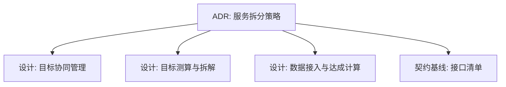
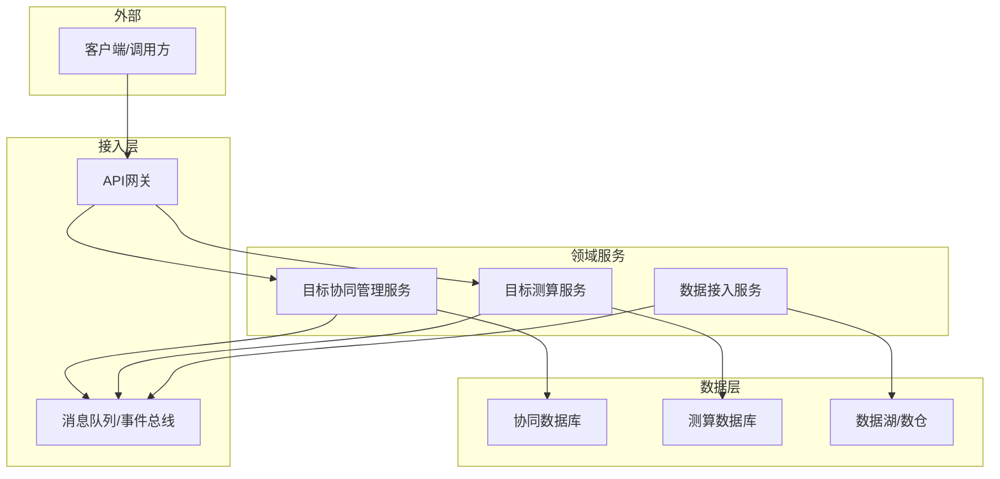
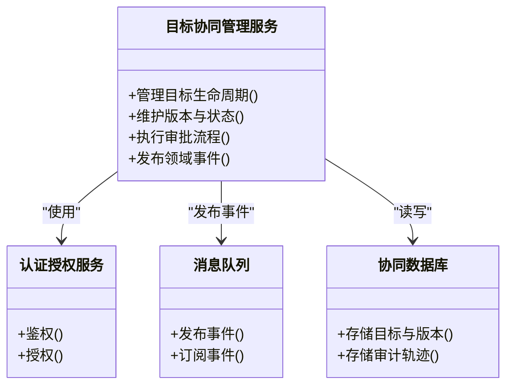
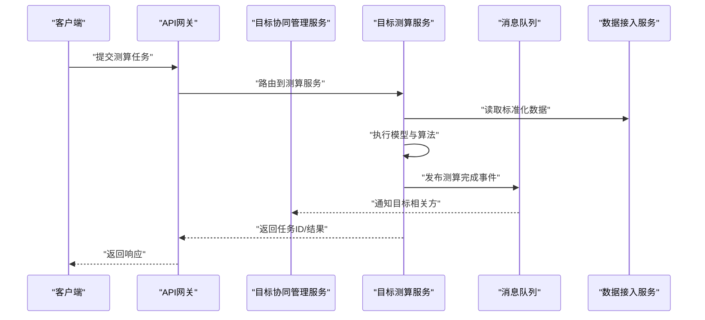
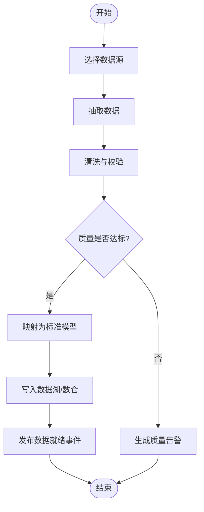
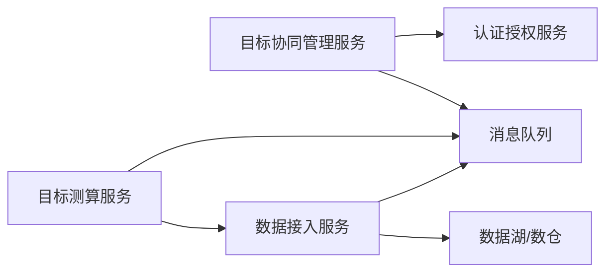

# 服务拆分策略

<cite>
**本文引用的文件**   
- [docs/adr/0003-服务拆分策略.md](file://docs/adr/0003-服务拆分策略.md)
- [docs/design/目标协同管理.md](file://docs/design/目标协同管理.md)
- [docs/design/目标测算与拆解.md](file://docs/design/目标测算与拆解.md)
- [docs/design/数据接入与达成计算.md](file://docs/design/数据接入与达成计算.md)
- [docs/design/00-契约基线-接口清单.md](file://docs/design/00-契约基线-接口清单.md)
</cite>

## 目录
1. [引言](#引言)
2. [项目结构](#项目结构)
3. [核心组件](#核心组件)
4. [架构总览](#架构总览)
5. [详细组件分析](#详细组件分析)
6. [依赖分析](#依赖分析)
7. [性能考虑](#性能考虑)
8. [故障排查指南](#故障排查指南)
9. [结论](#结论)
10. [附录](#附录)

## 引言
本文件面向“目标平台”的服务拆分策略，基于仓库中的设计文档与ADR，给出服务边界、职责划分、通信协议、治理机制以及部署与容器化方案。目标是形成可落地的微服务架构蓝图，指导后续实现与演进。

## 项目结构
本项目以文档驱动的方式沉淀架构决策与设计说明，关键目录与文件如下：
- docs/adr：架构决策记录，包含服务拆分策略的正式决策
- docs/design：领域设计与契约基线，覆盖目标协同管理、目标测算与拆解、数据接入与达成计算、接口清单等
- docs/reference：参考与记忆材料（可选）
- docs/requirements：需求对齐与遗留问题（可选）

图表来源
- [docs/adr/0003-服务拆分策略.md](file://docs/adr/0003-服务拆分策略.md)
- [docs/design/目标协同管理.md](file://docs/design/目标协同管理.md)
- [docs/design/目标测算与拆解.md](file://docs/design/目标测算与拆解.md)
- [docs/design/数据接入与达成计算.md](file://docs/design/数据接入与达成计算.md)
- [docs/design/00-契约基线-接口清单.md](file://docs/design/00-契约基线-接口清单.md)

章节来源
- [docs/adr/0003-服务拆分策略.md](file://docs/adr/0003-服务拆分策略.md)
- [docs/design/00-契约基线-接口清单.md](file://docs/design/00-契约基线-接口清单.md)

## 核心组件
围绕目标平台的核心业务域，建议拆分为以下服务：
- 目标协同管理服务：负责目标制定、分解、审批、版本与状态流转、协作与审计
- 目标测算服务：负责指标口径、模型与算法、情景假设、测算与回测、结果发布
- 数据接入服务：负责多源数据采集、清洗、校验、入库与数据质量监控
- 契约与网关层：对外暴露RESTful API，统一鉴权、限流、路由与协议转换
- 事件总线与消息中间件：承载异步解耦、事件驱动与跨域同步
- 共享能力：配置中心、注册发现、链路追踪、日志与指标采集

职责要点
- 单一职责：每个服务聚焦一个业务能力域，避免跨域逻辑渗透
- 高内聚低耦合：通过明确API契约与事件契约进行交互，内部变更不影响外部
- 领域驱动：以限界上下文为边界组织服务，保证领域一致性

章节来源
- [docs/adr/0003-服务拆分策略.md](file://docs/adr/0003-服务拆分策略.md)
- [docs/design/目标协同管理.md](file://docs/design/目标协同管理.md)
- [docs/design/目标测算与拆解.md](file://docs/design/目标测算与拆解.md)
- [docs/design/数据接入与达成计算.md](file://docs/design/数据接入与达成计算.md)

## 架构总览
整体采用“API网关 + 领域微服务 + 事件总线 + 数据层”的分层架构。外部请求经网关进入协同管理与测算服务；数据接入服务从上游系统拉取或接收推送数据，完成清洗入库后通过事件通知下游消费方。

图表来源
- [docs/adr/0003-服务拆分策略.md](file://docs/adr/0003-服务拆分策略.md)
- [docs/design/00-契约基线-接口清单.md](file://docs/design/00-契约基线-接口清单.md)

## 详细组件分析

### 目标协同管理服务
- 职责范围
  - 目标生命周期管理（创建、评审、发布、归档）
  - 目标分解与版本控制
  - 协作流程与审计轨迹
  - 权限与租户隔离
- 关键概念
  - 目标实体、版本、阶段、角色与权限
  - 工作流与审批节点
- 对外契约
  - RESTful API用于目标CRUD、版本切换、审批操作
  - 事件用于发布“目标已发布/已修订/已归档”等状态变更
- 依赖关系
  - 依赖认证与授权服务
  - 通过事件总线向测算服务发送“目标变更”事件
  - 持久化至协同数据库

图表来源
- [docs/design/目标协同管理.md](file://docs/design/目标协同管理.md)
- [docs/design/00-契约基线-接口清单.md](file://docs/design/00-契约基线-接口清单.md)

章节来源
- [docs/design/目标协同管理.md](file://docs/design/目标协同管理.md)
- [docs/design/00-契约基线-接口清单.md](file://docs/design/00-契约基线-接口清单.md)

### 目标测算服务
- 职责范围
  - 指标口径与参数管理
  - 测算模型与算法编排
  - 情景假设与批量测算
  - 结果输出与回溯
- 关键概念
  - 指标定义、模型版本、假设集、测算任务与结果
- 对外契约
  - RESTful API用于提交测算任务、查询结果、获取模型元信息
  - 事件用于发布“测算完成/失败”等结果事件
- 依赖关系
  - 订阅协同服务的“目标变更”事件触发重新测算
  - 读取数据接入服务产出的标准化数据
  - 持久化测算结果与模型元数据

图表来源
- [docs/design/目标测算与拆解.md](file://docs/design/目标测算与拆解.md)
- [docs/design/00-契约基线-接口清单.md](file://docs/design/00-契约基线-接口清单.md)

章节来源
- [docs/design/目标测算与拆解.md](file://docs/design/目标测算与拆解.md)
- [docs/design/00-契约基线-接口清单.md](file://docs/design/00-契约基线-接口清单.md)

### 数据接入服务
- 职责范围
  - 多源数据接入（批/流）、清洗、校验、去重
  - 数据质量规则与告警
  - 标准模型映射与入库
  - 数据血缘与可观测性
- 关键概念
  - 数据源、接入任务、清洗规则、质量报告、标准模型
- 对外契约
  - RESTful API用于接入任务管理、质量报告查询
  - 事件用于发布“数据就绪/质量异常”等事件
- 依赖关系
  - 写入数据湖/数仓
  - 向其他服务发布数据就绪事件，供测算与报表消费

图表来源
- [docs/design/数据接入与达成计算.md](file://docs/design/数据接入与达成计算.md)

章节来源
- [docs/design/数据接入与达成计算.md](file://docs/design/数据接入与达成计算.md)

### 契约与网关层
- 职责范围
  - 统一入口、路由、鉴权、限流、灰度与熔断
  - 协议适配（HTTP/gRPC/事件）
  - 请求/响应规范化与错误码体系
- 关键概念
  - 路由表、访问令牌、速率限制、熔断阈值
- 对外契约
  - 统一的RESTful API规范与错误语义
  - 开放API文档与SDK约定

章节来源
- [docs/design/00-契约基线-接口清单.md](file://docs/design/00-契约基线-接口清单.md)

## 依赖分析
- 直接依赖
  - 协同服务依赖认证授权与消息队列
  - 测算服务依赖数据接入服务的数据与消息队列
  - 数据接入服务依赖外部数据源与消息队列
- 间接依赖
  - 通过事件总线实现跨服务解耦，降低强依赖
- 潜在循环依赖
  - 应避免服务间直接双向调用，优先使用事件与异步回调

图表来源
- [docs/adr/0003-服务拆分策略.md](file://docs/adr/0003-服务拆分策略.md)
- [docs/design/00-契约基线-接口清单.md](file://docs/design/00-契约基线-接口清单.md)

章节来源
- [docs/adr/0003-服务拆分策略.md](file://docs/adr/0003-服务拆分策略.md)
- [docs/design/00-契约基线-接口清单.md](file://docs/design/00-契约基线-接口清单.md)

## 性能考虑
- 吞吐与延迟
  - 对热点接口实施缓存与分页
  - 测算任务采用异步批处理与分片并行
- 资源隔离
  - 按服务独立扩缩容，避免相互影响
- 数据层优化
  - 读写分离、索引优化、冷热分层
- 可观测性
  - 全链路追踪、指标采集与日志聚合，支撑容量规划与瓶颈定位

[本节为通用性能建议，不直接分析具体文件]

## 故障排查指南
- 常见问题定位
  - 接口超时：检查网关限流与下游服务健康状态
  - 事件丢失：核查消息队列堆积与消费者重试策略
  - 数据不一致：核对数据接入质量报告与溯源链路
- 诊断手段
  - 查看服务日志与链路追踪
  - 检查熔断与降级开关状态
  - 验证契约版本兼容性

章节来源
- [docs/design/00-契约基线-接口清单.md](file://docs/design/00-契约基线-接口清单.md)

## 结论
通过明确的领域边界与服务职责、清晰的契约与事件驱动通信、完善的治理与可观测性，目标平台可实现高内聚、低耦合、可扩展的微服务架构。后续应持续完善接口契约与事件契约，推进容器化与Kubernetes编排落地，并逐步引入服务网格以实现更细粒度的流量治理与安全控制。

[本节为总结性内容，不直接分析具体文件]

## 附录

### 服务间通信协议与模式
- RESTful API
  - 适用场景：同步查询、表单提交、幂等操作
  - 要求：统一错误码、版本化、幂等键
- 消息队列/事件驱动
  - 适用场景：异步解耦、最终一致性、跨域通知
  - 要求：事件幂等、重试与死信、顺序性保障（必要时）
- gRPC（可选）
  - 适用场景：高性能内部RPC、强类型契约
  - 要求：服务间直连、负载均衡与熔断

章节来源
- [docs/adr/0003-服务拆分策略.md](file://docs/adr/0003-服务拆分策略.md)
- [docs/design/00-契约基线-接口清单.md](file://docs/design/00-契约基线-接口清单.md)

### 服务治理机制
- 服务发现与注册
  - 服务启动时注册，心跳保活，动态更新路由
- 负载均衡
  - 客户端侧或服务端侧LB，支持权重与灰度
- 熔断与降级
  - 基于错误率与延迟阈值自动熔断，提供降级路径
- 监控与告警
  - 指标、日志、链路三件套，结合SLO设定告警策略

章节来源
- [docs/adr/0003-服务拆分策略.md](file://docs/adr/0003-服务拆分策略.md)

### 部署与容器化方案
- Docker镜像构建
  - 多阶段构建、最小基础镜像、非root运行
- Kubernetes编排
  - Deployment/StatefulSet、Service/Ingress、ConfigMap/Secret、HPA
- 服务网格集成（可选）
  - 流量治理、mTLS、可观测性增强

[本节为通用部署建议，不直接分析具体文件]