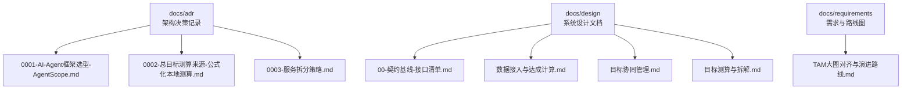
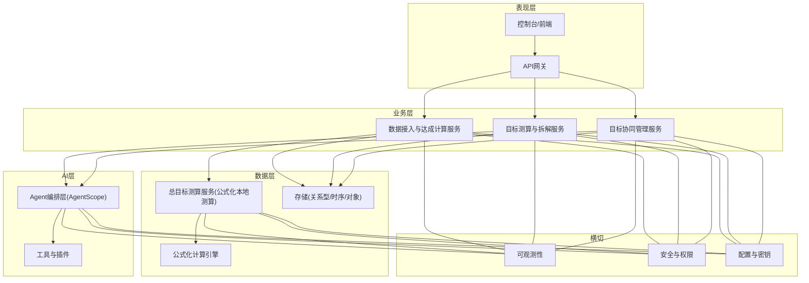
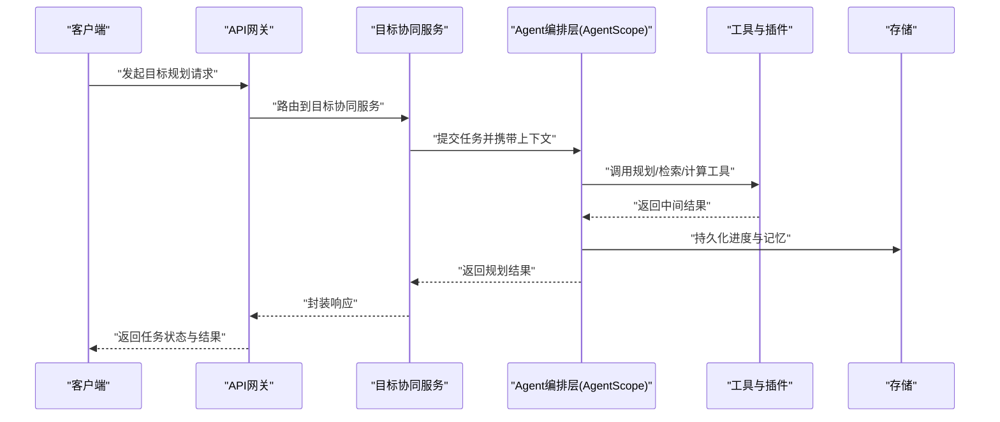
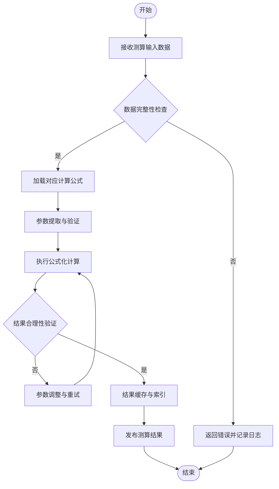
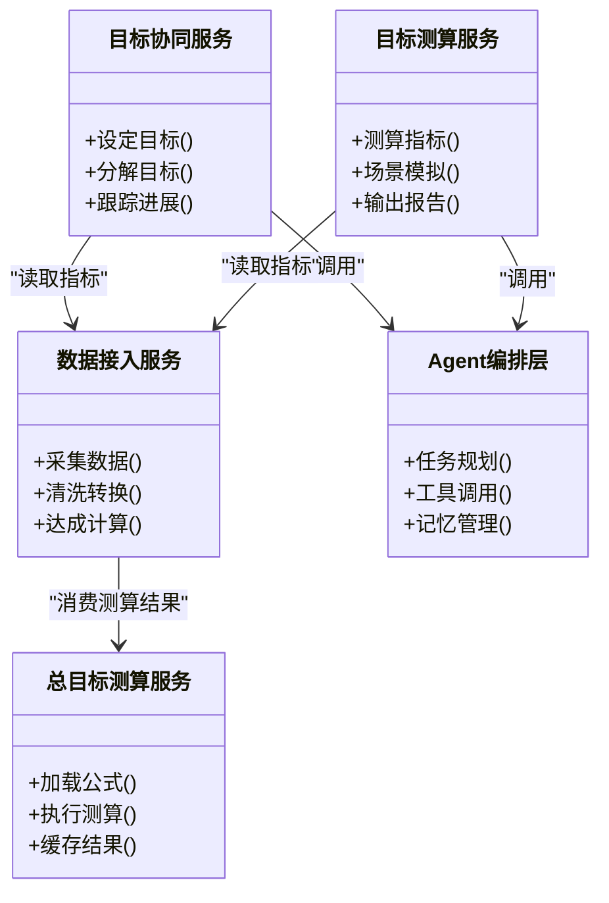
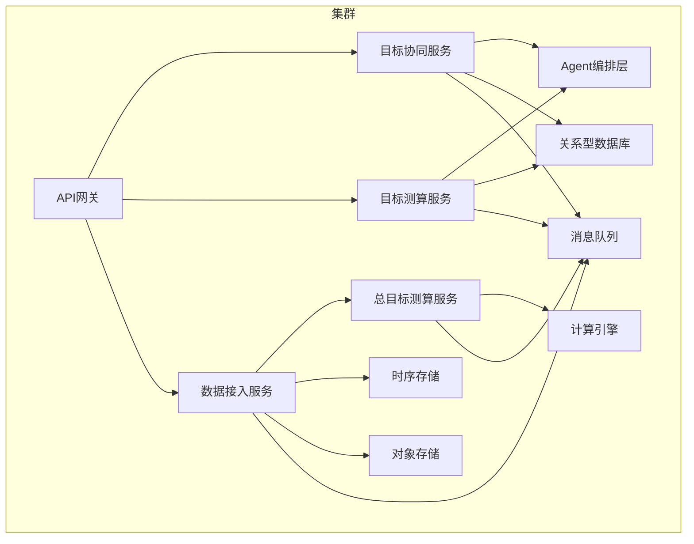
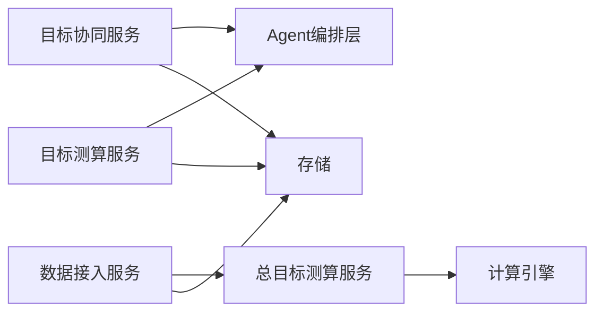

# 架构设计

<cite>
**本文引用的文件**   
- [0001-AI-Agent框架选型-AgentScope.md](file://docs/adr/0001-AI-Agent框架选型-AgentScope.md)
- [0002-总目标测算来源-公式化本地测算.md](file://docs/adr/0002-总目标测算来源-公式化本地测算.md)
- [0003-服务拆分策略.md](file://docs/adr/0003-服务拆分策略.md)
- [00-契约基线-接口清单.md](file://docs/design/00-契约基线-接口清单.md)
- [数据接入与达成计算.md](file://docs/design/数据接入与达成计算.md)
- [目标协同管理.md](file://docs/design/目标协同管理.md)
- [目标测算与拆解.md](file://docs/design/目标测算与拆解.md)
- [TAM大图对齐与演进路线.md](file://docs/requirements/TAM大图对齐与演进路线.md)
</cite>

## 更新摘要
**所做更改**   
- 更新了数值预测数据来源的架构设计，从大数据团队集成改为公式化本地测算
- 重新设计了总目标测算的数据流转机制和可靠性保障方案
- 简化了系统依赖关系，移除了对大数据团队系统的强耦合依赖
- 更新了相关架构图表以反映新的数据源和处理流程

## 目录
1. [引言](#引言)
2. [项目结构](#项目结构)
3. [核心组件](#核心组件)
4. [架构总览](#架构总览)
5. [详细组件分析](#详细组件分析)
6. [依赖分析](#依赖分析)
7. [性能考虑](#性能考虑)
8. [故障排查指南](#故障排查指南)
9. [结论](#结论)
10. [附录](#附录)

## 引言
本架构设计文档面向"目标平台"的目标管理与AI Agent能力，覆盖整体系统架构、技术栈选择与架构模式；重点阐述AI Agent框架选型（AgentScope）的技术优势、集成方案与扩展能力；说明总目标测算数据来源的架构设计与可靠性保障；定义服务拆分策略的设计原则、边界划分与通信协议；并提供架构图、组件交互图与部署拓扑图。同时总结技术决策的权衡、约束条件与演进路线。

**更新** 数值预测数据来源已从大数据团队集成调整为公式化本地测算，提升了系统的自主性和可维护性。

## 项目结构
仓库以文档驱动为主，包含架构决策记录（ADR）、设计文档、需求与参考材料等。关键目录：
- docs/adr：架构决策记录，涵盖Agent框架选型、总目标测算来源与服务拆分策略
- docs/design：系统设计文档，包括契约基线、数据接入与达成计算、目标协同管理、目标测算与拆解
- docs/requirements：需求与路线图，如TAM大图对齐与演进路线
- docs/reference：参考实现与模块说明

**图表来源** 
- [0001-AI-Agent框架选型-AgentScope.md](file://docs/adr/0001-AI-Agent框架选型-AgentScope.md)
- [0002-总目标测算来源-公式化本地测算.md](file://docs/adr/0002-总目标测算来源-公式化本地测算.md)
- [0003-服务拆分策略.md](file://docs/adr/0003-服务拆分策略.md)
- [00-契约基线-接口清单.md](file://docs/design/00-契约基线-接口清单.md)
- [数据接入与达成计算.md](file://docs/design/数据接入与达成计算.md)
- [目标协同管理.md](file://docs/design/目标协同管理.md)
- [目标测算与拆解.md](file://docs/design/目标测算与拆解.md)
- [TAM大图对齐与演进路线.md](file://docs/requirements/TAM大图对齐与演进路线.md)

## 核心组件
- AI Agent编排层：基于AgentScope构建，负责任务规划、工具调用、记忆与多Agent协作
- 总目标测算服务：采用公式化本地测算方案，提供可复用的目标计算结果与指标口径
- 目标协同与管理服务：承载目标设定、分解、跟踪与协同流程
- 契约与接口层：统一API契约、事件总线与消息格式，确保跨服务稳定交互
- 数据接入与达成计算：负责数据采集、清洗、聚合与达成率计算

上述组件通过明确的契约与事件进行解耦，支持横向扩展与独立演进。

**更新** 总目标测算服务已重构为公式化本地测算方案，减少了对大数据团队系统的依赖。

## 架构总览
总体采用分层与领域微服务相结合的模式：
- 表现层：面向用户与外部系统的API网关与开放接口
- 业务层：目标协同、目标测算与拆解、达成计算等核心域服务
- AI层：Agent编排与工具生态，支撑智能规划与自动化执行
- 数据层：总目标测算服务与本地公式化计算引擎，提供可靠数据供给
- 横切关注点：契约治理、可观测性、安全与权限、配置与密钥管理

**更新** 数据层已从大数据团队系统集成调整为本地公式化计算引擎，提升了系统的自主性和响应速度。

**图表来源**
- [0001-AI-Agent框架选型-AgentScope.md](file://docs/adr/0001-AI-Agent框架选型-AgentScope.md)
- [0002-总目标测算来源-公式化本地测算.md](file://docs/adr/0002-总目标测算来源-公式化本地测算.md)
- [0003-服务拆分策略.md](file://docs/adr/0003-服务拆分策略.md)
- [00-契约基线-接口清单.md](file://docs/design/00-契约基线-接口清单.md)
- [数据接入与达成计算.md](file://docs/design/数据接入与达成计算.md)
- [目标协同管理.md](file://docs/design/目标协同管理.md)
- [目标测算与拆解.md](file://docs/design/目标测算与拆解.md)

## 详细组件分析

### AI Agent框架选型与集成（AgentScope）
- 技术优势
  - 多Agent协作与编排能力，支持复杂任务的分解与并行执行
  - 丰富的工具生态与可扩展插件机制，便于接入内部系统与外部API
  - 记忆与上下文管理能力，提升长期任务的一致性与可追溯性
- 集成方案
  - 作为业务服务的AI增强层，通过标准化接口暴露推理与规划能力
  - 与目标协同、测算与拆解服务松耦合集成，遵循契约基线
  - 通过事件总线与异步任务队列，实现高吞吐与弹性伸缩
- 扩展能力
  - 插件化模型与工具注册，支持热插拔与灰度发布
  - 可观测性埋点与审计日志，满足合规与排障需求
  - 配置中心驱动的策略切换，支持A/B测试与回滚

**图表来源**
- [0001-AI-Agent框架选型-AgentScope.md](file://docs/adr/0001-AI-Agent框架选型-AgentScope.md)
- [00-契约基线-接口清单.md](file://docs/design/00-契约基线-接口清单.md)
- [目标协同管理.md](file://docs/design/目标协同管理.md)

### 总目标测算来源与公式化本地测算
- 测算方案与架构
  - 采用公式化本地测算方案，内置多种目标计算模型和算法
  - 支持动态公式配置和参数调优，适应不同业务场景需求
  - 提供完整的测算过程追踪和结果验证机制
- 数据处理机制
  - 实时计算与缓存结合，平衡计算精度与响应性能
  - 支持历史数据回溯和版本化管理，确保测算结果可重现
  - 内置数据质量检查和异常处理，保证计算结果的准确性
- 可靠性保障
  - 计算公式版本控制与兼容性检查，避免破坏性变更
  - 计算结果校验与一致性检查，防止数据漂移
  - 完善的监控告警和故障恢复机制

**更新** 总目标测算已从大数据团队预测服务调整为本地公式化计算，提升了系统的自主性和响应速度。

**图表来源**
- [0002-总目标测算来源-公式化本地测算.md](file://docs/adr/0002-总目标测算来源-公式化本地测算.md)
- [数据接入与达成计算.md](file://docs/design/数据接入与达成计算.md)

### 服务拆分策略与边界划分
- 设计原则
  - 按领域边界拆分，保持高内聚低耦合
  - 明确契约基线与接口清单，减少隐性依赖
  - 支持独立部署与弹性伸缩，提升交付效率
- 边界划分
  - 目标协同管理：目标设定、分解、跟踪与协同
  - 目标测算与拆解：指标口径、测算模型与场景模拟
  - 数据接入与达成计算：采集、清洗、聚合与达成率计算
  - 总目标测算服务：公式化本地测算与结果管理
- 通信协议
  - 同步：REST/gRPC用于强一致与低延迟场景
  - 异步：事件总线/消息队列用于最终一致与削峰填谷
  - 契约：OpenAPI/Protobuf + 版本化与兼容性校验

**更新** 服务架构中新增了总目标测算服务，替代了原有的数值预测服务。

**图表来源**
- [0003-服务拆分策略.md](file://docs/adr/0003-服务拆分策略.md)
- [00-契约基线-接口清单.md](file://docs/design/00-契约基线-接口清单.md)
- [目标协同管理.md](file://docs/design/目标协同管理.md)
- [目标测算与拆解.md](file://docs/design/目标测算与拆解.md)
- [数据接入与达成计算.md](file://docs/design/数据接入与达成计算.md)
- [0001-AI-Agent框架选型-AgentScope.md](file://docs/adr/0001-AI-Agent框架选型-AgentScope.md)

### 部署拓扑与运行环境
- 部署单元
  - 每个服务独立容器化，配合编排平台进行扩缩容与健康检查
  - 数据库与时序存储按读写分离与冷热分层优化
  - 公式化计算引擎作为独立组件部署，支持水平扩展
- 网络与安全
  - 服务间mTLS与最小权限访问控制
  - 网关层限流、熔断与降级策略
- 可观测性
  - 指标、日志、链路追踪三位一体，结合告警与自愈

**更新** 部署架构中新增了总目标测算服务和计算引擎组件。

**图表来源**
- [0003-服务拆分策略.md](file://docs/adr/0003-服务拆分策略.md)
- [00-契约基线-接口清单.md](file://docs/design/00-契约基线-接口清单.md)
- [数据接入与达成计算.md](file://docs/design/数据接入与达成计算.md)
- [0002-总目标测算来源-公式化本地测算.md](file://docs/adr/0002-总目标测算来源-公式化本地测算.md)

## 依赖分析
- 直接依赖
  - 业务服务依赖Agent编排层与数据存储
  - 数据接入服务依赖总目标测算服务与本地计算引擎
- 间接依赖
  - 通过事件总线与契约基线降低耦合度
- 潜在风险
  - 计算公式复杂度增加可能导致性能问题
  - 公式版本管理不当可能引发兼容性问题
- 缓解措施
  - 契约版本化与兼容性测试
  - 超时、重试与熔断策略
  - 全链路监控与快速回滚

**更新** 依赖关系已从外部大数据团队系统调整为内部公式化计算引擎，降低了外部依赖风险。

**图表来源**
- [0001-AI-Agent框架选型-AgentScope.md](file://docs/adr/0001-AI-Agent框架选型-AgentScope.md)
- [0002-总目标测算来源-公式化本地测算.md](file://docs/adr/0002-总目标测算来源-公式化本地测算.md)
- [0003-服务拆分策略.md](file://docs/adr/0003-服务拆分策略.md)
- [00-契约基线-接口清单.md](file://docs/design/00-契约基线-接口清单.md)
- [数据接入与达成计算.md](file://docs/design/数据接入与达成计算.md)
- [目标协同管理.md](file://docs/design/目标协同管理.md)
- [目标测算与拆解.md](file://docs/design/目标测算与拆解.md)

## 性能考虑
- 水平扩展：无状态服务横向扩容，热点数据缓存与分片
- 异步处理：长耗时任务入队，消费者池化与背压控制
- 资源隔离：CPU/内存配额与优先级调度，避免相互影响
- 数据路径优化：预聚合与物化视图，减少实时计算压力
- 可观测性：关键路径埋点与SLO度量，持续调优
- 计算优化：公式化计算的缓存策略和增量计算支持

**更新** 增加了公式化计算的缓存策略和增量计算支持，提升了测算性能。

## 故障排查指南
- 常见问题
  - 上游数据缺失或延迟：检查数据接入与测算服务健康状态与重试计数
  - Agent任务失败：查看工具调用日志与错误码，确认插件可用性与鉴权
  - 契约不一致：对比接口版本与兼容矩阵，定位变更点
  - 计算公式错误：检查公式版本和参数配置，验证计算逻辑正确性
- 诊断手段
  - 链路追踪：从网关到下游的全链路ID关联
  - 指标看板：QPS、延迟、错误率、饱和度
  - 日志聚合：结构化日志与关键字检索
  - 公式调试：计算过程追踪和中间结果验证
- 恢复策略
  - 快速回滚：版本化部署与一键回滚
  - 降级开关：关闭非核心功能保主流程
  - 数据修复：幂等重放与补偿任务
  - 公式回退：支持计算公式的版本回退

**更新** 新增了计算公式相关的故障排查和恢复策略。

## 结论
本架构以AgentScope为核心构建AI增强能力，结合清晰的服务边界与契约治理，形成高内聚、低耦合的可扩展体系。总目标测算服务采用公式化本地测算方案，替代了原有大数据团队集成，提升了系统的自主性、可维护性和响应性能。通过分层与领域微服务模式，系统在性能、可维护性与演进性方面具备良好基础。后续将围绕契约完善、可观测性增强与AI工具生态扩展持续推进。

**更新** 架构决策从外部依赖转向内部实现，体现了系统成熟度的提升和自主可控能力的增强。

## 附录
- 术语与缩写
  - ADR：架构决策记录
  - SLO：服务等级目标
  - mTLS：双向传输层安全
- 参考与演进
  - TAM大图对齐与演进路线：明确中长期目标与里程碑