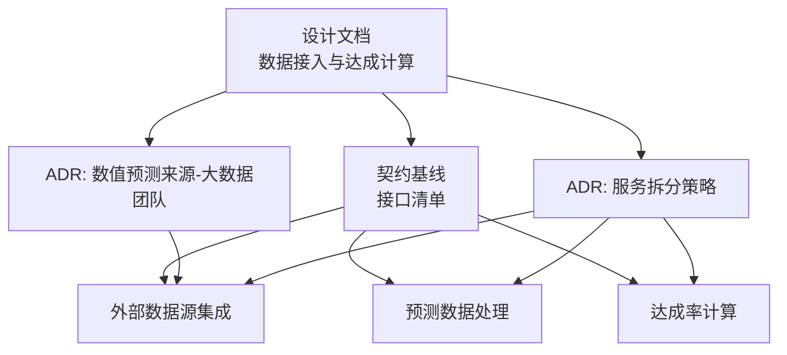
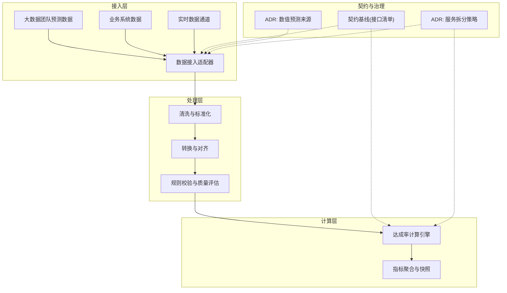
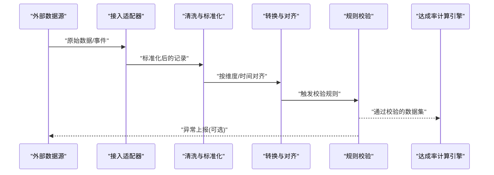
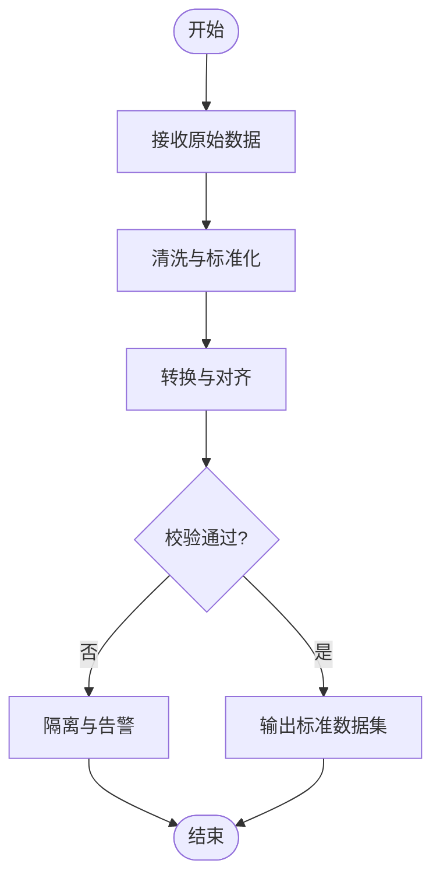
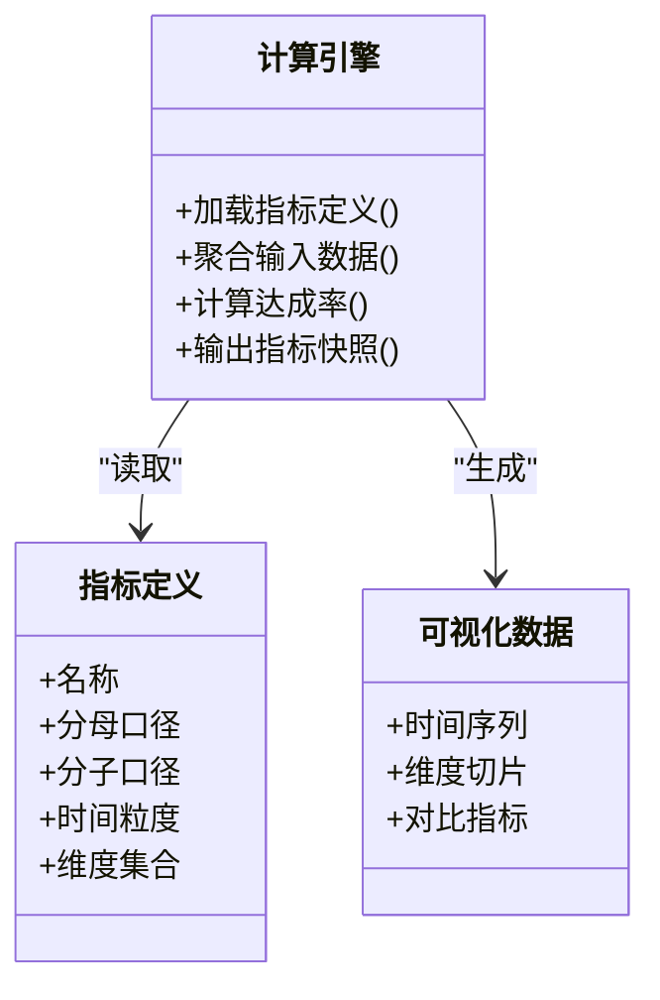
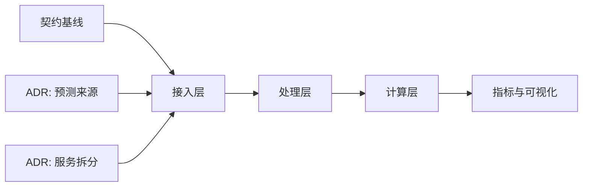

# 数据接入与达成计算

<cite>
**本文引用的文件**   
- [docs/design/数据接入与达成计算.md](file://docs/design/数据接入与达成计算.md)
- [docs/design/00-契约基线-接口清单.md](file://docs/design/00-契约基线-接口清单.md)
- [docs/adr/0002-数值预测来源-大数据团队.md](file://docs/adr/0002-数值预测来源-大数据团队.md)
- [docs/adr/0003-服务拆分策略.md](file://docs/adr/0003-服务拆分策略.md)
</cite>

## 目录
1. [引言](#引言)
2. [项目结构](#项目结构)
3. [核心组件](#核心组件)
4. [架构总览](#架构总览)
5. [详细组件分析](#详细组件分析)
6. [依赖分析](#依赖分析)
7. [性能考虑](#性能考虑)
8. [故障排查指南](#故障排查指南)
9. [结论](#结论)
10. [附录](#附录)

## 引言
本模块聚焦于“数据接入与达成计算”，目标是将来自多源的外部数据（如大数据团队的数值预测、业务系统同步数据、实时流式更新）统一接入，完成清洗、转换与校验后，进入达成率计算引擎，输出可观测的指标与可视化结果。文档面向产品、研发与运维人员，既提供高层架构说明，也给出关键流程与排障建议。

## 项目结构
仓库中与本主题相关的核心材料集中在 docs 目录下：
- design：设计文档与契约基线，定义数据接入与达成计算的总体方案与接口约定
- adr：架构决策记录，明确数据来源与服务拆分等关键决策
- requirements/acceptance/reference：需求与验收参考（与本主题相关度较低，本文不展开）

图表来源
- [docs/design/数据接入与达成计算.md](file://docs/design/数据接入与达成计算.md)
- [docs/design/00-契约基线-接口清单.md](file://docs/design/00-契约基线-接口清单.md)
- [docs/adr/0002-数值预测来源-大数据团队.md](file://docs/adr/0002-数值预测来源-大数据团队.md)
- [docs/adr/0003-服务拆分策略.md](file://docs/adr/0003-服务拆分策略.md)

章节来源
- [docs/design/数据接入与达成计算.md](file://docs/design/数据接入与达成计算.md)
- [docs/design/00-契约基线-接口清单.md](file://docs/design/00-契约基线-接口清单.md)
- [docs/adr/0002-数值预测来源-大数据团队.md](file://docs/adr/0002-数值预测来源-大数据团队.md)
- [docs/adr/0003-服务拆分策略.md](file://docs/adr/0003-服务拆分策略.md)

## 核心组件
围绕“数据接入与达成计算”的核心能力包括：
- 外部数据源集成：对接大数据团队预测数据、业务系统数据、实时数据通道
- 预测数据处理：对预测数据进行清洗、转换、对齐与校验
- 达成率计算引擎：基于统一口径进行达成率计算，并产出指标与可视化数据
- 契约与接口：通过契约基线明确各子系统间的数据交换格式与调用约定
- 架构决策：在数据来源与服务边界上形成稳定共识，指导后续演进

章节来源
- [docs/design/数据接入与达成计算.md](file://docs/design/数据接入与达成计算.md)
- [docs/design/00-契约基线-接口清单.md](file://docs/design/00-契约基线-接口清单.md)
- [docs/adr/0002-数值预测来源-大数据团队.md](file://docs/adr/0002-数值预测来源-大数据团队.md)
- [docs/adr/0003-服务拆分策略.md](file://docs/adr/0003-服务拆分策略.md)

## 架构总览
整体采用分层与解耦的设计思路：
- 接入层：负责多源数据的拉取、订阅与适配，屏蔽上游差异
- 处理层：执行数据清洗、转换、校验与质量评估
- 计算层：实现达成率算法与指标聚合，支持批/流两种模式
- 契约层：以接口清单为约束，确保跨服务数据一致性与可演进性
- 决策支撑：依据 ADR 明确数据来源与服务边界，降低耦合风险

图表来源
- [docs/design/数据接入与达成计算.md](file://docs/design/数据接入与达成计算.md)
- [docs/design/00-契约基线-接口清单.md](file://docs/design/00-契约基线-接口清单.md)
- [docs/adr/0002-数值预测来源-大数据团队.md](file://docs/adr/0002-数值预测来源-大数据团队.md)
- [docs/adr/0003-服务拆分策略.md](file://docs/adr/0003-服务拆分策略.md)

## 详细组件分析

### 外部数据源集成
- 大数据团队预测数据接入
  - 数据来源与更新节奏由 ADR 明确，接入适配器需遵循契约基线的字段与语义约定
  - 典型场景：T+1 批量预测数据入库；必要时支持增量补数
- 业务系统数据同步
  - 常见方式：数据库变更捕获、API 拉取或消息队列订阅
  - 需要幂等写入与去重策略，保障重复推送下的数据一致性
- 实时数据更新
  - 适用于高频指标或事件驱动场景，需具备背压与窗口聚合能力
  - 与批处理链路并行运行，最终通过时间戳与版本键合并

图表来源
- [docs/design/数据接入与达成计算.md](file://docs/design/数据接入与达成计算.md)
- [docs/design/00-契约基线-接口清单.md](file://docs/design/00-契约基线-接口清单.md)
- [docs/adr/0002-数值预测来源-大数据团队.md](file://docs/adr/0002-数值预测来源-大数据团队.md)

章节来源
- [docs/design/数据接入与达成计算.md](file://docs/design/数据接入与达成计算.md)
- [docs/design/00-契约基线-接口清单.md](file://docs/design/00-契约基线-接口清单.md)
- [docs/adr/0002-数值预测来源-大数据团队.md](file://docs/adr/0002-数值预测来源-大数据团队.md)

### 预测数据处理
- 清洗与标准化
  - 去除空值与非法字符，统一单位与度量口径
  - 时间与时区规范化，保证跨源可比
- 转换与对齐
  - 将不同粒度的数据对齐到统一的维度（如组织、品类、周期）
  - 建立主键与版本键，支持回溯与重算
- 校验与质量评估
  - 范围检查、分布异常检测、缺失率阈值告警
  - 对不符合契约的数据打标签并隔离，避免污染下游

图表来源
- [docs/design/数据接入与达成计算.md](file://docs/design/数据接入与达成计算.md)
- [docs/design/00-契约基线-接口清单.md](file://docs/design/00-契约基线-接口清单.md)

章节来源
- [docs/design/数据接入与达成计算.md](file://docs/design/数据接入与达成计算.md)
- [docs/design/00-契约基线-接口清单.md](file://docs/design/00-契约基线-接口清单.md)

### 达成率计算引擎
- 指标定义
  - 明确分母（目标值）、分子（实际值/预测值）与时间窗口
  - 区分批处理与实时口径，避免混用导致偏差
- 计算逻辑
  - 支持多维度聚合（组织、区域、品类等）
  - 支持滚动窗口与累计达成，便于趋势分析
- 可视化展示
  - 输出结构化指标与时间序列，供前端渲染仪表盘与报表
  - 提供下钻与对比能力（同比/环比/目标差）

图表来源
- [docs/design/数据接入与达成计算.md](file://docs/design/数据接入与达成计算.md)
- [docs/design/00-契约基线-接口清单.md](file://docs/design/00-契约基线-接口清单.md)

章节来源
- [docs/design/数据接入与达成计算.md](file://docs/design/数据接入与达成计算.md)
- [docs/design/00-契约基线-接口清单.md](file://docs/design/00-契约基线-接口清单.md)

### 契约与接口
- 接口清单作为跨服务契约，规定：
  - 请求/响应结构与字段语义
  - 错误码与重试策略
  - 版本管理与兼容性要求
- 对数据接入与达成计算的影响：
  - 确保上游预测数据与下游计算口径一致
  - 为新数据源接入提供快速对齐路径

章节来源
- [docs/design/00-契约基线-接口清单.md](file://docs/design/00-契约基线-接口清单.md)

### 架构决策支撑
- 数值预测来源（大数据团队）
  - 明确数据来源、更新频率与责任边界
  - 影响接入适配器的调度与容错策略
- 服务拆分策略
  - 将接入、处理、计算拆分为独立服务，提升可维护性与扩展性
  - 通过契约与消息总线解耦，降低耦合风险

章节来源
- [docs/adr/0002-数值预测来源-大数据团队.md](file://docs/adr/0002-数值预测来源-大数据团队.md)
- [docs/adr/0003-服务拆分策略.md](file://docs/adr/0003-服务拆分策略.md)

## 依赖分析
- 内部依赖
  - 接入层依赖契约基线与 ADR 决策，确保数据语义与服务边界清晰
  - 处理层依赖清洗/转换/校验的可配置规则库
  - 计算层依赖指标定义与历史快照，支持回溯与重算
- 外部依赖
  - 大数据团队预测数据服务
  - 业务系统数据接口或数据管道
  - 实时数据通道（消息队列/流平台）

图表来源
- [docs/design/数据接入与达成计算.md](file://docs/design/数据接入与达成计算.md)
- [docs/design/00-契约基线-接口清单.md](file://docs/design/00-契约基线-接口清单.md)
- [docs/adr/0002-数值预测来源-大数据团队.md](file://docs/adr/0002-数值预测来源-大数据团队.md)
- [docs/adr/0003-服务拆分策略.md](file://docs/adr/0003-服务拆分策略.md)

章节来源
- [docs/design/数据接入与达成计算.md](file://docs/design/数据接入与达成计算.md)
- [docs/design/00-契约基线-接口清单.md](file://docs/design/00-契约基线-接口清单.md)
- [docs/adr/0002-数值预测来源-大数据团队.md](file://docs/adr/0002-数值预测来源-大数据团队.md)
- [docs/adr/0003-服务拆分策略.md](file://docs/adr/0003-服务拆分策略.md)

## 性能考虑
- 批处理优化
  - 分区与并行：按时间/维度分区，利用并行计算提升吞吐
  - 增量计算：仅对变化窗口重算，减少全量开销
- 实时处理优化
  - 窗口聚合与状态管理：合理设置窗口大小与保留策略
  - 背压与限流：防止上游突发流量导致积压
- 存储与索引
  - 针对查询热点建立合适索引，缩短指标检索时延
  - 冷热数据分层，降低成本
- 资源弹性
  - 根据负载动态扩缩容，保障峰值稳定性

[本节为通用性能建议，无需特定文件引用]

## 故障排查指南
- 数据接入问题
  - 现象：数据延迟或缺失
  - 排查：检查上游服务健康、契约版本兼容、重试与补偿机制
- 数据质量问题
  - 现象：异常值、空值、口径不一致
  - 排查：查看清洗/转换/校验日志，定位失败规则与隔离数据
- 计算结果异常
  - 现象：达成率波动或越界
  - 排查：核对指标定义、分母/分子口径、时间窗口与聚合维度
- 监控与告警
  - 建立端到端监控：接入延迟、处理耗时、校验失败率、计算误差
  - 设定阈值与分级告警，联动工单与回滚策略

章节来源
- [docs/design/数据接入与达成计算.md](file://docs/design/数据接入与达成计算.md)
- [docs/design/00-契约基线-接口清单.md](file://docs/design/00-契约基线-接口清单.md)

## 结论
本模块通过清晰的契约与 ADR 决策，构建了从多源接入、数据处理到达成率计算的完整流水线。建议在后续迭代中持续完善指标字典与质量规则库，强化监控与自动化修复能力，以提升系统的稳定性与可观测性。

[本节为总结性内容，无需特定文件引用]

## 附录
- 术语表
  - 达成率：实际值与目标值的比率，按统一口径计算
  - 批处理：周期性批量数据处理模式
  - 实时处理：低延迟的事件驱动数据处理模式
- 参考链接
  - 设计文档：数据接入与达成计算
  - 契约基线：接口清单
  - ADR：数值预测来源、服务拆分策略

[本节为补充信息，无需特定文件引用]