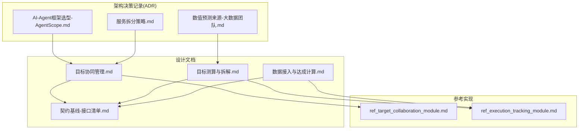
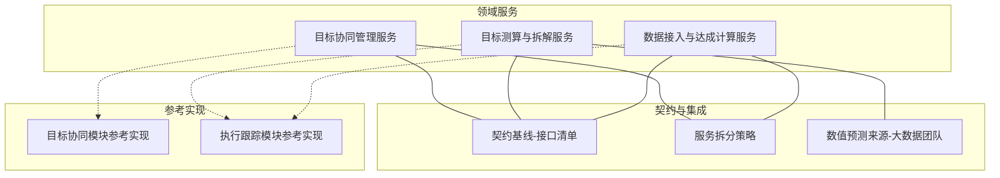
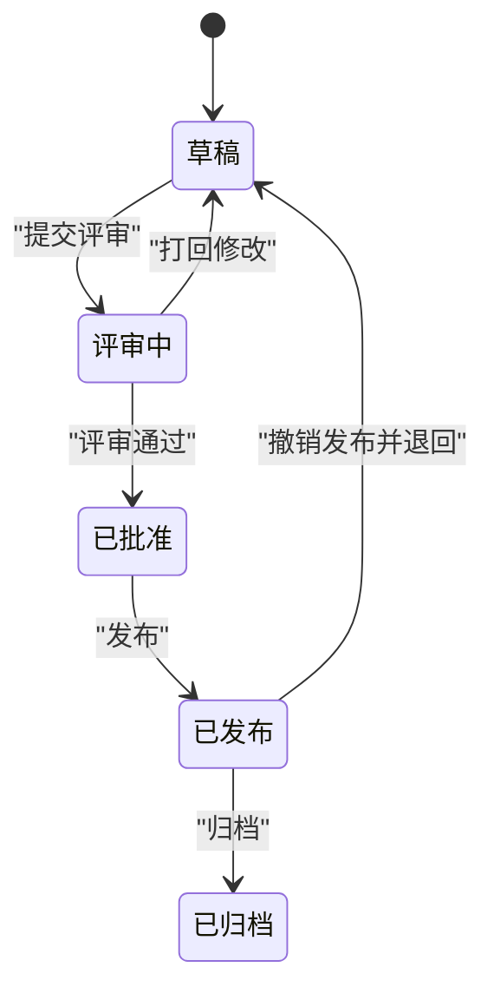
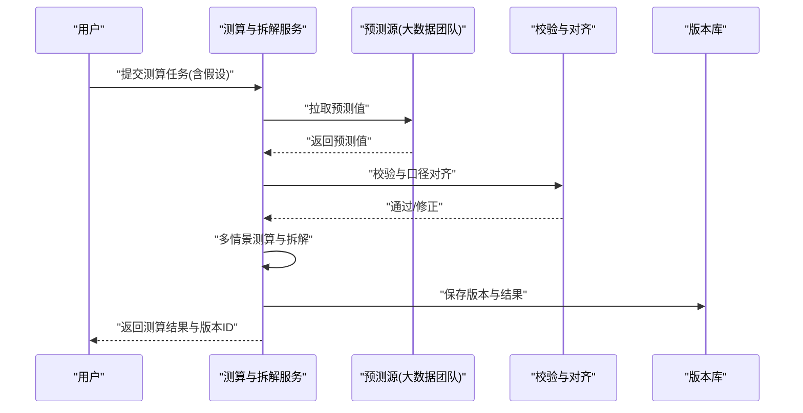
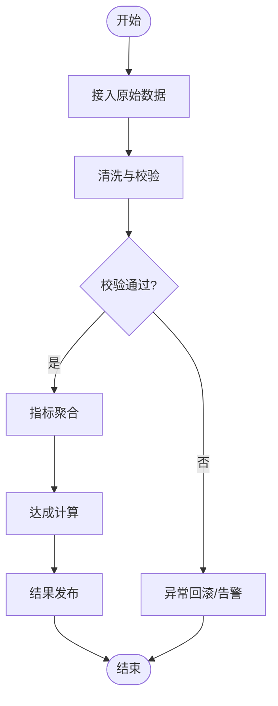
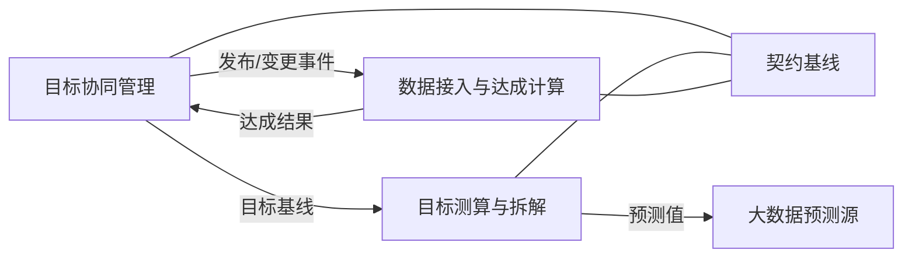

# 核心功能模块

<cite>
**本文引用的文件**   
- [目标协同管理.md](file://docs/design/目标协同管理.md)
- [目标测算与拆解.md](file://docs/design/目标测算与拆解.md)
- [数据接入与达成计算.md](file://docs/design/数据接入与达成计算.md)
- [契约基线-接口清单.md](file://docs/design/00-契约基线-接口清单.md)
- [服务拆分策略.md](file://docs/adr/0003-服务拆分策略.md)
- [数值预测来源-大数据团队.md](file://docs/adr/0002-数值预测来源-大数据团队.md)
- [AI-Agent框架选型-AgentScope.md](file://docs/adr/0001-AI-Agent框架选型-AgentScope.md)
- [ref_target_collaboration_module.md](file://docs/reference/.claude/agent-memory/requirements-analyst/ref_target_collaboration_module.md)
- [ref_execution_tracking_module.md](file://docs/reference/.claude/agent-memory/requirements-analyst/ref_execution_tracking_module.md)
</cite>

## 目录
1. [引言](#引言)
2. [项目结构](#项目结构)
3. [核心组件](#核心组件)
4. [架构总览](#架构总览)
5. [详细组件分析](#详细组件分析)
6. [依赖分析](#依赖分析)
7. [性能考虑](#性能考虑)
8. [故障排查指南](#故障排查指南)
9. [结论](#结论)
10. [附录](#附录)

## 引言
本文件面向目标平台的核心功能模块，聚焦三大能力：目标协同管理、目标测算与拆解、数据接入与达成计算。文档从职责边界、业务流程、状态机设计、工作流编排、接口契约、配置参数与最佳实践等维度进行系统化说明，并给出参考实现的使用方法与扩展指南，帮助读者快速理解与落地。

## 项目结构
仓库以“设计文档 + ADR（架构决策记录）+ 参考实现”为主，核心业务逻辑通过设计文档定义，ADR记录关键决策，参考实现提供可复用的模块记忆与执行跟踪思路。

图表来源
- [目标协同管理.md](file://docs/design/目标协同管理.md)
- [目标测算与拆解.md](file://docs/design/目标测算与拆解.md)
- [数据接入与达成计算.md](file://docs/design/数据接入与达成计算.md)
- [契约基线-接口清单.md](file://docs/design/00-契约基线-接口清单.md)
- [AI-Agent框架选型-AgentScope.md](file://docs/adr/0001-AI-Agent框架选型-AgentScope.md)
- [数值预测来源-大数据团队.md](file://docs/adr/0002-数值预测来源-大数据团队.md)
- [服务拆分策略.md](file://docs/adr/0003-服务拆分策略.md)
- [ref_target_collaboration_module.md](file://docs/reference/.claude/agent-memory/requirements-analyst/ref_target_collaboration_module.md)
- [ref_execution_tracking_module.md](file://docs/reference/.claude/agent-memory/requirements-analyst/ref_execution_tracking_module.md)

章节来源
- [目标协同管理.md](file://docs/design/目标协同管理.md)
- [目标测算与拆解.md](file://docs/design/目标测算与拆解.md)
- [数据接入与达成计算.md](file://docs/design/数据接入与达成计算.md)
- [契约基线-接口清单.md](file://docs/design/00-契约基线-接口清单.md)
- [AI-Agent框架选型-AgentScope.md](file://docs/adr/0001-AI-Agent框架选型-AgentScope.md)
- [数值预测来源-大数据团队.md](file://docs/adr/0002-数值预测来源-大数据团队.md)
- [服务拆分策略.md](file://docs/adr/0003-服务拆分策略.md)
- [ref_target_collaboration_module.md](file://docs/reference/.claude/agent-memory/requirements-analyst/ref_target_collaboration_module.md)
- [ref_execution_tracking_module.md](file://docs/reference/.claude/agent-memory/requirements-analyst/ref_execution_tracking_module.md)

## 核心组件
- 目标协同管理：负责目标的创建、评审、版本化、对齐与发布；维护目标生命周期状态机；提供跨部门协作与审批工作流。
- 目标测算与拆解：基于输入假设与预测源，完成自上而下与自下而上的测算、滚动更新与多情景对比；输出可执行的分解指标与路径。
- 数据接入与达成计算：对接外部数据源，完成清洗、校验、聚合与指标口径统一；按周期计算达成率与偏差，驱动预警与复盘。

章节来源
- [目标协同管理.md](file://docs/design/目标协同管理.md)
- [目标测算与拆解.md](file://docs/design/目标测算与拆解.md)
- [数据接入与达成计算.md](file://docs/design/数据接入与达成计算.md)

## 架构总览
整体采用“领域服务 + 契约基线 + 参考实现”的分层组织方式。领域服务围绕三大核心模块展开，契约基线明确对外接口规范，参考实现提供Agent记忆与执行跟踪的复用方案。

图表来源
- [契约基线-接口清单.md](file://docs/design/00-契约基线-接口清单.md)
- [服务拆分策略.md](file://docs/adr/0003-服务拆分策略.md)
- [数值预测来源-大数据团队.md](file://docs/adr/0002-数值预测来源-大数据团队.md)
- [ref_target_collaboration_module.md](file://docs/reference/.claude/agent-memory/requirements-analyst/ref_target_collaboration_module.md)
- [ref_execution_tracking_module.md](file://docs/reference/.claude/agent-memory/requirements-analyst/ref_execution_tracking_module.md)

## 详细组件分析

### 目标协同管理
- 职责边界
  - 目标建模：指标、维度、周期、责任人、关联关系。
  - 生命周期：草稿、评审中、已批准、已发布、已归档等状态流转。
  - 版本与基线：支持多次修订与基线快照，便于回溯与审计。
  - 协作与审批：跨角色参与、评论、批注、留痕。
- 业务流程
  - 创建与编辑 → 提交评审 → 评审意见闭环 → 批准并发布 → 运行期变更走变更流程。
- 状态机设计
  - 典型状态：草稿、评审中、已批准、已发布、已归档。
  - 转换条件：由操作人角色与前置校验决定。
- 工作流编排
  - 事件驱动：状态变更触发通知、审计日志与下游同步。
  - 幂等性：同一操作的重复提交需去重。
- 接口契约要点
  - 目标CRUD、版本查询、评审提交与结果回写、发布与撤销发布。
- 配置选项与参数
  - 评审规则集、审批链配置、通知渠道、审计保留策略。
- 参考实现使用与扩展
  - 参考实现提供Agent记忆用于上下文保持与任务追踪，可按需接入新的审批节点或消息通道。
- 最佳实践
  - 严格区分“计划态”和“运行态”，避免在发布后直接覆盖历史。
  - 对关键变更引入双人复核与灰度发布。

图表来源
- [目标协同管理.md](file://docs/design/目标协同管理.md)
- [ref_target_collaboration_module.md](file://docs/reference/.claude/agent-memory/requirements-analyst/ref_target_collaboration_module.md)

章节来源
- [目标协同管理.md](file://docs/design/目标协同管理.md)
- [ref_target_collaboration_module.md](file://docs/reference/.claude/agent-memory/requirements-analyst/ref_target_collaboration_module.md)

### 目标测算与拆解
- 职责边界
  - 输入：目标基线、假设库、预测值（来自大数据团队）。
  - 处理：自上而下分配、自下而上汇总、情景对比与敏感性分析。
  - 输出：分解指标、路径建议、滚动更新版本。
- 业务流程
  - 加载基线与假设 → 调用预测源 → 生成多情景测算 → 人工校准 → 形成可执行拆解。
- 算法与复杂度
  - 线性分解与约束求解结合；时间复杂度与指标粒度、情景数量相关。
- 数据流转
  - 上游预测值经校验与对齐后进入测算引擎；结果写入版本库并推送至协同管理。
- 接口契约要点
  - 测算任务提交、参数与假设上传、结果查询、版本对比。
- 配置选项与参数
  - 预测源选择、权重策略、阈值与容差、情景枚举与优先级。
- 参考实现使用与扩展
  - 参考实现提供执行跟踪，可用于记录每次测算的参数、耗时与中间产物，便于回放与审计。
- 最佳实践
  - 将“假设”与“模型”解耦，假设变更可独立回归验证。
  - 对关键指标设置异常检测与人工确认环节。

图表来源
- [目标测算与拆解.md](file://docs/design/目标测算与拆解.md)
- [数值预测来源-大数据团队.md](file://docs/adr/0002-数值预测来源-大数据团队.md)
- [ref_execution_tracking_module.md](file://docs/reference/.claude/agent-memory/requirements-analyst/ref_execution_tracking_module.md)

章节来源
- [目标测算与拆解.md](file://docs/design/目标测算与拆解.md)
- [数值预测来源-大数据团队.md](file://docs/adr/0002-数值预测来源-大数据团队.md)
- [ref_execution_tracking_module.md](file://docs/reference/.claude/agent-memory/requirements-analyst/ref_execution_tracking_module.md)

### 数据接入与达成计算
- 职责边界
  - 接入：对接多源系统，统一采集、清洗、校验与入库。
  - 计算：按指标口径与周期计算达成率、累计达成、偏差与趋势。
  - 输出：达成看板、预警信号、复盘素材。
- 业务流程
  - 数据接入 → 清洗与校验 → 指标聚合 → 达成计算 → 结果发布与订阅。
- 状态机设计
  - 数据状态：待接入、清洗中、已入库、已发布、异常回滚。
- 工作流编排
  - 定时调度与事件触发结合；失败重试与补偿机制。
- 接口契约要点
  - 数据源注册、增量/全量拉取、指标口径定义、达成查询与订阅。
- 配置选项与参数
  - 数据源连接、抽取频率、字段映射、容错策略、告警阈值。
- 参考实现使用与扩展
  - 参考实现提供执行跟踪，可用于记录每次接入任务的起止时间、吞吐与错误码，便于定位问题。
- 最佳实践
  - 建立“指标字典”与“口径版本”，确保计算一致性。
  - 对关键链路增加端到端校验与断点续跑。

图表来源
- [数据接入与达成计算.md](file://docs/design/数据接入与达成计算.md)
- [ref_execution_tracking_module.md](file://docs/reference/.claude/agent-memory/requirements-analyst/ref_execution_tracking_module.md)

章节来源
- [数据接入与达成计算.md](file://docs/design/数据接入与达成计算.md)
- [ref_execution_tracking_module.md](file://docs/reference/.claude/agent-memory/requirements-analyst/ref_execution_tracking_module.md)

## 依赖分析
- 内部依赖
  - 三大模块共享“契约基线”，保证接口一致性与可演进性。
  - 测算与拆解依赖“数值预测来源-大数据团队”的输出。
- 外部依赖
  - 预测源、数据源系统与消息/通知通道。
- 耦合与内聚
  - 模块间通过契约松耦合；参考实现提升内聚与复用。
- 潜在循环依赖
  - 通过事件与异步回调避免同步强耦合。

图表来源
- [契约基线-接口清单.md](file://docs/design/00-契约基线-接口清单.md)
- [数值预测来源-大数据团队.md](file://docs/adr/0002-数值预测来源-大数据团队.md)

章节来源
- [契约基线-接口清单.md](file://docs/design/00-契约基线-接口清单.md)
- [数值预测来源-大数据团队.md](file://docs/adr/0002-数值预测来源-大数据团队.md)

## 性能考虑
- 测算与拆解
  - 对大规模指标与情景，采用分片并行与缓存命中策略，降低重复计算。
- 数据接入
  - 批量拉取与增量拉取结合，配合背压与限流，避免下游抖动。
- 达成计算
  - 预聚合与物化视图，缩短查询时延；热点指标分层缓存。
- 通用优化
  - 幂等与去重、失败重试退避、超时熔断与降级。

[本节为通用指导，不直接分析具体文件]

## 故障排查指南
- 常见问题
  - 预测值缺失或延迟：检查预测源健康与拉取策略。
  - 指标口径不一致：核对“指标字典”与“口径版本”。
  - 审批卡点：查看审批链配置与参与者状态。
- 定位手段
  - 利用参考实现的执行跟踪，获取任务轨迹、耗时与错误码。
  - 结合契约基线的接口版本，确认上下游兼容。
- 恢复策略
  - 断点续跑、补偿任务与人工介入开关。

章节来源
- [ref_execution_tracking_module.md](file://docs/reference/.claude/agent-memory/requirements-analyst/ref_execution_tracking_module.md)
- [契约基线-接口清单.md](file://docs/design/00-契约基线-接口清单.md)

## 结论
三大核心模块通过清晰的职责边界、稳定的契约基线与可复用的参考实现，形成了“协同—测算—达成”的闭环体系。建议在演进过程中持续完善指标字典、强化可观测性与可回滚能力，并以事件驱动的方式增强系统弹性。

[本节为总结性内容，不直接分析具体文件]

## 附录
- 参考实现使用指南
  - Agent记忆：用于保持会话上下文与任务状态，适合在复杂审批与测算场景中复用。
  - 执行跟踪：记录任务生命周期与关键指标，便于审计与排障。
- 架构决策参考
  - AI-Agent框架选型：评估AgentScope在目标平台中的适用性与集成方式。
  - 服务拆分策略：依据职责与数据域划分服务边界，降低耦合。

章节来源
- [AI-Agent框架选型-AgentScope.md](file://docs/adr/0001-AI-Agent框架选型-AgentScope.md)
- [服务拆分策略.md](file://docs/adr/0003-服务拆分策略.md)
- [ref_target_collaboration_module.md](file://docs/reference/.claude/agent-memory/requirements-analyst/ref_target_collaboration_module.md)
- [ref_execution_tracking_module.md](file://docs/reference/.claude/agent-memory/requirements-analyst/ref_execution_tracking_module.md)