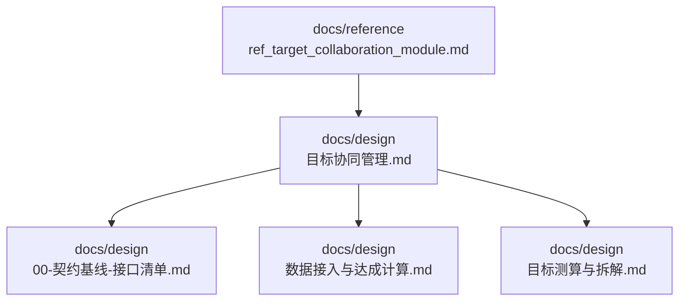
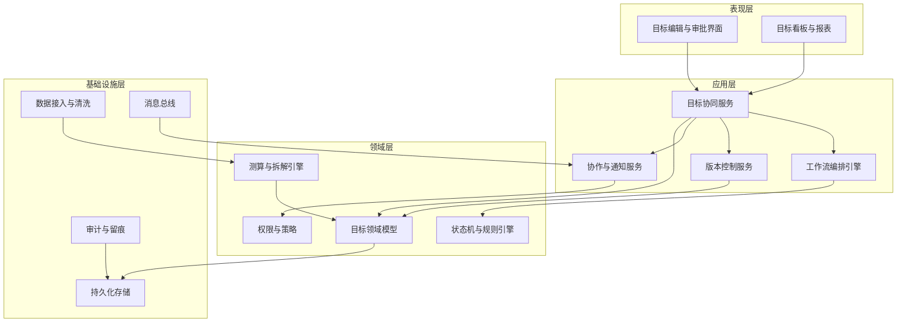
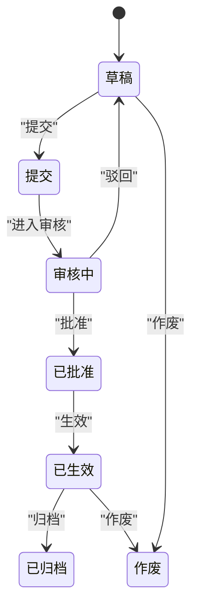
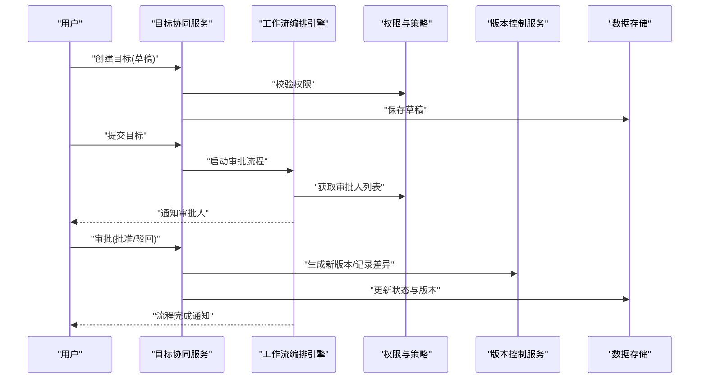
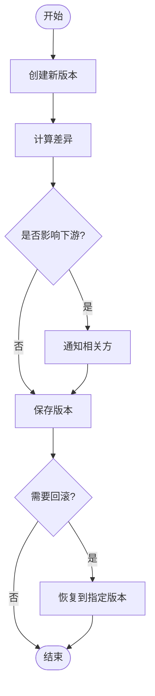
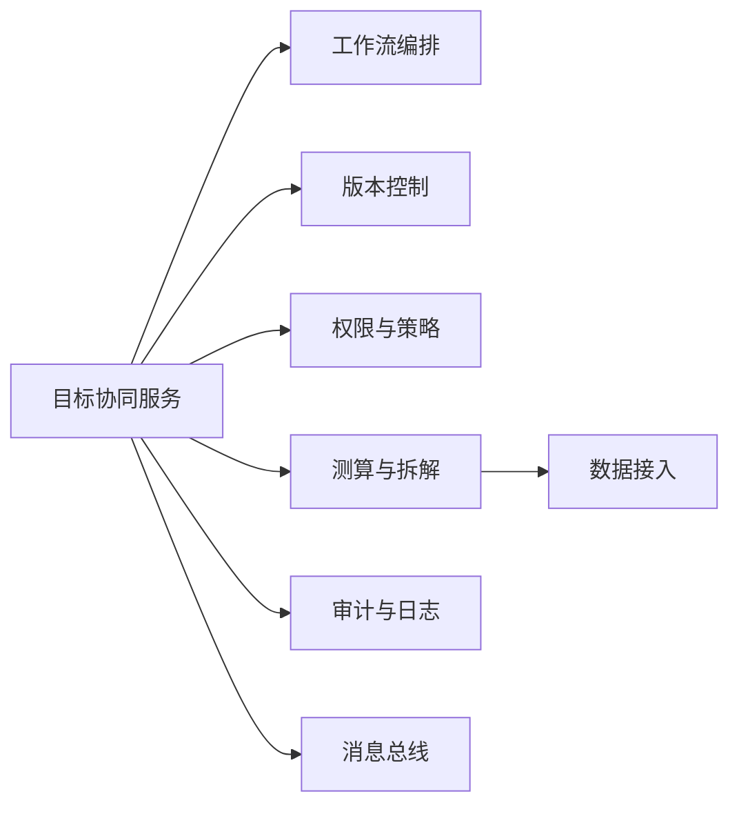

# 目标协同管理

<cite>
**本文引用的文件**   
- [docs/design/目标协同管理.md](file://docs/design/目标协同管理.md)
- [docs/reference/.claude/agent-memory/requirements-analyst/ref_target_collaboration_module.md](file://docs/reference/.claude/agent-memory/requirements-analyst/ref_target_collaboration_module.md)
- [docs/design/00-契约基线-接口清单.md](file://docs/design/00-契约基线-接口清单.md)
- [docs/design/数据接入与达成计算.md](file://docs/design/数据接入与达成计算.md)
- [docs/design/目标测算与拆解.md](file://docs/design/目标测算与拆解.md)
</cite>

## 目录
1. [引言](#引言)
2. [项目结构](#项目结构)
3. [核心组件](#核心组件)
4. [架构总览](#架构总览)
5. [详细组件分析](#详细组件分析)
6. [依赖分析](#依赖分析)
7. [性能考虑](#性能考虑)
8. [故障排查指南](#故障排查指南)
9. [结论](#结论)
10. [附录](#附录)

## 引言
本模块聚焦“目标协同管理”，围绕目标制定、审批流程、版本控制与跨部门协作四大能力，提供统一的目标生命周期管理与工作流编排。文档面向产品、研发与运维人员，既给出高层设计说明，也提供可落地的实现参考、接口契约与集成模式，帮助团队快速对齐并落地业务场景（如年度目标制定、季度调整、部门间协同）。

## 项目结构
仓库中与目标协同管理相关的资料主要位于 docs 目录下：
- design：包含目标协同管理的总体设计、接口契约、数据接入与达成计算、目标测算与拆解等设计文档
- reference：包含参考实现要点与需求分析记忆，便于对照落地

图表来源
- [docs/design/目标协同管理.md](file://docs/design/目标协同管理.md)
- [docs/design/00-契约基线-接口清单.md](file://docs/design/00-契约基线-接口清单.md)
- [docs/design/数据接入与达成计算.md](file://docs/design/数据接入与达成计算.md)
- [docs/design/目标测算与拆解.md](file://docs/design/目标测算与拆解.md)
- [docs/reference/.claude/agent-memory/requirements-analyst/ref_target_collaboration_module.md](file://docs/reference/.claude/agent-memory/requirements-analyst/ref_target_collaboration_module.md)

章节来源
- [docs/design/目标协同管理.md](file://docs/design/目标协同管理.md)
- [docs/reference/.claude/agent-memory/requirements-analyst/ref_target_collaboration_module.md](file://docs/reference/.claude/agent-memory/requirements-analyst/ref_target_collaboration_module.md)

## 核心组件
- 目标模型与版本控制
  - 目标实体包含周期、指标、口径、权重、分解维度、状态、版本等关键属性
  - 版本控制支持创建新版本、回滚到历史版本、合并冲突处理与差异对比
- 审批与工作流编排
  - 基于状态机的多阶段审批（草稿、提交、审核、批准、生效、归档）
  - 支持条件分支、会签、加签、转交、撤回、驳回重提
- 权限与组织协作
  - 基于角色与组织的访问控制（RBAC），细粒度到目标对象与操作级别
  - 跨部门协作通过共享视图、评论与变更留痕保障透明性
- 数据接入与达成计算
  - 对接外部数据源，按口径与周期聚合计算达成率
  - 提供校验与异常告警机制，确保数据质量
- 测算与拆解
  - 自上而下与自下而上结合的目标测算
  - 支持按组织、产品线、区域等多维拆解与汇总校验

章节来源
- [docs/design/目标协同管理.md](file://docs/design/目标协同管理.md)
- [docs/design/数据接入与达成计算.md](file://docs/design/数据接入与达成计算.md)
- [docs/design/目标测算与拆解.md](file://docs/design/目标测算与拆解.md)

## 架构总览
目标协同管理采用分层与事件驱动相结合的设计：
- 表现层：提供目标编辑、审批工作台、看板与报表
- 应用层：编排目标生命周期、版本控制、审批流与协作任务
- 领域层：承载目标模型、状态机、权限策略、测算与拆解算法
- 基础设施层：数据接入、存储、消息总线与审计日志

图表来源
- [docs/design/目标协同管理.md](file://docs/design/目标协同管理.md)
- [docs/design/00-契约基线-接口清单.md](file://docs/design/00-契约基线-接口清单.md)
- [docs/design/数据接入与达成计算.md](file://docs/design/数据接入与达成计算.md)
- [docs/design/目标测算与拆解.md](file://docs/design/目标测算与拆解.md)

## 详细组件分析

### 目标状态机设计
- 状态定义
  - 草稿、提交、审核中、已批准、已生效、已归档、作废
- 转换规则
  - 从草稿可提交；审核中可批准或驳回；批准后生效；生效后仅允许归档或作废
  - 支持在特定状态下撤回（如审核中）
- 触发条件
  - 用户动作（提交、批准、驳回）、系统事件（数据就绪、周期切换）
- 约束与校验
  - 前置条件检查（必填字段、关联数据完整性）
  - 并发控制（乐观锁版本号）

图表来源
- [docs/design/目标协同管理.md](file://docs/design/目标协同管理.md)

章节来源
- [docs/design/目标协同管理.md](file://docs/design/目标协同管理.md)

### 工作流编排与审批流程
- 编排要素
  - 节点类型：开始、审批、并行会签、条件分支、结束
  - 流转条件：基于目标属性（周期、组织、金额阈值）动态选择路径
- 典型流程
  - 年度目标制定：起草→部门审核→公司级审批→生效
  - 季度调整：修订→影响评估→快速审批→生效
- 协作特性
  - 评论与@提醒、变更留痕、版本差异对比
  - 超时自动升级、转交与加签

图表来源
- [docs/design/目标协同管理.md](file://docs/design/目标协同管理.md)
- [docs/design/00-契约基线-接口清单.md](file://docs/design/00-契约基线-接口清单.md)

章节来源
- [docs/design/目标协同管理.md](file://docs/design/目标协同管理.md)
- [docs/design/00-契约基线-接口清单.md](file://docs/design/00-契约基线-接口清单.md)

### 版本控制与差异对比
- 版本策略
  - 每次重要变更生成新版本，保留完整历史
  - 支持回滚至指定版本、合并冲突提示
- 差异对比
  - 字段级差异展示、影响范围评估（对下游指标与计划的影响）
- 一致性保障
  - 乐观锁版本号、事务边界内写入、幂等接口

图表来源
- [docs/design/目标协同管理.md](file://docs/design/目标协同管理.md)

章节来源
- [docs/design/目标协同管理.md](file://docs/design/目标协同管理.md)

### 权限控制与跨部门协作
- 权限模型
  - RBAC：角色-资源-操作三元组
  - 资源粒度：目标对象、字段、版本、审批节点
- 协作机制
  - 共享视图、评论与任务指派
  - 变更留痕与审计追踪
- 安全策略
  - 最小权限原则、敏感字段脱敏、越权访问拦截

章节来源
- [docs/design/目标协同管理.md](file://docs/design/目标协同管理.md)

### 数据接入与达成计算
- 数据接入
  - 多源接入（ERP、CRM、BI等），标准化清洗与映射
  - 接入配置：数据源、采集频率、字段映射、校验规则
- 达成计算
  - 按周期与口径聚合，支持加权与层级汇总
  - 异常检测与补数策略
- 质量保障
  - 数据血缘追踪、质量评分与告警

章节来源
- [docs/design/数据接入与达成计算.md](file://docs/design/数据接入与达成计算.md)

### 目标测算与拆解
- 测算方法
  - 自上而下：基于战略与预算分配
  - 自下而上：基于历史与预测模型
- 拆解维度
  - 组织、产品线、区域、渠道等
- 校验与平衡
  - 总量一致性与结构性校验，冲突提示与协商闭环

章节来源
- [docs/design/目标测算与拆解.md](file://docs/design/目标测算与拆解.md)

### 参考实现要点
- 参考实现模块关注点
  - 领域建模与状态机实现
  - 工作流编排与权限策略集成
  - 版本控制与差异对比的通用能力
- 使用建议
  - 以领域模型为核心，扩展具体业务属性
  - 将审批流程抽象为可配置模板，降低耦合

章节来源
- [docs/reference/.claude/agent-memory/requirements-analyst/ref_target_collaboration_module.md](file://docs/reference/.claude/agent-memory/requirements-analyst/ref_target_collaboration_module.md)

## 依赖分析
- 内部依赖
  - 目标协同服务依赖工作流编排、版本控制、权限与策略、测算与拆解引擎
  - 数据接入与达成计算为上游依赖，提供高质量数据输入
- 外部依赖
  - 数据源系统（ERP/CRM/BI等）
  - 消息总线与通知服务
  - 审计与日志系统

图表来源
- [docs/design/目标协同管理.md](file://docs/design/目标协同管理.md)
- [docs/design/00-契约基线-接口清单.md](file://docs/design/00-契约基线-接口清单.md)
- [docs/design/数据接入与达成计算.md](file://docs/design/数据接入与达成计算.md)

章节来源
- [docs/design/目标协同管理.md](file://docs/design/目标协同管理.md)
- [docs/design/00-契约基线-接口清单.md](file://docs/design/00-契约基线-接口清单.md)
- [docs/design/数据接入与达成计算.md](file://docs/design/数据接入与达成计算.md)

## 性能考虑
- 高并发审批与版本写入
  - 使用乐观锁与批量写入，减少锁竞争
  - 热点目标分片与缓存策略
- 数据接入与计算
  - 增量采集与异步批处理，避免阻塞主流程
  - 计算结果缓存与失效策略
- 查询与报表
  - 预聚合与索引优化，分页与游标查询
  - 读写分离与只读副本

[本节为通用性能指导，不直接分析具体文件]

## 故障排查指南
- 常见错误与定位
  - 审批失败：检查工作流节点配置、权限策略与审批人有效性
  - 版本冲突：查看差异对比与乐观锁版本号，确认并发写入顺序
  - 数据异常：核查数据接入配置、字段映射与质量评分
- 诊断工具
  - 审计日志与变更留痕
  - 工作流执行轨迹与状态快照
  - 数据血缘与质量报告

章节来源
- [docs/design/目标协同管理.md](file://docs/design/目标协同管理.md)
- [docs/design/数据接入与达成计算.md](file://docs/design/数据接入与达成计算.md)

## 结论
目标协同管理模块通过清晰的状态机、灵活的工作流编排、严格的版本控制与完善的权限策略，支撑年度目标制定、季度调整与跨部门协作等复杂业务场景。配合数据接入与达成计算、测算与拆解能力，形成端到端的目标管理体系。建议以领域模型为核心进行扩展，并将审批流程抽象为可配置模板，提升复用性与可维护性。

[本节为总结性内容，不直接分析具体文件]

## 附录

### 业务场景示例
- 年度目标制定
  - 步骤：起草→部门审核→公司级审批→生效
  - 关键点：版本控制、差异对比、影响评估
- 季度调整
  - 步骤：修订→影响评估→快速审批→生效
  - 关键点：条件分支、会签、超时升级
- 部门间协同
  - 步骤：共享视图→评论与任务指派→变更留痕→共识达成
  - 关键点：权限控制、协作通知、审计追踪

章节来源
- [docs/design/目标协同管理.md](file://docs/design/目标协同管理.md)

### 接口契约概览
- 目标管理接口
  - 创建/更新/删除目标、查询目标详情与列表
  - 版本列表、差异对比、回滚
- 审批与工作流接口
  - 启动/暂停/终止流程、审批操作、流程状态查询
- 权限与协作接口
  - 角色与资源绑定、评论与任务管理
- 数据接入与计算接口
  - 数据源配置、采集任务、达成计算与质量报告

章节来源
- [docs/design/00-契约基线-接口清单.md](file://docs/design/00-契约基线-接口清单.md)

### 配置选项与参数说明
- 数据接入配置
  - 数据源类型、连接信息、采集频率、字段映射、校验规则
- 工作流配置
  - 节点定义、流转条件、审批人策略、超时与升级规则
- 权限策略配置
  - 角色-资源-操作映射、字段级权限、越权拦截策略
- 版本控制策略
  - 版本命名规范、差异对比维度、回滚策略

章节来源
- [docs/design/数据接入与达成计算.md](file://docs/design/数据接入与达成计算.md)
- [docs/design/目标协同管理.md](file://docs/design/目标协同管理.md)

### 扩展指南
- 新增审批节点
  - 在工作流模板中添加节点与流转条件，配置审批人策略
- 扩展权限维度
  - 在权限策略中增加新的资源类型与操作，适配RBAC模型
- 接入新数据源
  - 在数据接入层注册新数据源，定义字段映射与校验规则
- 自定义测算算法
  - 在测算与拆解引擎中扩展算法插件，保持接口稳定

章节来源
- [docs/design/目标协同管理.md](file://docs/design/目标协同管理.md)
- [docs/design/数据接入与达成计算.md](file://docs/design/数据接入与达成计算.md)
- [docs/design/目标测算与拆解.md](file://docs/design/目标测算与拆解.md)