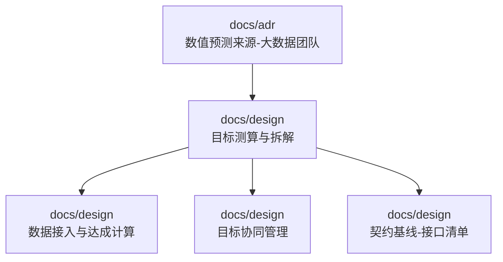
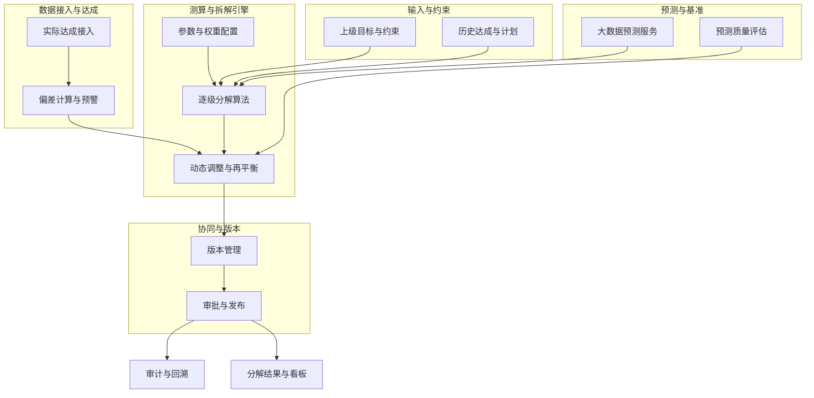
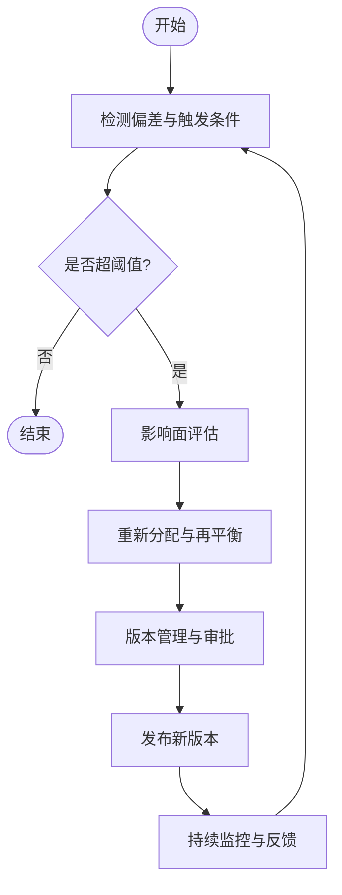
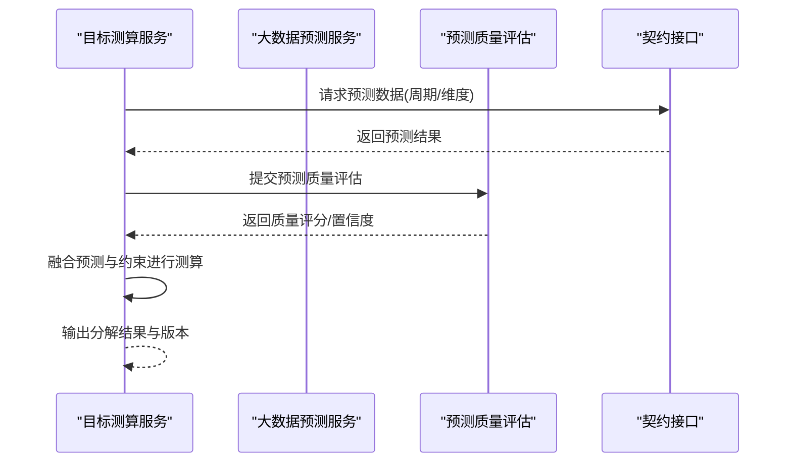
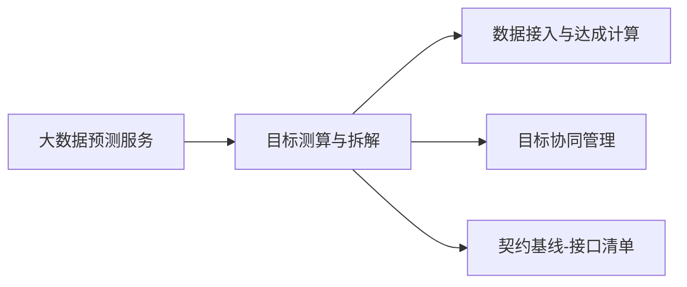

# 目标测算与拆解

<cite>
**本文引用的文件**   
- [设计文档：目标测算与拆解.md](file://docs/design/目标测算与拆解.md)
- [设计文档：数据接入与达成计算.md](file://docs/design/数据接入与达成计算.md)
- [设计文档：目标协同管理.md](file://docs/design/目标协同管理.md)
- [ADR：数值预测来源-大数据团队.md](file://docs/adr/0002-数值预测来源-大数据团队.md)
- [契约基线-接口清单.md](file://docs/design/00-契约基线-接口清单.md)
</cite>

## 目录
1. [引言](#引言)
2. [项目结构](#项目结构)
3. [核心组件](#核心组件)
4. [架构总览](#架构总览)
5. [详细组件分析](#详细组件分析)
6. [依赖分析](#依赖分析)
7. [性能考虑](#性能考虑)
8. [故障排查指南](#故障排查指南)
9. [结论](#结论)
10. [附录](#附录)

## 引言
本模块聚焦“目标测算与拆解”，围绕收入、成本、利润等关键经营指标，提供从宏观目标到微观执行的逐级分解能力。其核心包括：
- 量化算法设计：基于数学模型对目标进行可解释的拆分与动态调整。
- 逐级分解策略：按组织、时间、产品/渠道等多维度进行结构化拆解。
- 动态调整机制：结合外部预测与实际达成，滚动修正下级目标。
- 业务逻辑与计算引擎：将业务规则与算法参数化，形成可配置的计算流程。
- 与大数据预测集成：对接大数据团队的数值预测结果，驱动测算与校准。

本说明旨在帮助产品、算法与工程团队对齐设计意图、实现路径与验收标准。

## 项目结构
本项目为设计与规范型仓库，目标测算与拆解相关的设计与约定主要位于 docs/design 与 docs/adr 目录中。整体结构如下：
- docs/design：包含目标测算与拆解、数据接入与达成计算、目标协同管理等设计文档，以及契约基线接口清单。
- docs/adr：记录关键决策，如数值预测来源选择（大数据团队）。
- docs/reference：参考材料，用于对齐需求与历史上下文。
- docs/requirements：需求审查与差异清单，辅助范围确认。

图表来源
- [设计文档：目标测算与拆解.md](file://docs/design/目标测算与拆解.md)
- [设计文档：数据接入与达成计算.md](file://docs/design/数据接入与达成计算.md)
- [设计文档：目标协同管理.md](file://docs/design/目标协同管理.md)
- [契约基线-接口清单.md](file://docs/design/00-契约基线-接口清单.md)
- [ADR：数值预测来源-大数据团队.md](file://docs/adr/0002-数值预测来源-大数据团队.md)

章节来源
- [设计文档：目标测算与拆解.md](file://docs/design/目标测算与拆解.md)
- [设计文档：数据接入与达成计算.md](file://docs/design/数据接入与达成计算.md)
- [设计文档：目标协同管理.md](file://docs/design/目标协同管理.md)
- [契约基线-接口清单.md](file://docs/design/00-契约基线-接口清单.md)
- [ADR：数值预测来源-大数据团队.md](file://docs/adr/0002-数值预测来源-大数据团队.md)

## 核心组件
围绕目标测算与拆解，系统由以下核心组件构成：
- 目标输入与约束层：接收上级下达的目标与约束条件（如预算上限、增长底线）。
- 预测与基准层：引入大数据团队提供的数值预测作为基准或先验。
- 测算与拆解引擎：根据业务规则与权重，执行逐级分解与动态调整。
- 协同与版本管理：支持多角色协作、版本对比与审批流转。
- 数据接入与达成计算：统一接入实际达成数据，计算偏差并触发再平衡。
- 契约与接口：定义对外服务边界与数据交换格式。

章节来源
- [设计文档：目标测算与拆解.md](file://docs/design/目标测算与拆解.md)
- [设计文档：数据接入与达成计算.md](file://docs/design/数据接入与达成计算.md)
- [设计文档：目标协同管理.md](file://docs/design/目标协同管理.md)
- [契约基线-接口清单.md](file://docs/design/00-契约基线-接口清单.md)
- [ADR：数值预测来源-大数据团队.md](file://docs/adr/0002-数值预测来源-大数据团队.md)

## 架构总览
下图展示目标测算与拆解的总体架构与数据流，涵盖输入、预测、测算引擎、协同管理与输出闭环。

图表来源
- [设计文档：目标测算与拆解.md](file://docs/design/目标测算与拆解.md)
- [设计文档：数据接入与达成计算.md](file://docs/design/数据接入与达成计算.md)
- [设计文档：目标协同管理.md](file://docs/design/目标协同管理.md)
- [ADR：数值预测来源-大数据团队.md](file://docs/adr/0002-数值预测来源-大数据团队.md)

## 详细组件分析

### 量化算法与数学模型
- 目标函数与约束
  - 目标函数：在满足上级目标与资源约束的前提下，最小化各层级目标的偏离度或最大化达成概率。
  - 约束条件：预算上限、增长底线、产能/人力上限、合规红线等。
- 分解策略
  - 维度分解：按组织、时间、产品/渠道、区域等进行分层。
  - 权重分配：依据历史贡献、趋势、战略优先级设定权重，支持动态更新。
  - 平滑与归一化：避免极端波动，保证结果的可执行性与稳定性。
- 动态调整机制
  - 滚动修正：结合最新预测与实际达成，周期性重算下级目标。
  - 阈值触发：当偏差超过阈值时自动进入再平衡流程。
  - 回滚与版本：保留历史版本，支持对比与回滚。

章节来源
- [设计文档：目标测算与拆解.md](file://docs/design/目标测算与拆解.md)

### 逐级分解策略
- 自上而下与自下而上结合
  - 自上而下：以公司级目标为锚点，按权重与策略分配到部门/产品线。
  - 自下而上：汇总一线可行性与承诺，校验是否满足上级目标。
- 多维联动
  - 时间维度：月度/季度/年度节奏匹配，考虑季节性因素。
  - 组织维度：权责清晰，避免重复或遗漏。
  - 业务维度：收入、成本、利润联动，确保财务一致性。
- 校验与收敛
  - 一致性检查：总量等于分量和，结构合理。
  - 收敛控制：迭代次数与误差容忍度，防止震荡。

章节来源
- [设计文档：目标测算与拆解.md](file://docs/design/目标测算与拆解.md)

### 动态调整机制
- 触发条件
  - 预测更新：大数据预测显著变化。
  - 实际达成：阶段性达成偏离预期。
  - 策略变更：管理层调整优先级或资源。
- 调整流程
  - 偏差识别：计算预测/实际与目标的差距。
  - 影响评估：评估对上下游的影响面与风险。
  - 方案生成：基于权重与约束重新分配。
  - 审批发布：版本化管理与审批后生效。

图表来源
- [设计文档：目标测算与拆解.md](file://docs/design/目标测算与拆解.md)
- [设计文档：目标协同管理.md](file://docs/design/目标协同管理.md)

### 业务场景示例
- 收入目标分解
  - 输入：公司级收入目标、历史收入结构、市场预测。
  - 过程：按产品线/区域/渠道分配权重，结合预测校准。
  - 输出：各单元月度/季度收入目标与达成路径。
- 成本目标控制
  - 输入：成本预算、结构性成本项、效率提升计划。
  - 过程：按成本中心与费用科目分解，设置降本阈值与弹性区间。
  - 输出：各中心成本目标与管控措施建议。
- 利润目标达成
  - 输入：收入目标、成本目标、税率与固定费用。
  - 过程：利润=收入-成本，联动调整收入与成本目标，确保利润达标。
  - 输出：利润目标分解与敏感性分析。

章节来源
- [设计文档：目标测算与拆解.md](file://docs/design/目标测算与拆解.md)

### 算法参数配置与验证
- 参数类别
  - 权重参数：历史贡献、趋势、战略优先级等。
  - 约束参数：预算上限、增长底线、产能限制等。
  - 平滑参数：波动容忍度、迭代收敛阈值。
- 配置管理
  - 版本化：参数变更需纳入版本管理，支持回滚。
  - 权限控制：不同角色可编辑/查看不同范围的参数。
- 验证机制
  - 单元测试：覆盖典型场景与边界条件。
  - 回归测试：确保历史结果可复现。
  - 沙箱演练：在隔离环境进行压力与异常测试。

章节来源
- [设计文档：目标测算与拆解.md](file://docs/design/目标测算与拆解.md)

### 与大数据预测数据的集成
- 数据来源与职责
  - 大数据团队负责数值预测，提供标准化预测接口与质量评估。
- 集成方式
  - 接口契约：通过契约基线定义的接口清单进行对接。
  - 数据格式：统一字段命名与时区处理，确保一致性。
  - 质量评估：对预测置信度、偏差分布进行评估与过滤。
- 数据流转
  - 拉取预测：定时或事件驱动拉取最新预测。
  - 融合测算：将预测作为先验参与测算与拆解。
  - 反馈闭环：将实际达成与偏差反馈至预测侧，促进模型优化。

图表来源
- [ADR：数值预测来源-大数据团队.md](file://docs/adr/0002-数值预测来源-大数据团队.md)
- [契约基线-接口清单.md](file://docs/design/00-契约基线-接口清单.md)

章节来源
- [ADR：数值预测来源-大数据团队.md](file://docs/adr/0002-数值预测来源-大数据团队.md)
- [契约基线-接口清单.md](file://docs/design/00-契约基线-接口清单.md)

## 依赖分析
- 内部依赖
  - 目标测算与拆解依赖于数据接入与达成计算、目标协同管理。
  - 契约基线为跨服务交互提供统一接口规范。
- 外部依赖
  - 大数据预测服务：提供数值预测与质量评估。
- 耦合与内聚
  - 高内聚：测算引擎封装算法与参数，降低外部感知。
  - 低耦合：通过契约接口与预测服务解耦，便于替换与升级。
- 潜在循环依赖
  - 通过明确的数据流向与接口边界避免循环调用。

图表来源
- [设计文档：目标测算与拆解.md](file://docs/design/目标测算与拆解.md)
- [设计文档：数据接入与达成计算.md](file://docs/design/数据接入与达成计算.md)
- [设计文档：目标协同管理.md](file://docs/design/目标协同管理.md)
- [契约基线-接口清单.md](file://docs/design/00-契约基线-接口清单.md)

章节来源
- [设计文档：目标测算与拆解.md](file://docs/design/目标测算与拆解.md)
- [设计文档：数据接入与达成计算.md](file://docs/design/数据接入与达成计算.md)
- [设计文档：目标协同管理.md](file://docs/design/目标协同管理.md)
- [契约基线-接口清单.md](file://docs/design/00-契约基线-接口清单.md)

## 性能考虑
- 计算复杂度
  - 分解算法采用分层与权重加权，时间复杂度近似线性于节点数；复杂约束下可能引入迭代收敛开销。
- 批处理与增量更新
  - 批量任务使用并行化与缓存；增量更新仅重算受影响分支。
- 存储与索引
  - 对历史版本与参数配置建立索引，加速查询与对比。
- 容错与重试
  - 外部预测服务调用增加超时、重试与降级策略。
- 监控与告警
  - 关键指标：计算耗时、内存占用、预测质量评分、偏差阈值命中率。

[本节为通用性能指导，不直接分析具体文件]

## 故障排查指南
- 常见问题
  - 预测数据缺失或延迟：检查契约接口连通性与调度任务状态。
  - 参数配置错误：核对版本与权限，确认必填项与取值范围。
  - 分解结果不一致：比对历史版本与权重变更，定位差异点。
- 诊断步骤
  - 日志采集：记录关键阶段输入输出与中间变量。
  - 数据校验：验证总量一致性与结构合理性。
  - 回归复现：使用相同参数与数据进行复测。
- 恢复策略
  - 快速回滚：切换到上一稳定版本。
  - 局部修复：仅更新问题参数或数据源映射。

章节来源
- [设计文档：目标测算与拆解.md](file://docs/design/目标测算与拆解.md)
- [设计文档：数据接入与达成计算.md](file://docs/design/数据接入与达成计算.md)
- [设计文档：目标协同管理.md](file://docs/design/目标协同管理.md)

## 结论
目标测算与拆解模块通过明确的数学模型、灵活的参数配置与严格的版本管理，实现了从宏观目标到微观执行的科学分解与动态调整。与大数据预测服务的集成提升了前瞻性与准确性，而契约基线与协同管理机制保障了跨团队协作的效率与质量。建议在后续演进中持续完善预测质量评估、自动化回归测试与可视化洞察，进一步提升系统的鲁棒性与易用性。

[本节为总结性内容，不直接分析具体文件]

## 附录
- 术语表
  - 目标：需要达成的经营指标（收入、成本、利润等）。
  - 拆解：将总体目标按维度与层级分解为子目标。
  - 动态调整：根据预测与实际达成对目标进行滚动修正。
  - 预测质量：对预测结果的置信度与偏差分布的评估。
- 参考链接
  - 设计文档：目标测算与拆解
  - 设计文档：数据接入与达成计算
  - 设计文档：目标协同管理
  - 契约基线：接口清单
  - ADR：数值预测来源-大数据团队

[本节为补充信息，不直接分析具体文件]