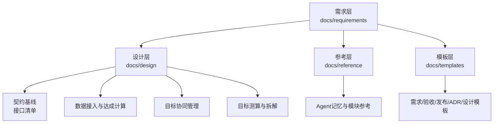
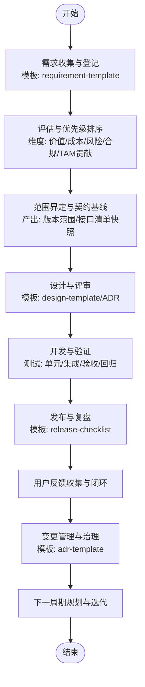
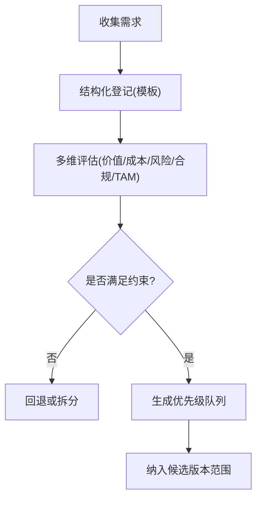
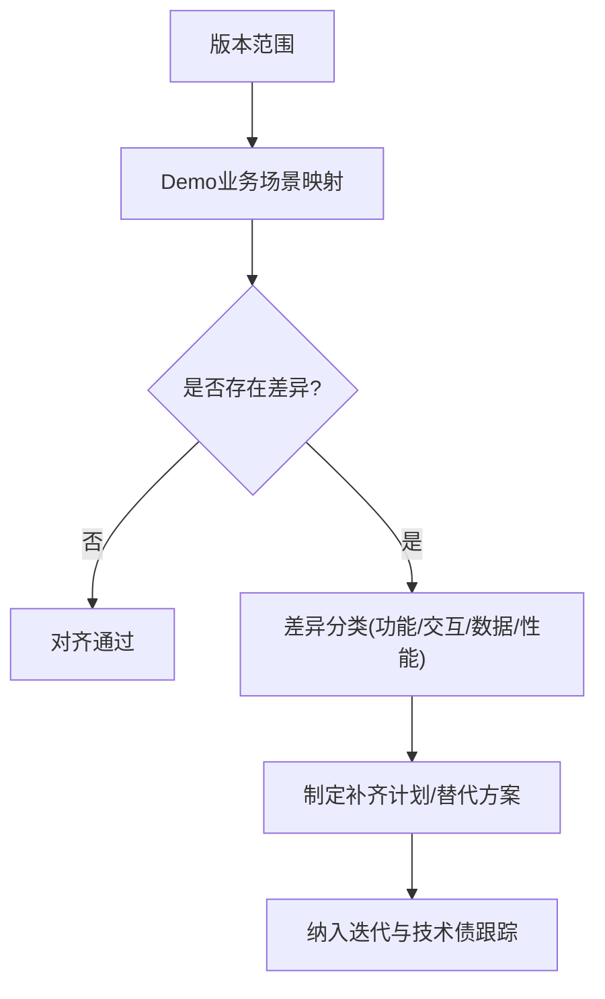
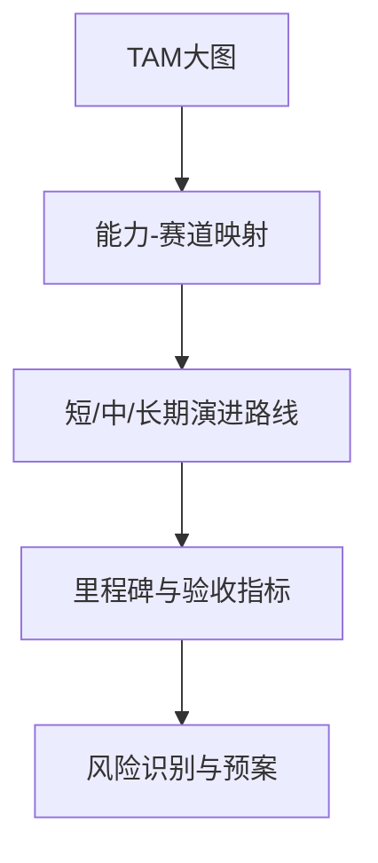
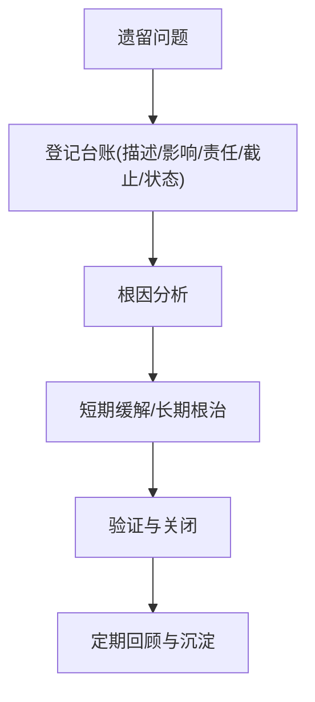
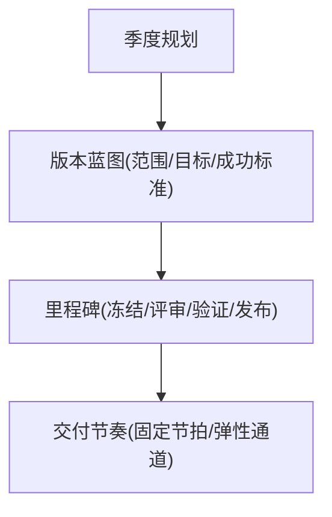
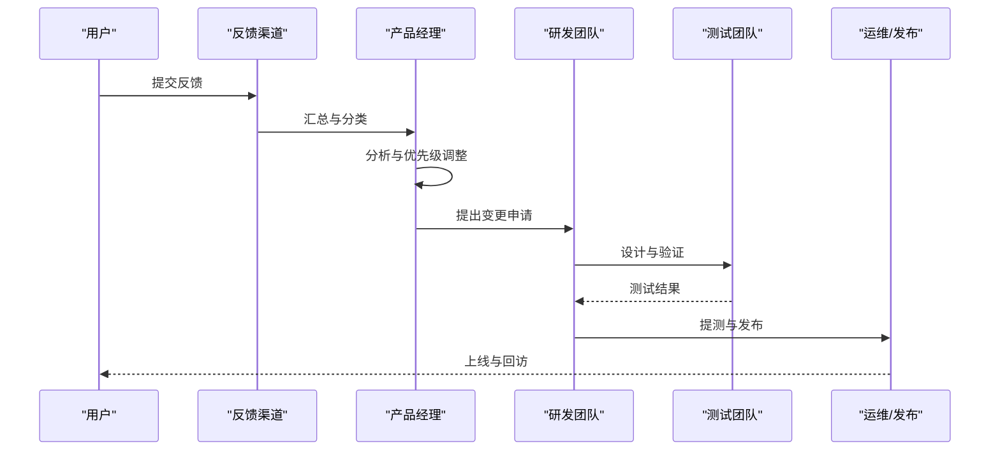
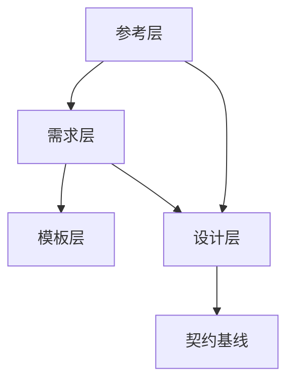

# 需求管理与演进路线

<cite>
**本文引用的文件**   
- [docs/requirements/Demo业务对齐差异清单.md](file://docs/requirements/Demo业务对齐差异清单.md)
- [docs/requirements/TAM大图对齐与演进路线.md](file://docs/requirements/TAM大图对齐与演进路线.md)
- [docs/requirements/需求审查遗留问题.md](file://docs/requirements/需求审查遗留问题.md)
- [docs/product-vision.md](file://docs/product-vision.md)
- [docs/design/00-契约基线-接口清单.md](file://docs/design/00-契约基线-接口清单.md)
- [docs/design/数据接入与达成计算.md](file://docs/design/数据接入与达成计算.md)
- [docs/design/目标协同管理.md](file://docs/design/目标协同管理.md)
- [docs/design/目标测算与拆解.md](file://docs/design/目标测算与拆解.md)
- [docs/reference/.claude/agent-memory/requirements-analyst/MEMORY.md](file://docs/reference/.claude/agent-memory/requirements-analyst/MEMORY.md)
- [docs/reference/.claude/agent-memory/requirements-analyst/one-period-scope.md](file://docs/reference/.claude/agent-memory/requirements-analyst/one-period-scope.md)
- [docs/reference/.claude/agent-memory/requirements-analyst/ref_execution_tracking_module.md](file://docs/reference/.claude/agent-memory/requirements-analyst/ref_execution_tracking模块.md)
- [docs/reference/.claude/agent-memory/requirements-analyst/ref_target_collaboration_module.md](file://docs/reference/.claude/agent-memory/requirements-analyst/ref_target_collaboration_module.md)
- [docs/templates/requirement-template.md](file://docs/templates/requirement-template.md)
- [docs/templates/acceptance-checklist-template.md](file://docs/templates/acceptance-checklist-template.md)
- [docs/templates/release-checklist-template.md](file://docs/templates/release-checklist-template.md)
- [docs/templates/adr-template.md](file://docs/templates/adr-template.md)
- [docs/templates/design-template.md](file://docs/templates/design-template.md)
- [docs/templates/product-vision-template.md](file://docs/templates/product-vision-template.md)
</cite>

## 目录
1. [引言](#引言)
2. [项目结构](#项目结构)
3. [核心组件](#核心组件)
4. [架构总览](#架构总览)
5. [详细组件分析](#详细组件分析)
6. [依赖分析](#依赖分析)
7. [性能考虑](#性能考虑)
8. [故障排查指南](#故障排查指南)
9. [结论](#结论)
10. [附录](#附录)

## 引言
本文件面向产品团队与开发团队，系统化梳理目标平台的需求管理与演进路线。内容覆盖需求收集、评估与优先级排序流程；当前版本功能范围与Demo业务对齐及差异分析；TAM（Total Addressable Market）大图战略对齐与长期演进路线；需求审查过程中的遗留问题跟踪与解决方案；版本规划、里程碑设定与交付节奏；用户反馈收集机制与需求变更管理流程。目标是形成一套可执行、可度量、可追溯的需求治理体系，支撑产品持续演进与高质量交付。

## 项目结构
仓库采用“文档驱动”的组织方式，围绕需求、设计、参考与模板四大维度展开：
- 需求层：聚焦业务对齐、TAM大图与演进路线、审查遗留问题
- 设计层：契约基线、数据接入与达成计算、目标协同管理、目标测算与拆解
- 参考层：Agent记忆与模块参考，用于沉淀历史决策与上下文
- 模板层：统一需求、验收、发布、ADR与设计模板，保障流程一致性

图表来源
- [docs/requirements/Demo业务对齐差异清单.md](file://docs/requirements/Demo业务对齐差异清单.md)
- [docs/requirements/TAM大图对齐与演进路线.md](file://docs/requirements/TAM大图对齐与演进路线.md)
- [docs/requirements/需求审查遗留问题.md](file://docs/requirements/需求审查遗留问题.md)
- [docs/design/00-契约基线-接口清单.md](file://docs/design/00-契约基线-接口清单.md)
- [docs/design/数据接入与达成计算.md](file://docs/design/数据接入与达成计算.md)
- [docs/design/目标协同管理.md](file://docs/design/目标协同管理.md)
- [docs/design/目标测算与拆解.md](file://docs/design/目标测算与拆解.md)
- [docs/reference/.claude/agent-memory/requirements-analyst/MEMORY.md](file://docs/reference/.claude/agent-memory/requirements-analyst/MEMORY.md)
- [docs/templates/requirement-template.md](file://docs/templates/requirement-template.md)
- [docs/templates/acceptance-checklist-template.md](file://docs/templates/acceptance-checklist-template.md)
- [docs/templates/release-checklist-template.md](file://docs/templates/release-checklist-template.md)
- [docs/templates/adr-template.md](file://docs/templates/adr-template.md)
- [docs/templates/design-template.md](file://docs/templates/design-template.md)

章节来源
- [docs/requirements/Demo业务对齐差异清单.md](file://docs/requirements/Demo业务对齐差异清单.md)
- [docs/requirements/TAM大图对齐与演进路线.md](file://docs/requirements/TAM大图对齐与演进路线.md)
- [docs/requirements/需求审查遗留问题.md](file://docs/requirements/需求审查遗留问题.md)
- [docs/design/00-契约基线-接口清单.md](file://docs/design/00-契约基线-接口清单.md)
- [docs/design/数据接入与达成计算.md](file://docs/design/数据接入与达成计算.md)
- [docs/design/目标协同管理.md](file://docs/design/目标协同管理.md)
- [docs/design/目标测算与拆解.md](file://docs/design/目标测算与拆解.md)
- [docs/reference/.claude/agent-memory/requirements-analyst/MEMORY.md](file://docs/reference/.claude/agent-memory/requirements-analyst/MEMORY.md)
- [docs/templates/requirement-template.md](file://docs/templates/requirement-template.md)
- [docs/templates/acceptance-checklist-template.md](file://docs/templates/acceptance-checklist-template.md)
- [docs/templates/release-checklist-template.md](file://docs/templates/release-checklist-template.md)
- [docs/templates/adr-template.md](file://docs/templates/adr-template.md)
- [docs/templates/design-template.md](file://docs/templates/design-template.md)

## 核心组件
本节从流程视角定义需求管理的核心组件与职责边界，确保端到端可追踪、可度量、可复盘。

- 需求收集与登记
  - 入口：统一使用需求模板进行结构化登记，明确背景、目标、范围、验收标准、风险与依赖。
  - 渠道：用户反馈、业务方提案、技术债、合规与安全要求等。
  - 产出：标准化需求条目，进入评估池。

- 需求评估与优先级排序
  - 评估维度：商业价值、用户影响、实现成本、风险与合规、对TAM大图的贡献度。
  - 方法：加权评分+约束条件（容量、依赖、窗口期），结合季度/月度规划滚动调整。
  - 产出：优先级队列与候选版本范围。

- 范围界定与契约基线
  - 范围：基于评估结果划定版本范围，明确新增、优化、修复与下线项。
  - 契约：以接口清单为基线，冻结关键契约，减少跨团队耦合风险。
  - 产出：版本范围说明与契约基线快照。

- 设计与评审
  - 设计：按设计模板输出方案，包括数据接入与达成计算、目标协同与测算拆解等。
  - 评审：跨角色评审（产品、研发、测试、运维、安全），记录决策与权衡。
  - 产出：设计方案、评审纪要与待决事项。

- 开发与验证
  - 开发：依据契约与设计方案实施，遵循编码规范与分支策略。
  - 验证：单元测试、集成测试、验收测试与回归测试，确保质量基线。
  - 产出：可交付增量与测试报告。

- 发布与复盘
  - 发布：按发布检查清单完成预发验证、灰度与全量发布。
  - 复盘：收集上线后指标与用户反馈，沉淀经验教训。
  - 产出：发布报告与复盘纪要。

- 变更与治理
  - 变更：通过ADR记录重大决策，变更需走审批与影响面评估。
  - 治理：定期回顾需求健康度、积压与流转效率，持续优化流程。
  - 产出：变更记录与治理报告。

章节来源
- [docs/templates/requirement-template.md](file://docs/templates/requirement-template.md)
- [docs/templates/acceptance-checklist-template.md](file://docs/templates/acceptance-checklist-template.md)
- [docs/templates/release-checklist-template.md](file://docs/templates/release-checklist-template.md)
- [docs/templates/adr-template.md](file://docs/templates/adr-template.md)
- [docs/templates/design-template.md](file://docs/templates/design-template.md)
- [docs/design/00-契约基线-接口清单.md](file://docs/design/00-契约基线-接口清单.md)
- [docs/design/数据接入与达成计算.md](file://docs/design/数据接入与达成计算.md)
- [docs/design/目标协同管理.md](file://docs/design/目标协同管理.md)
- [docs/design/目标测算与拆解.md](file://docs/design/目标测算与拆解.md)

## 架构总览
下图展示需求到交付的端到端流程，以及各阶段的关键产物与参与角色。

[此图为概念性流程图，不直接映射具体源码文件]

## 详细组件分析

### 需求收集、评估与优先级排序流程
- 收集
  - 统一入口：使用需求模板登记，确保信息完整与可比性。
  - 多源输入：业务诉求、用户反馈、技术债、合规与安全。
- 评估
  - 维度：商业价值、用户影响、实现成本、风险与合规、对TAM的贡献。
  - 方法：加权评分、约束条件（容量、依赖、窗口期）、情景假设。
- 排序
  - 输出：优先级队列与候选版本范围。
  - 动态调整：根据市场变化、资源波动与风险暴露进行滚动更新。

[此图为概念性流程图，不直接映射具体源码文件]

章节来源
- [docs/templates/requirement-template.md](file://docs/templates/requirement-template.md)

### 当前版本功能范围与Demo业务对齐及差异分析
- 功能范围
  - 基于评估结果确定本期新增、优化、修复与下线项。
  - 以契约基线锁定关键接口，降低跨团队耦合风险。
- Demo业务对齐
  - 对照Demo业务场景，逐项核对能力覆盖度与体验一致性。
  - 识别缺口与偏差，制定补齐计划与替代方案。
- 差异分析
  - 分类：功能缺失、交互差异、数据口径不一致、性能差距。
  - 处理：高优差异纳入近期迭代，低优差异纳入技术债池。

章节来源
- [docs/requirements/Demo业务对齐差异清单.md](file://docs/requirements/Demo业务对齐差异清单.md)
- [docs/design/00-契约基线-接口清单.md](file://docs/design/00-契约基线-接口清单.md)

### TAM大图战略对齐与长期演进路线
- 战略对齐
  - 将产品能力映射至TAM大图中的关键赛道与增长曲线。
  - 明确每期的战略贡献点与护城河构建方向。
- 演进路线
  - 短中长期分层：短期聚焦核心价值交付，中期完善生态与扩展性，长期布局前沿能力与平台化。
  - 里程碑：以季度/半年度为节拍，设定关键里程碑与验收指标。
- 风险管理
  - 识别外部依赖、政策与合规风险，制定预案与缓冲策略。

章节来源
- [docs/requirements/TAM大图对齐与演进路线.md](file://docs/requirements/TAM大图对齐与演进路线.md)
- [docs/product-vision.md](file://docs/product-vision.md)

### 需求审查遗留问题跟踪与解决方案
- 问题台账
  - 建立统一台账，记录问题描述、影响面、责任人、截止日期与状态。
- 根因分析
  - 针对高频问题开展根因分析，推动流程与架构层面的改进。
- 解决方案
  - 短期缓解：补丁、降级、绕行方案。
  - 长期根治：重构、替换、自动化与监控增强。
- 闭环机制
  - 定期回顾与通报，确保问题清零与经验沉淀。

章节来源
- [docs/requirements/需求审查遗留问题.md](file://docs/requirements/需求审查遗留问题.md)

### 版本规划、里程碑设定与交付节奏
- 版本规划
  - 以季度为规划周期，结合容量与依赖，形成版本蓝图。
  - 明确每个版本的范围、目标与成功标准。
- 里程碑
  - 关键节点：需求冻结、设计评审、代码冻结、预发验证、灰度与全量。
  - 指标：质量门禁、性能基线、覆盖率与缺陷密度。
- 交付节奏
  - 稳定节拍：固定周/双周迭代，配合月度/季度发布窗口。
  - 弹性机制：紧急修复通道与热更策略。

[此图为概念性流程图，不直接映射具体源码文件]

### 用户反馈收集机制与需求变更管理流程
- 反馈收集
  - 多渠道：应用内反馈、客服工单、社区与调研、数据分析埋点。
  - 结构化：统一标签与分类，便于统计与分析。
- 分析与闭环
  - 趋势分析：识别热点与痛点，指导优先级调整。
  - 闭环：反馈→需求→设计→开发→验证→发布→回访。
- 变更管理
  - 变更申请：影响面评估、风险评估与审批。
  - 决策记录：通过ADR记录重大决策与权衡。
  - 回溯：变更效果度量与复盘。

[此图为概念性序列图，不直接映射具体源码文件]

章节来源
- [docs/templates/adr-template.md](file://docs/templates/adr-template.md)
- [docs/templates/acceptance-checklist-template.md](file://docs/templates/acceptance-checklist-template.md)
- [docs/templates/release-checklist-template.md](file://docs/templates/release-checklist-template.md)

## 依赖分析
需求管理流程与文档体系之间的依赖关系如下：
- 需求层依赖模板层：所有需求登记、验收与发布均需遵循模板规范。
- 设计层依赖契约基线：接口清单作为跨团队协作的契约，约束设计与实现。
- 参考层提供历史上下文：Agent记忆与模块参考帮助快速理解历史决策与演进脉络。

图表来源
- [docs/requirements/Demo业务对齐差异清单.md](file://docs/requirements/Demo业务对齐差异清单.md)
- [docs/requirements/TAM大图对齐与演进路线.md](file://docs/requirements/TAM大图对齐与演进路线.md)
- [docs/requirements/需求审查遗留问题.md](file://docs/requirements/需求审查遗留问题.md)
- [docs/design/00-契约基线-接口清单.md](file://docs/design/00-契约基线-接口清单.md)
- [docs/design/数据接入与达成计算.md](file://docs/design/数据接入与达成计算.md)
- [docs/design/目标协同管理.md](file://docs/design/目标协同管理.md)
- [docs/design/目标测算与拆解.md](file://docs/design/目标测算与拆解.md)
- [docs/reference/.claude/agent-memory/requirements-analyst/MEMORY.md](file://docs/reference/.claude/agent-memory/requirements-analyst/MEMORY.md)
- [docs/templates/requirement-template.md](file://docs/templates/requirement-template.md)
- [docs/templates/acceptance-checklist-template.md](file://docs/templates/acceptance-checklist-template.md)
- [docs/templates/release-checklist-template.md](file://docs/templates/release-checklist-template.md)
- [docs/templates/adr-template.md](file://docs/templates/adr-template.md)
- [docs/templates/design-template.md](file://docs/templates/design-template.md)

章节来源
- [docs/requirements/Demo业务对齐差异清单.md](file://docs/requirements/Demo业务对齐差异清单.md)
- [docs/requirements/TAM大图对齐与演进路线.md](file://docs/requirements/TAM大图对齐与演进路线.md)
- [docs/requirements/需求审查遗留问题.md](file://docs/requirements/需求审查遗留问题.md)
- [docs/design/00-契约基线-接口清单.md](file://docs/design/00-契约基线-接口清单.md)
- [docs/design/数据接入与达成计算.md](file://docs/design/数据接入与达成计算.md)
- [docs/design/目标协同管理.md](file://docs/design/目标协同管理.md)
- [docs/design/目标测算与拆解.md](file://docs/design/目标测算与拆解.md)
- [docs/reference/.claude/agent-memory/requirements-analyst/MEMORY.md](file://docs/reference/.claude/agent-memory/requirements-analyst/MEMORY.md)
- [docs/templates/requirement-template.md](file://docs/templates/requirement-template.md)
- [docs/templates/acceptance-checklist-template.md](file://docs/templates/acceptance-checklist-template.md)
- [docs/templates/release-checklist-template.md](file://docs/templates/release-checklist-template.md)
- [docs/templates/adr-template.md](file://docs/templates/adr-template.md)
- [docs/templates/design-template.md](file://docs/templates/design-template.md)

## 性能考虑
- 流程性能
  - 缩短需求流转时间：标准化模板与自动化校验可减少返工。
  - 提升评审效率：提前准备材料，明确评审要点与决策人。
- 交付性能
  - 契约基线稳定：减少跨团队沟通成本与集成风险。
  - 质量门禁前置：在设计与开发阶段引入静态检查与用例先行。
- 观测与度量
  - 建立指标看板：需求吞吐、平均周期、缺陷密度、发布成功率。
  - 定期复盘：基于数据驱动的流程优化与资源配置调整。

[本节为通用指导，不直接分析具体文件]

## 故障排查指南
- 常见问题定位
  - 需求不完整：检查模板字段是否齐全，必要时退回补充。
  - 契约漂移：对比接口清单快照与实际实现，及时拉齐。
  - 验收失败：对照验收检查清单逐项核验，定位断点。
- 应急与恢复
  - 快速回滚：保留发布快照与配置基线，支持一键回滚。
  - 降级策略：关键路径降级与非关键路径熔断，保障核心体验。
- 复盘与改进
  - 根因分析：区分流程问题与实现问题，针对性改进。
  - 知识沉淀：将问题与解决方案纳入知识库与模板。

章节来源
- [docs/templates/acceptance-checklist-template.md](file://docs/templates/acceptance-checklist-template.md)
- [docs/templates/release-checklist-template.md](file://docs/templates/release-checklist-template.md)
- [docs/design/00-契约基线-接口清单.md](file://docs/design/00-契约基线-接口清单.md)

## 结论
通过标准化的需求收集、评估与优先级排序流程，结合契约基线与模板体系，目标平台实现了从需求到交付的可控、可度量与可复盘。TAM大图对齐确保了战略一致性与长期价值导向，而遗留问题跟踪与变更管理机制保障了质量与稳定性。建议持续完善指标看板与自动化能力，进一步提升流程效率与交付质量。

[本节为总结性内容，不直接分析具体文件]

## 附录
- 模板清单
  - 需求模板：用于结构化登记需求背景、目标、范围、验收标准、风险与依赖。
  - 验收检查清单：用于版本验收与质量门禁。
  - 发布检查清单：用于发布前验证与风险控制。
  - ADR模板：用于记录重大决策与权衡。
  - 设计模板：用于输出设计方案与评审材料。
- 参考文档
  - Agent记忆与模块参考：沉淀历史决策与上下文，辅助快速理解与复用。

章节来源
- [docs/templates/requirement-template.md](file://docs/templates/requirement-template.md)
- [docs/templates/acceptance-checklist-template.md](file://docs/templates/acceptance-checklist-template.md)
- [docs/templates/release-checklist-template.md](file://docs/templates/release-checklist-template.md)
- [docs/templates/adr-template.md](file://docs/templates/adr-template.md)
- [docs/templates/design-template.md](file://docs/templates/design-template.md)
- [docs/reference/.claude/agent-memory/requirements-analyst/MEMORY.md](file://docs/reference/.claude/agent-memory/requirements-analyst/MEMORY.md)
- [docs/reference/.claude/agent-memory/requirements-analyst/one-period-scope.md](file://docs/reference/.claude/agent-memory/requirements-analyst/one-period-scope.md)
- [docs/reference/.claude/agent-memory/requirements-analyst/ref_execution_tracking模块.md](file://docs/reference/.claude/agent-memory/requirements-analyst/ref_execution_tracking模块.md)
- [docs/reference/.claude/agent-memory/requirements-analyst/ref_target_collaboration_module.md](file://docs/reference/.claude/agent-memory/requirements-analyst/ref_target_collaboration_module.md)