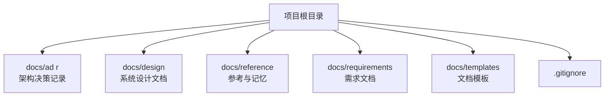
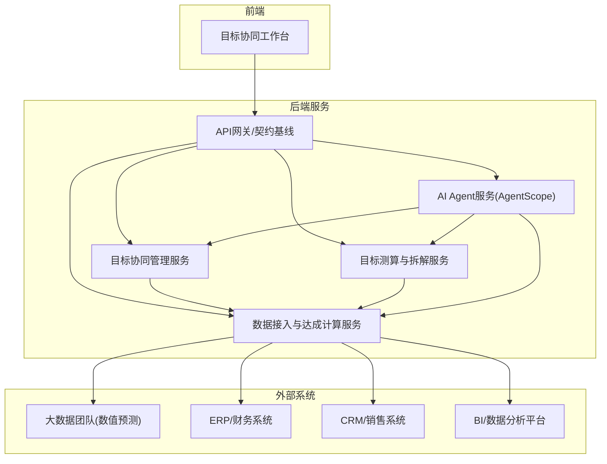
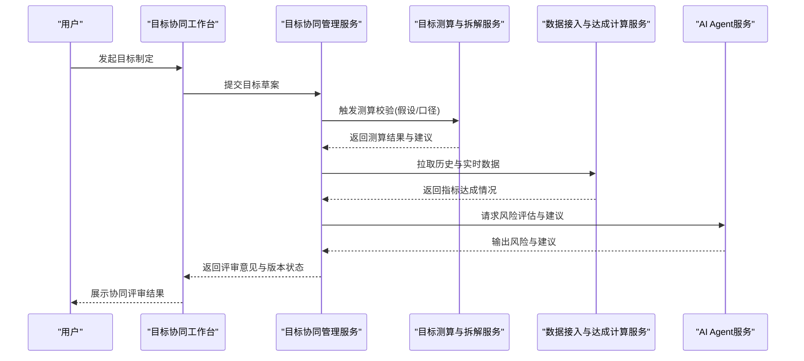
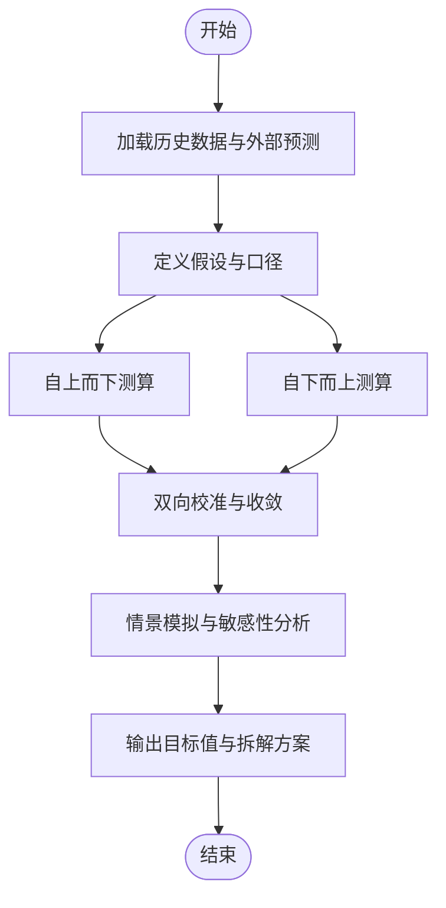
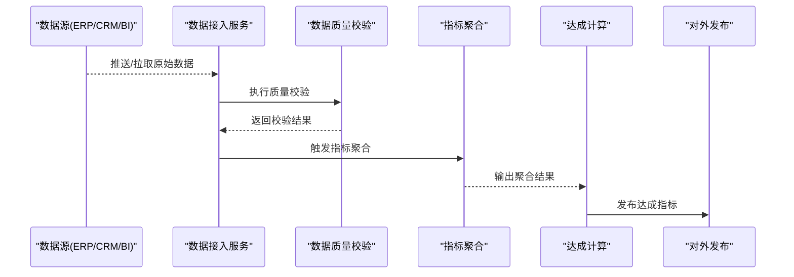
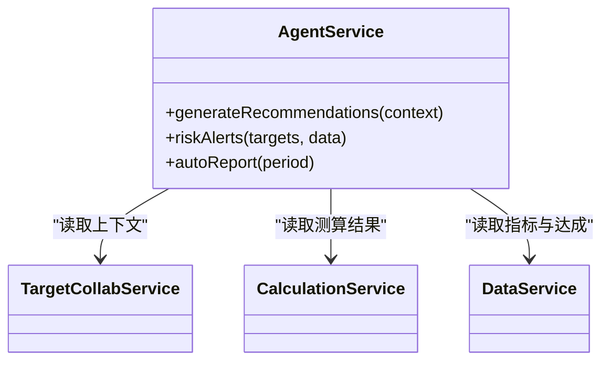
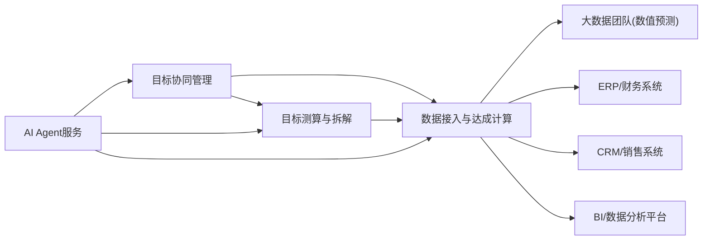

# 项目概述

<cite>
**本文引用的文件**   
- [docs/product-vision.md](file://docs/product-vision.md)
- [docs/design/目标协同管理.md](file://docs/design/目标协同管理.md)
- [docs/design/目标测算与拆解.md](file://docs/design/目标测算与拆解.md)
- [docs/design/数据接入与达成计算.md](file://docs/design/数据接入与达成计算.md)
- [docs/design/00-契约基线-接口清单.md](file://docs/design/00-契约基线-接口清单.md)
- [docs/adr/0001-AI-Agent框架选型-AgentScope.md](file://docs/adr/0001-AI-Agent框架选型-AgentScope.md)
- [docs/adr/0002-数值预测来源-大数据团队.md](file://docs/adr/0002-数值预测来源-大数据团队.md)
- [docs/adr/0003-服务拆分策略.md](file://docs/adr/0003-服务拆分策略.md)
- [docs/reference/.claude/agent-memory/requirements-analyst/MEMORY.md](file://docs/reference/.claude/agent-memory/requirements-analyst/MEMORY.md)
- [docs/reference/.claude/agent-memory/requirements-analyst/one-period-scope.md](file://docs/reference/.claude/agent-memory/requirements-analyst/one-period-scope.md)
- [docs/reference/.claude/agent-memory/requirements-analyst/ref_target_collaboration_module.md](file://docs/reference/.claude/agent-memory/requirements-analyst/ref_target_collaboration_module.md)
- [docs/reference/.claude/agent-memory/requirements-analyst/ref_execution_tracking_module.md](file://docs/reference/.claude/agent-memory/requirements-analyst/ref_execution_tracking_module.md)
- [docs/requirements/Demo业务对齐差异清单.md](file://docs/requirements/Demo业务对齐差异清单.md)
- [docs/requirements/TAM大图对齐与演进路线.md](file://docs/requirements/TAM大图对齐与演进路线.md)
- [docs/requirements/需求审查遗留问题.md](file://docs/requirements/需求审查遗留问题.md)
</cite>

## 目录
1. [引言](#引言)
2. [项目结构](#项目结构)
3. [核心组件](#核心组件)
4. [架构总览](#架构总览)
5. [详细组件分析](#详细组件分析)
6. [依赖分析](#依赖分析)
7. [性能考虑](#性能考虑)
8. [故障排查指南](#故障排查指南)
9. [结论](#结论)
10. [附录](#附录)

## 引言
本项目围绕“目标协同管理系统”展开，聚焦多部门协作、目标制定流程、目标测算与拆解、数据接入与达成计算等关键能力，支撑企业在数字化转型中实现“以目标为牵引、以数据为依据、以协作为抓手”的管理闭环。项目的核心价值在于：
- 统一目标语言：将战略意图转化为可量化、可追踪的目标体系，贯穿组织各层级。
- 强化协同效率：通过在线协同、版本化评审与留痕，提升跨部门沟通与决策质量。
- 科学测算与拆解：结合历史数据与外部预测，提供自上而下与自下而上的双向校准。
- 数据驱动达成：打通数据接入与达成计算链路，形成“计划—执行—评估—改进”的持续优化机制。

在企业管理数字化转型中的定位与作用：
- 作为企业级目标管理与经营分析的“中枢系统”，连接战略规划、预算与绩效、运营数据与分析平台。
- 通过标准化接口与契约基线，降低系统集成成本，提高扩展性与可维护性。
- 引入AI Agent能力（如AgentScope）增强智能辅助，包括目标建议、风险预警、自动报告生成等。

文档驱动开发模式的优势与实施策略：
- 优势：以设计文档与ADR（架构决策记录）为单一事实源，减少信息不对称；以契约基线约束前后端与上下游集成；以模板化规范保障产出质量与一致性。
- 实施策略：先定义产品愿景与范围，再沉淀设计文档与接口契约，随后落地代码实现；以验收清单与发布清单确保交付质量；以TAM大图与演进路线指导长期技术规划。

## 项目结构
仓库采用“文档驱动”的组织方式，核心目录如下：
- docs/ad r：架构决策记录，记录关键技术选型与服务拆分策略。
- docs/design：系统设计文档，覆盖目标协同、测算与拆解、数据接入与达成计算、接口契约基线。
- docs/reference：参考与记忆材料，包含需求分析师视角的记忆与模块参考。
- docs/requirements：需求相关文档，包括Demo对齐差异、TAM大图与演进路线、需求审查遗留问题。
- docs/templates：各类模板，用于规范文档产出。
- .gitignore：版本控制忽略规则。

图表来源
- [docs/adr/0001-AI-Agent框架选型-AgentScope.md](file://docs/adr/0001-AI-Agent框架选型-AgentScope.md)
- [docs/adr/0002-数值预测来源-大数据团队.md](file://docs/adr/0002-数值预测来源-大数据团队.md)
- [docs/adr/0003-服务拆分策略.md](file://docs/adr/0003-服务拆分策略.md)
- [docs/design/目标协同管理.md](file://docs/design/目标协同管理.md)
- [docs/design/目标测算与拆解.md](file://docs/design/目标测算与拆解.md)
- [docs/design/数据接入与达成计算.md](file://docs/design/数据接入与达成计算.md)
- [docs/design/00-契约基线-接口清单.md](file://docs/design/00-契约基线-接口清单.md)

章节来源
- [docs/product-vision.md](file://docs/product-vision.md)
- [docs/adr/0001-AI-Agent框架选型-AgentScope.md](file://docs/adr/0001-AI-Agent框架选型-AgentScope.md)
- [docs/adr/0002-数值预测来源-大数据团队.md](file://docs/adr/0002-数值预测来源-大数据团队.md)
- [docs/adr/0003-服务拆分策略.md](file://docs/adr/0003-服务拆分策略.md)
- [docs/design/目标协同管理.md](file://docs/design/目标协同管理.md)
- [docs/design/目标测算与拆解.md](file://docs/design/目标测算与拆解.md)
- [docs/design/数据接入与达成计算.md](file://docs/design/数据接入与达成计算.md)
- [docs/design/00-契约基线-接口清单.md](file://docs/design/00-契约基线-接口清单.md)

## 核心组件
基于设计文档与ADR，系统由以下核心组件构成：
- 目标协同管理：负责目标生命周期管理、版本化评审、审批流、任务分解与跟踪。
- 目标测算与拆解：支持自上而下与自下而上双通道测算，提供指标口径、假设管理与情景模拟。
- 数据接入与达成计算：对接内外部数据源，完成指标采集、清洗、聚合与达成率计算。
- AI Agent能力：基于AgentScope进行智能辅助，包括目标建议、风险识别、自动化报告等。
- 接口契约基线：定义稳定的API契约，保障前后端与上下游系统的解耦与演进可控。

章节来源
- [docs/design/目标协同管理.md](file://docs/design/目标协同管理.md)
- [docs/design/目标测算与拆解.md](file://docs/design/目标测算与拆解.md)
- [docs/design/数据接入与达成计算.md](file://docs/design/数据接入与达成计算.md)
- [docs/design/00-契约基线-接口清单.md](file://docs/design/00-契约基线-接口清单.md)
- [docs/adr/0001-AI-Agent框架选型-AgentScope.md](file://docs/adr/0001-AI-Agent框架选型-AgentScope.md)

## 架构总览
系统采用“文档驱动+契约先行”的架构治理方式，结合服务拆分策略与AI Agent能力，形成“目标—测算—数据—协同—智能”的整体闭环。

图表来源
- [docs/adr/0003-服务拆分策略.md](file://docs/adr/0003-服务拆分策略.md)
- [docs/adr/0001-AI-Agent框架选型-AgentScope.md](file://docs/adr/0001-AI-Agent框架选型-AgentScope.md)
- [docs/adr/0002-数值预测来源-大数据团队.md](file://docs/adr/0002-数值预测来源-大数据团队.md)
- [docs/design/00-契约基线-接口清单.md](file://docs/design/00-契约基线-接口清单.md)

## 详细组件分析

### 目标协同管理
- 职责边界：目标创建、版本化、评审与审批、任务分解、进度跟踪、变更留痕。
- 关键流程：目标立项→草案发布→多部门会签→定稿生效→执行跟踪→复盘归档。
- 与其他组件交互：调用测算服务进行假设校验；与数据服务联动获取执行数据；受AI Agent辅助进行风险提示与建议。

图表来源
- [docs/design/目标协同管理.md](file://docs/design/目标协同管理.md)
- [docs/design/目标测算与拆解.md](file://docs/design/目标测算与拆解.md)
- [docs/design/数据接入与达成计算.md](file://docs/design/数据接入与达成计算.md)
- [docs/adr/0001-AI-Agent框架选型-AgentScope.md](file://docs/adr/0001-AI-Agent框架选型-AgentScope.md)

章节来源
- [docs/design/目标协同管理.md](file://docs/design/目标协同管理.md)
- [docs/reference/.claude/agent-memory/requirements-analyst/ref_target_collaboration_module.md](file://docs/reference/.claude/agent-memory/requirements-analyst/ref_target_collaboration_module.md)

### 目标测算与拆解
- 职责边界：指标口径管理、假设库、情景模拟、自上而下与自下而上双向校准、版本对比。
- 关键算法：趋势外推、回归/时间序列、分层拆解（按区域/渠道/产品线）、敏感性分析。
- 输入输出：输入历史数据与外部预测，输出目标值、拆解方案与置信区间。

图表来源
- [docs/design/目标测算与拆解.md](file://docs/design/目标测算与拆解.md)
- [docs/adr/0002-数值预测来源-大数据团队.md](file://docs/adr/0002-数值预测来源-大数据团队.md)

章节来源
- [docs/design/目标测算与拆解.md](file://docs/design/目标测算与拆解.md)
- [docs/adr/0002-数值预测来源-大数据团队.md](file://docs/adr/0002-数值预测来源-大数据团队.md)

### 数据接入与达成计算
- 职责边界：数据源注册、接入配置、ETL调度、指标聚合、达成率计算、数据质量校验。
- 关键流程：数据接入→清洗转换→指标聚合→达成计算→结果发布。
- 外部依赖：大数据团队（数值预测）、ERP/CRM/BI等系统。

图表来源
- [docs/design/数据接入与达成计算.md](file://docs/design/数据接入与达成计算.md)
- [docs/adr/0002-数值预测来源-大数据团队.md](file://docs/adr/0002-数值预测来源-大数据团队.md)

章节来源
- [docs/design/数据接入与达成计算.md](file://docs/design/数据接入与达成计算.md)

### AI Agent能力（AgentScope）
- 职责边界：智能建议、风险预警、自动化报告、对话式查询与解释。
- 集成点：与目标协同、测算与数据服务交互，读取上下文并输出建议或报告。
- 价值：提升决策效率、降低人为偏差、增强用户体验。

图表来源
- [docs/adr/0001-AI-Agent框架选型-AgentScope.md](file://docs/adr/0001-AI-Agent框架选型-AgentScope.md)
- [docs/design/目标协同管理.md](file://docs/design/目标协同管理.md)
- [docs/design/目标测算与拆解.md](file://docs/design/目标测算与拆解.md)
- [docs/design/数据接入与达成计算.md](file://docs/design/数据接入与达成计算.md)

章节来源
- [docs/adr/0001-AI-Agent框架选型-AgentScope.md](file://docs/adr/0001-AI-Agent框架选型-AgentScope.md)

### 接口契约基线
- 职责边界：定义API版本、字段语义、错误码、幂等性与限流策略，保障系统间稳定集成。
- 关键内容：接口清单、请求/响应模型、鉴权与审计要求、兼容性策略。
- 作用：降低耦合度、加速迭代、便于测试与回归。

章节来源
- [docs/design/00-契约基线-接口清单.md](file://docs/design/00-契约基线-接口清单.md)

## 依赖分析
- 内部依赖：目标协同管理依赖测算与数据服务；测算服务依赖数据服务；AI Agent依赖三者以获取上下文。
- 外部依赖：大数据团队提供数值预测；ERP/CRM/BI提供业务与运营数据。
- 契约依赖：所有服务遵循接口契约基线，确保版本兼容与平滑演进。

图表来源
- [docs/adr/0003-服务拆分策略.md](file://docs/adr/0003-服务拆分策略.md)
- [docs/adr/0001-AI-Agent框架选型-AgentScope.md](file://docs/adr/0001-AI-Agent框架选型-AgentScope.md)
- [docs/adr/0002-数值预测来源-大数据团队.md](file://docs/adr/0002-数值预测来源-大数据团队.md)
- [docs/design/00-契约基线-接口清单.md](file://docs/design/00-契约基线-接口清单.md)

章节来源
- [docs/adr/0003-服务拆分策略.md](file://docs/adr/0003-服务拆分策略.md)
- [docs/design/00-契约基线-接口清单.md](file://docs/design/00-契约基线-接口清单.md)

## 性能考虑
- 数据接入与聚合：对高频数据源采用增量同步与批处理结合，避免全量刷新带来的延迟与资源消耗。
- 测算与拆解：对复杂模型进行缓存与异步计算，提供预览与快速估算能力，提升交互体验。
- 契约与网关：引入限流、熔断与重试策略，保障高并发下的稳定性。
- AI Agent：对大模型调用进行批处理与结果缓存，减少重复推理开销。

[本节为通用性能建议，不直接分析具体文件]

## 故障排查指南
- 数据接入异常：检查数据源连通性、权限与格式；查看质量校验日志与失败明细；确认ETL调度状态。
- 测算结果异常：核对假设与口径配置；验证历史数据完整性；检查外部预测数据的时效性与准确性。
- 协同流程阻塞：查看审批节点与留痕记录；确认版本冲突与合并策略；检查通知与提醒是否送达。
- AI Agent建议不准确：检查上下文数据质量；调整提示词与策略；增加人工复核环节。

章节来源
- [docs/design/数据接入与达成计算.md](file://docs/design/数据接入与达成计算.md)
- [docs/design/目标测算与拆解.md](file://docs/design/目标测算与拆解.md)
- [docs/design/目标协同管理.md](file://docs/design/目标协同管理.md)

## 结论
本项目以“目标协同管理”为核心，构建起从目标制定、测算拆解到数据达成与智能辅助的完整闭环。通过文档驱动与契约基线，系统在可扩展性、可维护性与集成效率方面具备显著优势。面向初学者，建议从产品愿景与设计文档入手，逐步理解业务流程与数据链路；面向经验丰富的开发者，应重点关注服务拆分策略、接口契约与AI Agent集成点，以确保高质量交付与持续演进。

[本节为总结性内容，不直接分析具体文件]

## 附录
- 术语表：目标协同、测算与拆解、数据接入、达成计算、AI Agent、契约基线、服务拆分。
- 参考材料：需求分析师记忆与模块参考、单周期范围说明、执行跟踪模块参考。
- 需求与演进：Demo业务对齐差异清单、TAM大图与演进路线、需求审查遗留问题。

章节来源
- [docs/reference/.claude/agent-memory/requirements-analyst/MEMORY.md](file://docs/reference/.claude/agent-memory/requirements-analyst/MEMORY.md)
- [docs/reference/.claude/agent-memory/requirements-analyst/one-period-scope.md](file://docs/reference/.claude/agent-memory/requirements-analyst/one-period-scope.md)
- [docs/reference/.claude/agent-memory/requirements-analyst/ref_execution_tracking_module.md](file://docs/reference/.claude/agent-memory/requirements-analyst/ref_execution_tracking_module.md)
- [docs/requirements/Demo业务对齐差异清单.md](file://docs/requirements/Demo业务对齐差异清单.md)
- [docs/requirements/TAM大图对齐与演进路线.md](file://docs/requirements/TAM大图对齐与演进路线.md)
- [docs/requirements/需求审查遗留问题.md](file://docs/requirements/需求审查遗留问题.md)